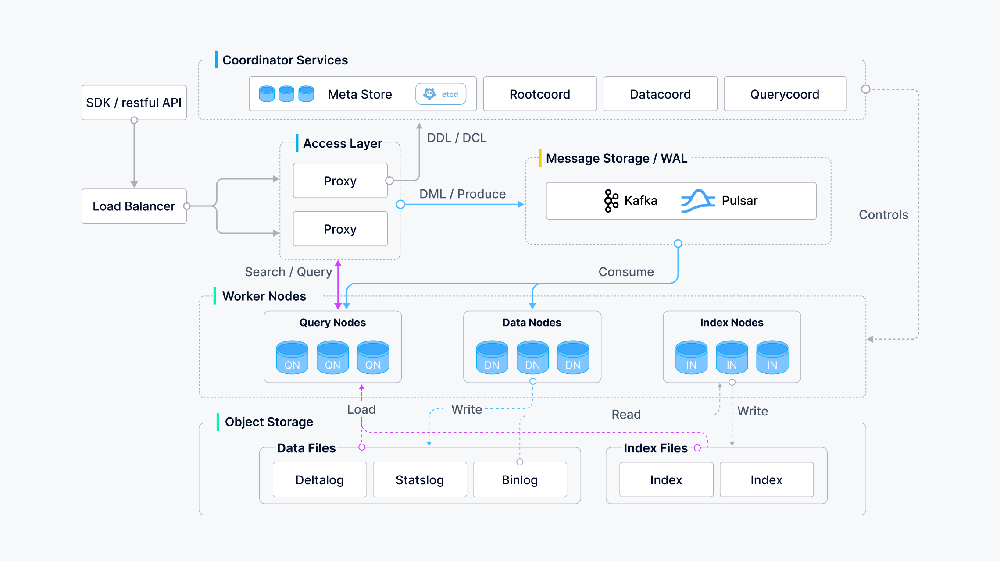

# 介绍

本页面旨在通过回答几个问题来为您提供Milvus的概述。阅读本页面后，您将了解Milvus是什么，它是如何工作的，以及关键概念、为什么使用Milvus、支持的索引和度量、示例应用程序、架构和相关工具。

## 什么是Milvus向量数据库？

Milvus是在2019年创建的，其唯一目标是存储、索引和管理由深度神经网络和其他机器学习（ML）模型生成的大规模[嵌入向量](#嵌入向量)。 

作为一个专门设计用于处理输入向量查询的数据库，它能够在万亿级别上对向量进行索引。与现有的主要处理遵循预定义模式的结构化数据的关系型数据库不同，Milvus是从底层开始设计的，用于处理从[非结构化数据](#非结构化数据)转换而来的嵌入向量。

随着互联网的发展和演变，非结构化数据变得越来越普遍，包括电子邮件、论文、物联网传感器数据、Facebook照片、蛋白质结构等。为了使计算机能够理解和处理非结构化数据，这些数据会使用嵌入技术转换为向量。Milvus存储和索引这些向量。Milvus能够通过计算它们的相似性距离来分析两个向量之间的相关性。如果两个嵌入向量非常相似，这意味着原始数据源也是相似的。

## 关键概念

如果您对向量数据库和相似性搜索的世界还不熟悉，请阅读以下关键概念的解释，以便更好地理解。

了解更多关于[Milvus术语表](glossary.md)。

### 非结构化数据

非结构化数据，包括图像、视频、音频和自然语言，是不遵循预定义模型或组织方式的信息。这种数据类型约占世界数据的80%，可以使用各种人工智能（AI）和机器学习（ML）模型将其转换为向量。

### 嵌入向量

嵌入向量是非结构化数据的特征抽象，例如电子邮件、物联网传感器数据、Instagram照片、蛋白质结构等。从数学上讲，嵌入向量是一组浮点数或二进制数。现代嵌入技术用于将非结构化数据转换为嵌入向量。

### 向量相似性搜索
向量相似性搜索是将一个向量与数据库进行比较，以找到与查询向量最相似的向量的过程。近似最近邻（ANN）搜索算法用于加速搜索过程。如果两个嵌入向量非常相似，那么原始数据源也是相似的。

## 为什么选择 Milvus？

- 在处理大规模数据集上进行向量搜索时性能高。
- 以开发者为先的社区，提供多语言支持和工具链。
- 云扩展性强，即使发生中断也能保持高可靠性。
- 通过将标量过滤与向量相似性搜索配对实现混合搜索。

## 支持的索引和度量标准是什么？

索引是数据的组织单元。在搜索或查询插入的实体之前，您必须声明索引类型和相似性度量标准。**如果您不指定索引类型，Milvus 将默认执行暴力搜索。**

### 索引类型

Milvus 支持的大多数向量索引类型使用近似最近邻搜索（ANNS），包括：

- **HNSW**：HNSW 是基于图的索引，最适合对搜索效率有很高需求的场景。还有一个 GPU 版本 **GPU_CAGRA**，得益于 Nvidia 的贡献。
- **FLAT**：FLAT 最适合在小型百万级数据集上寻求完全准确和精确搜索结果的场景。还有一个 GPU 版本 **GPU_BRUTE_FORCE**。
- **IVF_FLAT**：IVF_FLAT 是基于量化的索引，最适合在准确性和查询速度之间寻求理想平衡的场景。还有一个 GPU 版本 **GPU_IVF_FLAT**。
- **IVF_SQ8**：IVF_SQ8 是基于量化的索引，最适合在磁盘、CPU 和 GPU 内存消耗方面寻求显著减少的场景，因为这些资源非常有限。
- **IVF_PQ**：IVF_PQ 是基于量化的索引，最适合在牺牲准确性的情况下追求高查询速度的场景。还有一个 GPU 版本 **GPU_IVF_PQ**。
- **SCANN**：SCANN 在向量聚类和产品量化方面类似于 IVF_PQ。它们的区别在于产品量化的实现细节以及使用 SIMD（单指令/多数据）进行高效计算。
- **DiskANN**：基于 Vamana 图，DiskANN 可以在大型数据集内进行高效搜索。

更多详情请参阅 [Vector Index](index.md)。

### 相似性度量标准

在 Milvus 中，相似性度量标准用于衡量向量之间的相似性。选择一个好的距离度量标准有助于显著提高分类和聚类性能。根据输入数据形式，选择特定的相似性度量标准以获得最佳性能。

用于浮点嵌入的常用度量标准包括：

- **余弦相似度**：这个度量标准是归一化的内积，通常用于文本相似性搜索（NLP）。

- **欧氏距离（L2）**：这个度量标准通常在计算机视觉（CV）领域中使用。
- **内积（IP）**：这个度量标准通常在自然语言处理（NLP）领域中使用。
在二进制嵌入中广泛使用的度量标准包括：
- **汉明距离**：这个度量标准通常在自然语言处理（NLP）领域中使用。
- **Jaccard 相似度**：这个度量标准通常在分子相似性搜索领域中使用。

更多信息请参见[相似性度量](metric.md#floating)。

## 示例应用

Milvus使得向应用程序添加相似性搜索变得轻而易举。Milvus的示例应用包括：

- [图像相似性搜索](image_similarity_search.md)：使图像可搜索，并即时从庞大数据库中返回最相似的图像。
- [视频相似性搜索](video_similarity_search.md)：通过将关键帧转换为向量，然后将结果输入Milvus，可以在几乎实时中搜索和推荐数十亿个视频。
- [音频相似性搜索](audio_similarity_search.md)：快速查询大量音频数据，如语音、音乐、音效，并找到相似声音。
- [推荐系统](recommendation_system.md)：根据用户行为和需求推荐信息或产品。
- [问答系统](question_answering_system.md)：交互式数字问答聊天机器人，自动回答用户问题。
- [DNA 序列分类](dna_sequence_classification.md)：通过比较相似的DNA序列，在毫秒内准确分类基因。
- [文本搜索引擎](text_search_engine.md)：通过将关键词与文本数据库进行比较，帮助用户找到他们正在寻找的信息。

更多Milvus应用场景请参见[Milvus教程](https://github.com/milvus-io/bootcamp/tree/master/bootcamp)和[Milvus采用者](milvus_adopters.md)。

## Milvus的设计理念

作为一个云原生向量数据库，Milvus通过设计将存储和计算分离。为了增强弹性和灵活性，Milvus中的所有组件都是无状态的。

系统分为四个层级：

- 访问层：访问层由一组无状态代理组成，作为系统的前端层和用户端点。
- 协调器服务：协调器服务将任务分配给工作节点，充当系统的大脑。
- 工作节点：工作节点充当手臂和腿部，是从协调器服务接收指令并执行用户触发的DML/DDL命令的哑执行器。
- 存储：存储是系统的支柱，负责数据持久化。它包括元数据存储、日志代理和对象存储。

更多信息请参见[架构概述](architecture_overview.md)。

## 开发者工具

Milvus支持丰富的API和工具，以便于DevOps。
### API访问

Milvus提供了封装在Milvus API之上的客户端库，可用于从应用程序代码中以编程方式插入、删除和查询数据：

- [PyMilvus](https://github.com/milvus-io/pymilvus)
- [Node.js SDK](https://github.com/milvus-io/milvus-sdk-node)
- [Go SDK](https://github.com/milvus-io/milvus-sdk-go)
- [Java SDK](https://github.com/milvus-io/milvus-sdk-java)
- [Restful API](https://milvus.io/api-reference/restful/v2.4.x/About.md)

我们正在努力开发更多新的客户端库。如果您想要贡献代码，请访问[Milvus项目](https://github.com/milvus-io)的相应存储库。

### Milvus生态系统工具

Milvus生态系统提供了一些有用的工具，包括：

- [Attu](https://github.com/zilliztech/attu)，一个用于Milvus的图形化管理系统。
- [Milvus sizing tool](https://milvus.io/tools/sizing/)，可帮助您估算需要的原始文件大小、内存大小和稳定磁盘大小，以适应不同索引类型的向量数量。
- [Milvus CLI](https://github.com/zilliztech/milvus_cli#overview)

## 接下来做什么

- 通过3分钟教程开始使用：
  - [Hello Milvus](quickstart.md)
- 为您的测试或生产环境安装Milvus：
  - [安装前提条件](prerequisite-docker.md)
  - [安装独立Milvus](install_standalone-docker.md)
- 如果您对深入了解Milvus的设计细节感兴趣：
  - 阅读有关[Milvus架构](architecture_overview.md)的内容