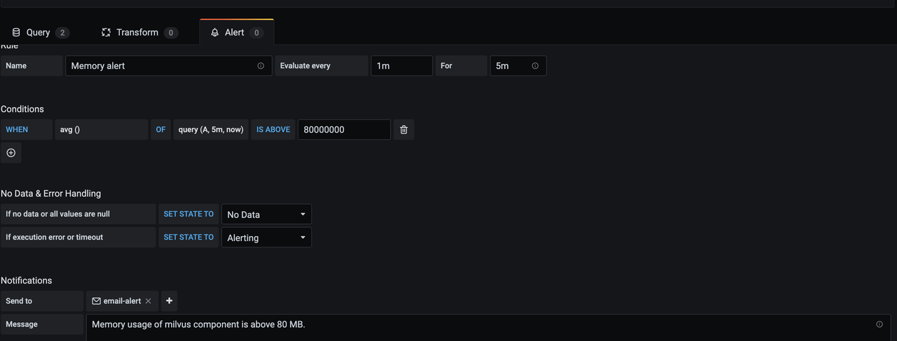
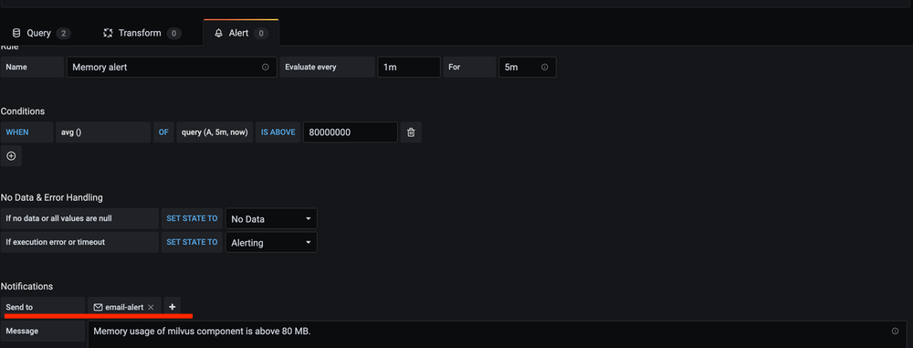
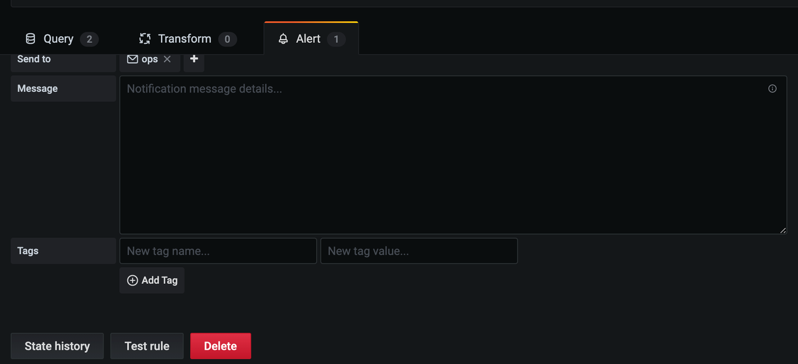

# 为 Milvus 服务创建警报

本主题介绍了 Milvus 服务的警报机制，并解释了在 Milvus 中创建警报的原因、时间和方法。

通过创建警报，您可以在特定指标的值超过您预定义的阈值时收到通知。

例如，您可以创建一个警报，并将内存使用量设置为 80 MB 作为 Milvus 组件的最大值。如果实际使用量超过预定义数字，您将收到提醒，提示您 Milvus 组件的内存使用量超过了 80 MB。在收到警报后，您可以及时调整资源分配，以确保服务的可用性。

## 创建警报的场景

以下是一些需要创建警报的常见场景：

- Milvus 组件的 CPU 或内存使用率过高。
- Milvus 组件的 Pod 磁盘空间不足。
- Milvus 组件的 Pod 频繁重启。

以下指标可用于警报配置：

| 指标   | 描述  | 计量单位  |
| --------  | --------- | -------------- |
| CPU 使用率   | Milvus 组件的 CPU 使用率，由 CPU 运行时间表示。  | 秒    |
| 内存      | Milvus 组件消耗的内存资源。  | MB    |
| Goroutines   | GO 语言中并发执行的活动。  |  /   |
| 操作系统线程   | 操作系统中的线程或轻量级进程。  |   / |
| 进程打开的文件描述符   | 当前使用的文件描述符数量。  | /    |

## 设置警报
本指南以创建 Milvus 组件内存使用量的警报为例。要创建其他类型的警报，请相应调整您的命令。如果在过程中遇到任何问题，请随时在[Milvus 论坛](https://discuss.milvus.io/)提问或在[Slack](https://join.slack.com/t/milvusio/shared_invite/zt-e0u4qu3k-bI2GDNys3ZqX1YCJ9OM~GQ)上发起讨论。

### 先决条件
本教程假定您已安装并配置了 Grafana。如果没有，请阅读[监控指南](monitor.md)。

### 1. 添加新查询
要为 Milvus 组件的内存使用量添加警报，请编辑内存面板。然后，使用以下指标添加新查询：`process_resident_memory_bytes{app_kubernetes_io_name="milvus", app_kubernetes_io_instance=~"my-release", namespace="default"}`

### 2. 保存仪表板
保存仪表板，并等待几分钟以查看警报。

Grafana 警报查询不支持模板变量。因此，您应添加一个没有任何模板变量的第二个查询标签。第二个查询默认命名为“A”。您可以点击下拉菜单重新命名它。

### 3. 添加警报通知
要接收警报通知，请添加一个“通知渠道”。然后，在“发送至”字段中指定该通道。

如果成功创建并触发了警报，您将会收到如下屏幕截图所示的通知。

要删除警报，请转到“警报”面板，然后点击删除按钮。

## 接下来的步骤

- 如果您需要开始监控 Milvus 服务：
  - 阅读 [监控指南](monitor.md)
  - 学习如何 [可视化监控指标](visualize.md)
- 如果您已为 Milvus 组件的内存使用创建了警报：
  - 学习如何 [分配资源](allocate.md#standalone)
- 如果您正在寻找有关如何扩展 Milvus 集群的信息：
  - 学习如何 [扩展 Milvus 集群](scaleout.md)