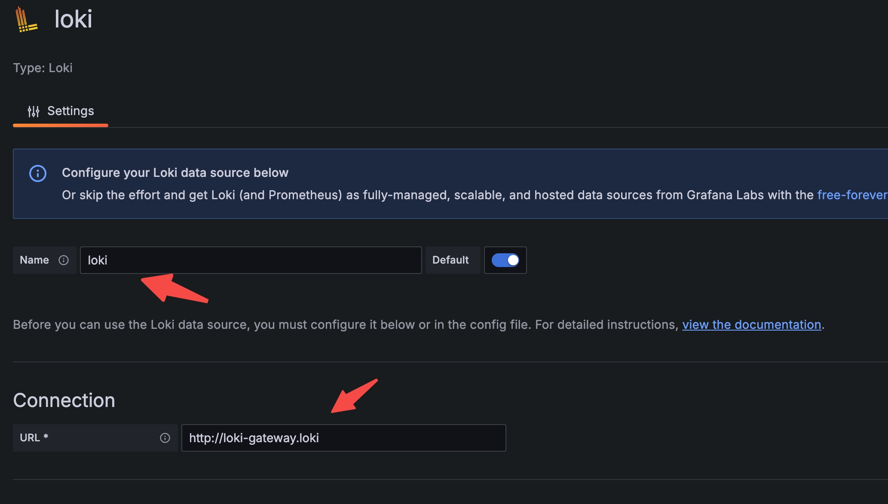
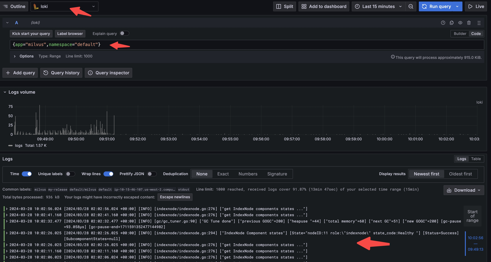

# 配置 Grafana Loki

本指南提供了如何配置 Loki 收集日志以及 Grafana 查询和显示 Milvus 集群日志的说明。

在本指南中，您将学习如何：

- 使用 Helm 在 Milvus 集群上部署 [Loki](https://grafana.com/docs/loki/latest/get-started/overview/) 和 [Promtail](https://grafana.com/docs/loki/latest/send-data/promtail/)。
- 为 Loki 配置对象存储。
- 使用 Grafana 查询日志。

## 先决条件

- 您已经在 K8s 上 [安装了 Milvus 集群](install_cluster-helm.md)。
- 您已经安装了必要的工具，包括 [Helm](https://helm.sh/docs/intro/install/) 和 [Kubectl](https://kubernetes.io/docs/tasks/tools/)。

## 部署 Loki

Loki 是受 Prometheus 启发的日志聚合系统。使用 Helm 部署 Loki 来收集来自 Milvus 集群的日志。

### 1. 添加 Grafana 的 Helm Chart 仓库

添加 Grafana 的图表仓库到 Helm 并更新：

```
helm repo add grafana https://grafana.github.io/helm-charts
helm repo update
```

### 2. 为 Loki 配置对象存储

选择以下存储选项之一并创建 `loki.yaml` 配置文件：

- 选项 1: 使用 MinIO 作为存储

  ```yaml
  loki:
    commonConfig:
      replication_factor: 1
    auth_enabled: false

  minio:
    enabled: true
  ```

- 选项 2: 使用 AWS S3 作为存储

  在下面的示例中，将 `<accessKey>` 和 `<keyId>` 替换为您自己的 S3 访问密钥和 ID，将 `s3.endpoint` 替换为 S3 端点，将 `s3.region` 替换为 S3 区域。

  ```yaml
  loki:
    commonConfig:
      replication_factor: 1
    auth_enabled: false
    storage:
      bucketNames:
        chunks: loki-chunks
        ruler: loki-ruler
        admin: loki-admin
      type: 's3'
      s3:
        endpoint: s3.us-west-2.amazonaws.com
        region: us-west-2
        secretAccessKey: <accessKey>
        accessKeyId: <keyId>
  ```

### 3. 安装 Loki

运行以下命令安装 Loki：

```shell
kubectl create ns loki
helm install --values loki.yaml loki grafana/loki -n loki
```

## 部署 Promtail

Promtail 是 Loki 的日志收集代理。它从 Milvus pod 中读取日志并将其发送到 Loki。

### 1. 创建 Promtail 配置

创建一个 `promtail.yaml` 配置文件：

```yaml
config:
  clients:
    - url: http://loki-gateway/loki/api/v1/push
```

### 2. 安装 Promtail

使用 Helm 安装 Promtail：

```shell
helm install  --values promtail.yaml promtail grafana/promtail -n loki
```

## 使用 Grafana 查询日志

部署 Grafana 并配置它连接到 Loki 查询日志。

### 1. 部署 Grafana

使用以下命令安装 Grafana：

```shell
kubectl create ns monitoring
helm install my-grafana grafana/grafana --namespace monitoring
```
在访问 Grafana 之前，您需要获取 `admin` 密码：

```shell
kubectl get secret --namespace monitoring my-grafana -o jsonpath="{.data.admin-password}" | base64 --decode ; echo
```

然后，将 Grafana 端口转发到本地机器：

```shell
export POD_NAME=$(kubectl get pods --namespace monitoring -l "app.kubernetes.io/name=grafana,app.kubernetes.io/instance=my-grafana" -o jsonpath="{.items[0].metadata.name}")
kubectl --namespace monitoring port-forward $POD_NAME 3000
```

### 2. 在 Grafana 中添加 Loki 作为数据源

一旦 Grafana 运行起来，您需要将 Loki 添加为数据源以查询日志。

1. 打开一个网页浏览器，访问 `127.0.0.1:3000`。使用用户名 `admin` 和之前获取的密码登录。
2. 在左侧菜单中，选择 __Connections__ > __Add new connection__。
3. 在打开的页面中，选择 __Loki__ 作为数据源类型。您可以在搜索栏中输入 __loki__ 来找到数据源。
4. 在 Loki 数据源设置中，指定 __Name__ 和 __URL__，然后点击 __Save & test__。



### 3. 查询 Milvus 日志

在将 Loki 添加为数据源后，在 Grafana 中查询 Milvus 日志：

1. 在左侧菜单中，点击 __Explore__。
2. 在页面左上角，选择 loki 数据源。
3. 使用 __Label browser__ 选择标签并查询日志。

