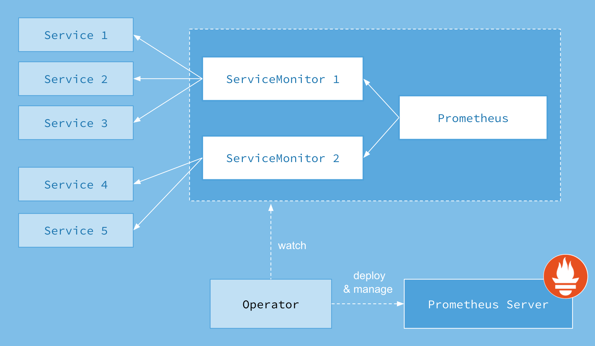

# 在 Kubernetes 上部署监控服务

本主题介绍如何使用 Prometheus 在 Kubernetes 上为 Milvus 集群部署监控服务。

## 使用 Prometheus 监控指标
指标是提供有关系统运行状态信息的指标。例如，通过指标，您可以了解 Milvus 中数据节点消耗了多少内存或 CPU 资源。了解 Milvus 集群中组件的性能和状态使您能够及时做出更好的决策，并调整资源分配。

通常，指标存储在时间序列数据库（TSDB）中，比如 [Prometheus](https://prometheus.io/)，并且指标会记录时间戳。在监控 Milvus 服务的情况下，您可以使用 Prometheus 从由出口器设置的端点拉取数据。然后 Prometheus 会在 `http://<组件主机>:9091/metrics` 处导出每个 Milvus 组件的指标。

然而，您可能会为一个组件拥有多个副本，这使得手动配置 Prometheus 变得过于复杂。因此，您可以使用 [Prometheus Operator](https://github.com/prometheus-operator/prometheus-operator)，这是 Kubernetes 的一个扩展，用于自动化和有效管理 Prometheus 监控实例。使用 Prometheus Operator 可以避免手动添加指标目标和服务提供者的麻烦。

ServiceMonitor 自定义资源定义（CRD）使您能够声明性地定义要监视的一组动态服务。它还允许使用标签选择器选择要监视的服务，并使用所需的配置。通过 Prometheus Operator，您可以引入规范，指定如何公开指标。新服务可以根据您设置的规范自动发现，无需手动重新配置。

以下图片展示了 Prometheus 的工作流程。



## 先决条件

本教程使用 [kube-prometheus](https://github.com/prometheus-operator/kube-prometheus) 来帮助您避免安装和手动配置每个监控和警报组件的麻烦。

Kube-prometheus 收集了 Kubernetes 清单、[Grafana](http://grafana.com/) 仪表盘以及与文档和脚本相结合的 [Prometheus 规则](https://prometheus.io/docs/prometheus/latest/configuration/recording_rules/)。

在部署监控服务之前，您需要使用 kube-prometheus 清单目录中的配置创建一个监控堆栈。

```
$ git clone https://github.com/prometheus-operator/kube-prometheus.git
$ cd kube-prometheus
$ kubectl apply --server-side -f manifests/setup
$ kubectl wait \
        --for condition=Established \
        --all CustomResourceDefinition \
        --namespace=monitoring
$ kubectl apply -f manifests/
```

<div class="alert note">
默认的 prometheus-k8s 集群角色无法捕获 milvus 的指标，需要进行修补：
</div>

```bash
kubectl patch clusterrole prometheus-k8s --type=json -p='[{"op": "add", "path": "/rules/-", "value": {"apiGroups": [""], "resources": ["pods", "services", "endpoints"], "verbs": ["get", "watch", "list"]}}]'
```

要删除一个堆栈，请运行 `kubectl delete --ignore-not-found=true -f manifests/ -f manifests/setup`。

## 在 Kubernetes 上部署监控服务

### 1. 访问仪表盘

将 Prometheus 服务转发到端口 `9090`，将 Grafana 服务转发到端口 `3000`。

```
$ kubectl --namespace monitoring --address 0.0.0.0 port-forward svc/prometheus-k8s 9090
$ kubectl --namespace monitoring --address 0.0.0.0 port-forward svc/grafana 3000
```

### 2. 启用 ServiceMonitor

Milvus Helm 默认情况下未启用 ServiceMonitor。在 Kubernetes 集群中安装 Prometheus Operator 后，您可以通过添加参数 `metrics.serviceMonitor.enabled=true` 来启用它。

```
$ helm upgrade my-release milvus/milvus --set metrics.serviceMonitor.enabled=true --reuse-values
```

安装完成后，使用 `kubectl` 来检查 ServiceMonitor 资源。

```
$ kubectl get servicemonitor
```
```
NAME                           AGE
my-release-milvus              54s
```

## 下一步

- 如果您已经为 Milvus 集群部署了监控服务，您可能还想了解如何：
  - [在 Grafana 中可视化 Milvus 指标](visualize.md)
  - [为 Milvus 服务创建警报](alert.md)
  - 调整您的 [资源分配](allocate.md)
- 如果您正在寻找关于如何扩展 Milvus 集群的信息：
  - 学习 [扩展 Milvus 集群](scaleout.md)
- 如果您对升级 Milvus 版本感兴趣，
  - 阅读 [升级 Milvus 集群的指南](upgrade_milvus_cluster-operator.md) 和 [升级 Milvus 独立版的指南](upgrade_milvus_standalone-operator.md)。