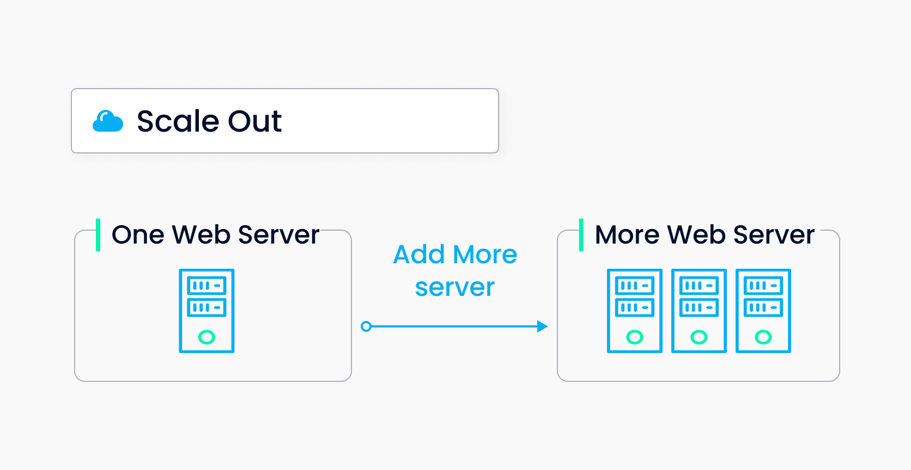
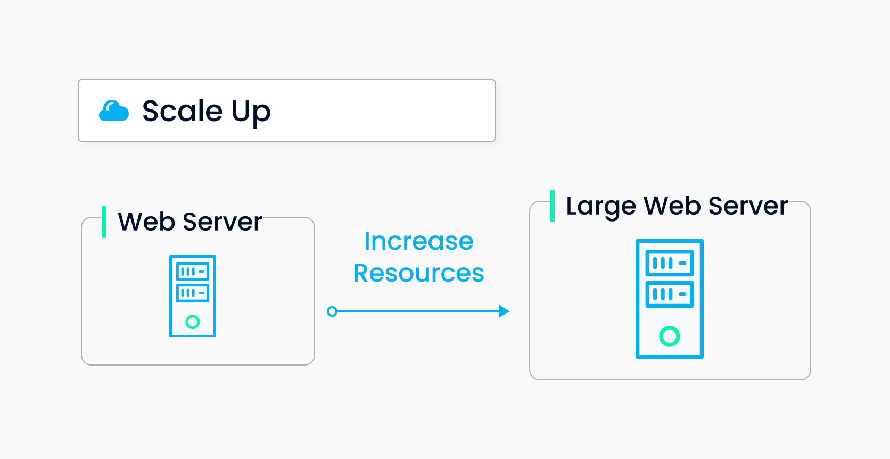

# 扩展 Milvus 集群

Milvus 支持其组件的水平扩展。这意味着您可以根据自己的需求增加或减少每种类型的工作节点数量。

本主题描述了如何扩展和收缩 Milvus 集群。我们假设您在扩展之前已经[安装了 Milvus 集群](install_cluster-helm.md)。此外，我们建议在开始之前熟悉[Milvus 架构](architecture_overview.md)。

本教程以扩展三个查询节点为例。要扩展其他类型的节点，请在命令行中将 `queryNode` 替换为相应的节点类型。

## 什么是水平扩展？

水平扩展包括扩展和收缩。

### 扩展
扩展指增加集群中节点的数量。与升级不同，扩展不需要您为集群中的一个节点分配更多资源。相反，扩展通过添加更多节点来水平扩展集群。





根据[Milvus 架构](architecture_overview.md)，无状态的工作节点包括查询节点、数据节点、索引节点和代理。因此，您可以扩展这些类型的节点以适应您的业务需求和应用场景。您可以手动或自动扩展 Milvus 集群。

通常，如果您的 Milvus 集群过度利用，您将需要扩展它。以下是一些可能需要扩展 Milvus 集群的典型情况：
- CPU 和内存利用率一段时间较高。
- 查询吞吐量增加。
- 需要更高速度的索引。
- 需要处理大量大型数据集。
- 需要确保 Milvus 服务的高可用性。

### 收缩
收缩指减少集群中节点的数量。通常，如果您的 Milvus 集群利用不足，您将需要收缩它。以下是一些可能需要收缩 Milvus 集群的典型情况：
- CPU 和内存利用率一段时间较低。
- 查询吞吐量减少。
- 不需要更高速度的索引。
- 待处理数据集的大小较小。

<div class="alert note">
我们不建议大幅减少工作节点的数量。例如，如果集群中有五个数据节点，我们建议每次减少一个数据节点以确保服务可用性。如果在第一次收缩尝试后服务可用，您可以继续进一步减少数据节点的数量。
</div>

## 先决条件

运行 `kubectl get pods` 命令，获取您创建的 Milvus 集群中组件及其工作状态的列表。

```
NAME                                            READY   STATUS       RESTARTS   AGE
my-release-etcd-0                               1/1     Running      0          1m
my-release-milvus-datacoord-7b5d84d8c6-rzjml    1/1     Running      0          1m
my-release-milvus-datanode-665d4586b9-525pm     1/1     Running      0          1m
my-release-milvus-indexcoord-9669d5989-kr5cm    1/1     Running      0          1m
my-release-milvus-indexnode-b89cc5756-xbpbn     1/1     Running      0          1m
my-release-milvus-proxy-7cbcc8ffbc-4jn8d        1/1     Running      0          1m
my-release-milvus-pulsar-6b9754c64d-4tg4m       1/1     Running      0          1m
my-release-milvus-querycoord-75f6c789f8-j28bg   1/1     Running      0          1m
my-release-milvus-querynode-7c7779c6f8-pnjzh    1/1     Running      0          1m
my-release-milvus-rootcoord-75585dc57b-cjh87    1/1     Running      0          1m
my-release-minio-5564fbbddc-9sbgv               1/1     Running      0          1m 
```

<div class="alert note">
Milvus 仅支持添加工作节点，不支持添加协调组件。
</div>

## 扩展 Milvus 集群

您可以手动或自动扩展 Milvus 集群。如果启用了自动扩展，当 CPU 和内存资源消耗达到您设置的值时，Milvus 集群将自动收缩或扩展。

目前，Milvus 2.1.0 仅支持手动扩展和缩减。

#### 扩展

运行 `helm upgrade my-release milvus/milvus --set queryNode.replicas=3 --reuse-values` 命令，手动扩展查询节点。

如果成功，将会添加三个运行中的查询节点 pod，如下所示。

```
NAME                                            READY   STATUS    RESTARTS   AGE
my-release-etcd-0                               1/1     Running   0          2m
my-release-milvus-datacoord-7b5d84d8c6-rzjml    1/1     Running   0          2m
my-release-milvus-datanode-665d4586b9-525pm     1/1     Running   0          2m
my-release-milvus-indexcoord-9669d5989-kr5cm    1/1     Running   0          2m
my-release-milvus-indexnode-b89cc5756-xbpbn     1/1     Running   0          2m
my-release-milvus-proxy-7cbcc8ffbc-4jn8d        1/1     Running   0          2m
my-release-milvus-pulsar-6b9754c64d-4tg4m       1/1     Running   0          2m
my-release-milvus-querycoord-75f6c789f8-j28bg   1/1     Running   0          2m
my-release-milvus-querynode-7c7779c6f8-czq9f    1/1     Running   0          5s
my-release-milvus-querynode-7c7779c6f8-jcdcn    1/1     Running   0          5s
my-release-milvus-querynode-7c7779c6f8-pnjzh    1/1     Running   0          2m
my-release-milvus-rootcoord-75585dc57b-cjh87    1/1     Running   0          2m
my-release-minio-5564fbbddc-9sbgv               1/1     Running   0          2m
```

#### 缩减
运行 `helm upgrade my-release milvus/milvus --set queryNode.replicas=1 --reuse-values` 来缩减查询节点的规模。

如果成功，查询节点上运行的三个 pod 将会减少到一个，如下例所示。

```
NAME                                            READY   STATUS    RESTARTS   AGE
my-release-etcd-0                               1/1     Running   0          2m
my-release-milvus-datacoord-7b5d84d8c6-rzjml    1/1     Running   0          2m
my-release-milvus-datanode-665d4586b9-525pm     1/1     Running   0          2m
my-release-milvus-indexcoord-9669d5989-kr5cm    1/1     Running   0          2m
my-release-milvus-indexnode-b89cc5756-xbpbn     1/1     Running   0          2m
my-release-milvus-proxy-7cbcc8ffbc-4jn8d        1/1     Running   0          2m
my-release-milvus-pulsar-6b9754c64d-4tg4m       1/1     Running   0          2m
my-release-milvus-querycoord-75f6c789f8-j28bg   1/1     Running   0          2m
my-release-milvus-querynode-7c7779c6f8-pnjzh    1/1     Running   0          2m
my-release-milvus-rootcoord-75585dc57b-cjh87    1/1     Running   0          2m
my-release-minio-5564fbbddc-9sbgv               1/1     Running   0          2m
```


## 下一步

- 如果您想了解如何监控 Milvus 服务并创建警报：
  - 参阅 [在 Kubernetes 上使用 Prometheus Operator 监控 Milvus](monitor.md)

- 如果您准备在云上部署您的集群：
  - 学习如何使用 Terraform 和 Ansible 在 AWS 上部署 Milvus [在 AWS 上部署 Milvus](aws.md)
  - 学习如何使用 Terraform 在 Amazon EKS 上部署 Milvus [在 Amazon EKS 上部署 Milvus](eks.md)
  - 学习如何在 GCP 上使用 Kubernetes 部署 Milvus [在 GCP 上部署 Milvus Cluster](gcp.md)
  - 学习如何在 Microsoft Azure 上使用 Kubernetes 部署 Milvus [在 Microsoft Azure 上部署 Milvus](azure.md)

- 如果您正在寻找如何分配资源的说明：
  - [在 Kubernetes 上分配资源](allocate.md#standalone)