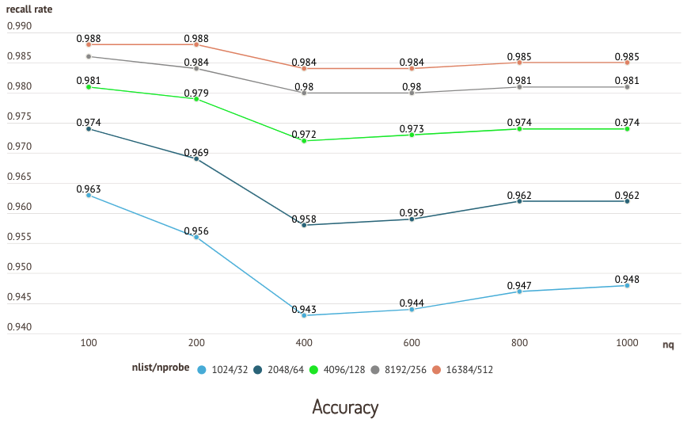
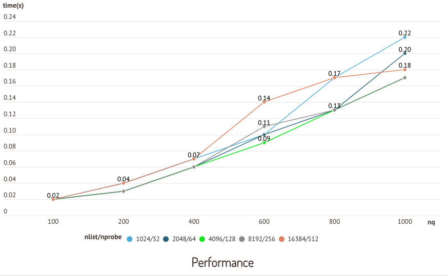

# 性能常见问题解答

<!-- TOC -->

<!-- /TOC -->

#### 如何为 IVF 索引设置 `nlist` 和 `nprobe`？

设置 `nlist` 是根据具体场景而定的。一般而言，推荐的 `nlist` 值为 `4 × sqrt(n)`，其中 `n` 是段中实体的总数。

每个段的大小由 `datacoord.segment.maxSize` 参数确定，默认设置为 512 MB。段中实体的总数 n 可以通过将 `datacoord.segment.maxSize` 除以每个实体的大小来估算。

设置 `nprobe` 针对的是数据集和具体场景，涉及到准确性和查询性能之间的权衡。我们建议通过反复实验找到最佳值。

以下图表是在 sift50m 数据集和 IVF_SQ8 索引上运行的测试结果，比较了不同 `nlist`/`nprobe` 组合的召回率和查询性能。

#### 为什么在较小的数据集上查询有时会花费更长的时间？

查询操作是在段上进行的。索引减少了查询段所需的时间。如果一个段没有被索引，Milvus 将会在原始数据上进行暴力搜索，大大增加查询时间。

因此，在小数据集（集合）上进行查询通常需要更长的时间，因为它没有构建索引。这是因为其段的大小尚未达到由 `rootCoord.minSegmentSizeToEnableindex` 设置的构建索引的阈值。调用 `create_index()` 强制 Milvus 对已达到阈值但尚未自动索引的段进行索引，显著提高查询性能。

#### 有哪些因素会影响 CPU 使用率？

当 Milvus 构建索引或运行查询时，CPU 使用率会增加。一般来说，除了使用 Annoy（在单个线程上运行）之外，构建索引是 CPU 密集型的。

运行查询时，CPU 使用率受 `nq` 和 `nprobe` 影响。当 `nq` 和 `nprobe` 较小时，并发性较低，CPU 使用率保持较低。

#### 同时插入数据和搜索会影响查询性能吗？

插入操作并不消耗太多 CPU。然而，由于新段可能尚未达到构建索引的阈值，Milvus 将会进行暴力搜索，严重影响查询性能。

`rootcoord.minSegmentSizeToEnableIndex` 参数确定了段的索引构建阈值，默认设置为 1024 行。更多信息请参阅[系统配置](system_configuration.md)。

#### 仍有疑问吗？

您可以：

- 查看 [Milvus](https://github.com/milvus-io/milvus/issues) 的 GitHub 页面。随时提出问题，分享想法，并帮助他人。
- 加入我们的 [Slack 频道](https://join.slack.com/t/milvusio/shared_invite/enQtNzY1OTQ0NDI3NjMzLWNmYmM1NmNjOTQ5MGI5NDhhYmRhMGU5M2NhNzhhMDMzY2MzNDdlYjM5ODQ5MmE3ODFlYzU3YjJkNmVlNDQ2ZTk)，获取支持并参与我们的开源社区。