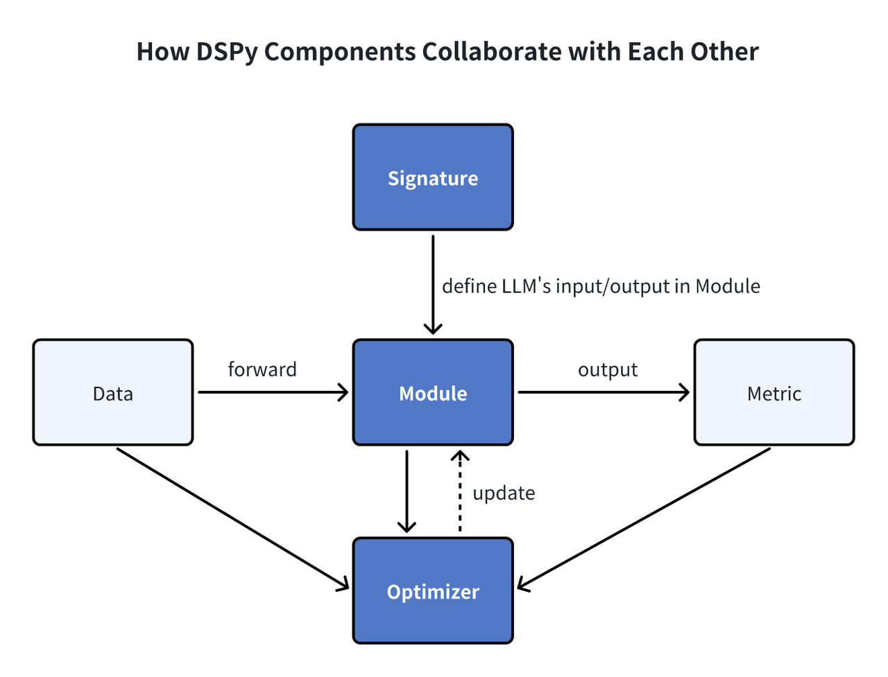

# 将 Milvus 与 DSPy 集成

<a href="https://colab.research.google.com/github/milvus-io/bootcamp/blob/master/bootcamp/tutorials/integration/milvus_and_DSPy.ipynb" target="_parent"></a>

本指南演示了如何使用 MilvusRM，DSPy 的检索模块之一，来优化 RAG 程序。

## 什么是 DSPy？

DSPy 是由斯坦福大学自然语言处理组介绍的一种开创性的编程框架，旨在优化语言模型中的提示和权重，在多个流水线阶段集成大型语言模型（LLMs）的场景中尤为重要。与传统的依赖于手工制作和调整的提示工程技术不同，DSPy 采用了基于学习的方法。通过吸收查询-答案示例，DSPy 动态生成优化的提示，针对特定任务进行定制。这种创新方法使得整个流水线可以无缝重组，消除了持续手动提示调整的需要。DSPy 的 Python 语法提供了各种可组合和声明性模块，简化了对 LLMs 的指导。

## 使用 DSPy 的好处

- 编程方法：DSPy 通过将流水线抽象为文本转换图而不仅仅是提示语言模型，为 LM 流水线开发提供了系统化的编程方法。其声明性模块实现了结构化设计和优化，取代了传统提示模板的反复试错方法。

- 性能提升：DSPy 显著提高了现有方法的性能。通过案例研究，它在编译到较小的 LM 模型时，优于标准提示和专家创建的演示，展示了其多功能性和有效性。

- 模块化抽象：DSPy 有效地抽象了 LM 流水线开发的复杂方面，如分解、微调和模型选择。使用 DSPy，简洁的程序可以无缝地转化为对各种模型的指令，如 GPT-4、Llama2-13b 或 T5-base，简化了开发并提高了性能。

## 模块

有许多组件有助于构建 LM 流水线。在这里，我们将描述一些关键组件，以便提供对 DSPy 操作方式的高级理解。



- 签名

    在 DSPy 中，签名作为声明性规范，概述了模块的输入/输出行为，指导语言模型执行任务。

- 模块

DSPy 模块是利用语言模型（LMs）的程序的基本组件。它们抽象了各种提示技术，如思维链或 ReAct，并适应处理任何 DSPy Signature。具有可学习参数和处理输入并生成输出的能力，这些模块可以组合成更大的程序，灵感来源于 PyTorch 中的 NN 模块，但专为 LM 应用定制。

- 优化器

    DSPy 中的优化器微调 DSPy 程序的参数，如提示和 LLM 权重，以最大化准确性等指定指标，增强程序效率。

## 为什么在 DSPy 中使用 Milvus

DSPy 是一个强大的编程框架，可提升 RAG 应用。这种应用需要检索有用信息以增强答案质量，这需要矢量数据库。Milvus 是一个知名的开源矢量数据库，可提高性能和可扩展性。通过 MilvusRM，在 DSPy 中集成 Milvus 变得无缝。现在，开发人员可以轻松地使用 DSPy 定义和优化 RAG 程序，利用 Milvus 强大的矢量搜索功能。这种合作使 RAG 应用更高效和可扩展，将 DSPy 的编程能力与 Milvus 的搜索功能结合起来。

## 示例

现在，让我们通过一个快速示例演示如何利用 Milvus 在 DSPy 中优化 RAG 应用。

### 先决条件

在构建 RAG 应用程序之前，安装 DSPy 和 PyMilvus。

```
$ pip install pymilvus==2.4.2
$ pip install dspy-ai[milvus]
```

<div class="alert note">

> 如果您正在使用 Google Colab，为了启用刚安装的依赖项，您可能需要**重新启动运行时**。

</div>

### 加载数据集

在此示例中，我们使用 HotPotQA，一个复杂问题-答案对的集合，作为我们的训练数据集。我们可以通过 HotPotQA 类加载它们。

```python
from dspy.datasets import HotPotQA

# 加载数据集。
dataset = HotPotQA(
    train_seed=1, train_size=20, eval_seed=2023, dev_size=50, test_size=0
)

# 告诉 DSPy 'question' 字段是输入。其他字段是标签和/或元数据。
trainset = [x.with_inputs("question") for x in dataset.train]
devset = [x.with_inputs("question") for x in dataset.dev]
```

### 将数据导入 Milvus 矢量数据库
将上下文信息导入 Milvus 集合以进行矢量检索。该集合应具有一个 `embedding` 字段和一个 `text` 字段。在这种情况下，我们使用 OpenAI 的 `text-embedding-3-small` 模型作为默认的查询嵌入函数。
```python
import requests
import os

os.environ["OPENAI_API_KEY"] = "<YOUR_OPENAI_API_KEY>"
MILVUS_URI = "example.db"
MILVUS_TOKEN = ""

from pymilvus import MilvusClient, DataType, Collection
from dspy.retrieve.milvus_rm import openai_embedding_function

client = MilvusClient(uri=MILVUS_URI, token=MILVUS_TOKEN)

if "dspy_example" not in client.list_collections():
    client.create_collection(
        collection_name="dspy_example",
        overwrite=True,
        dimension=1536,
        primary_field_name="id",
        vector_field_name="embedding",
        id_type="int",
        metric_type="IP",
        max_length=65535,
        enable_dynamic=True,
    )
text = requests.get(
    "https://raw.githubusercontent.com/wxywb/dspy_dataset_sample/master/sample_data.txt"
).text

for idx, passage in enumerate(text.split("\n")):
    if len(passage) == 0:
        continue
    client.insert(
        collection_name="dspy_example",
        data=[
            {
                "id": idx,
                "embedding": openai_embedding_function(passage)[0],
                "text": passage,
            }
        ],
    )
```

### 定义 MilvusRM。
现在，您需要定义 MilvusRM。


```python
from dspy.retrieve.milvus_rm import MilvusRM
import dspy

retriever_model = MilvusRM(
    collection_name="dspy_example",
    uri=MILVUS_URI,
    token=MILVUS_TOKEN,  # 如果 Milvus 连接不需要 token，则忽略此项
    embedding_function=openai_embedding_function,
)
turbo = dspy.OpenAI(model="gpt-3.5-turbo")
dspy.settings.configure(lm=turbo)
```

### 构建签名
现在我们已经加载了数据，让我们开始为流水线的子任务定义签名。我们可以确定我们的简单输入 `question` 和输出 `answer`，但由于我们正在构建一个 RAG 流水线，我们将从 Milvus 中检索上下文信息。因此，让我们将我们的签名定义为 `context, question --> answer`。


```python
class GenerateAnswer(dspy.Signature):
    """用简短事实性答案回答问题。"""

    context = dspy.InputField(desc="可能包含相关事实")
    question = dspy.InputField()
    answer = dspy.OutputField(desc="通常在 1 到 5 个词之间")
```

我们为 `context` 和 `answer` 字段提供了简短描述，以便更清晰地定义模型将接收和生成的内容的指南。

### 构建流水线
现在，让我们定义 RAG 流水线。


```python
class RAG(dspy.Module):
    def __init__(self, rm):
        super().__init__()
        self.retrieve = rm

        # 此签名指示了 COT 模块施加的任务。
        self.generate_answer = dspy.ChainOfThought(GenerateAnswer)

    def forward(self, question):
        # 使用 milvus_rm 检索问题的上下文。
        context = self.retrieve(question).passages
        # COT 模块接受 "context, query" 并输出 "answer"。
        prediction = self.generate_answer(context=context, question=question)
        return dspy.Prediction(
            context=[item.long_text for item in context], answer=prediction.answer
        )
```

### 执行流水线并获取结果
现在，我们已经构建了这个 RAG 流水线。让我们尝试一下并获取结果。


```python
rag = RAG(retriever_model)
print(rag("who write At My Window").answer)
```

    Townes Van Zandt


我们可以在数据集上评估定量结果。


```python
from dspy.evaluate.evaluate import Evaluate
from dspy.datasets import HotPotQA

evaluate_on_hotpotqa = Evaluate(
    devset=devset, num_threads=1, display_progress=False, display_table=5
)

metric = dspy.evaluate.answer_exact_match
score = evaluate_on_hotpotqa(rag, metric=metric)
print("rag:", score)
```

### 优化流水线
在定义了这个程序之后，下一步是编译。此过程更新每个模块中的参数以增强性能。编译过程取决于三个关键因素：
- 训练集：我们将利用我们训练数据集中的 20 个问题-答案示例进行演示。
- 验证指标：我们将建立一个简单的 `validate_context_and_answer` 指标。该指标验证了预测答案的准确性，并确保检索到的上下文包含答案。
- 特定优化器（电视提示器）：DSPy 的编译器集成了多个旨在有效优化您的程序的电视提示器。

```python
from dspy.teleprompt import BootstrapFewShot

# 验证逻辑：检查预测答案是否正确。# 同时检查检索到的上下文是否包含该答案。

def validate_context_and_answer(example, pred, trace=None):
    answer_EM = dspy.evaluate.answer_exact_match(example, pred)
    answer_PM = dspy.evaluate.answer_passage_match(example, pred)
    return answer_EM and answer_PM

# 设置一个基本的电视提示器，用于编译我们的 RAG 程序。
teleprompter = BootstrapFewShot(metric=validate_context_and_answer)

# 编译！
compiled_rag = teleprompter.compile(rag, trainset=trainset)

# 现在编译后的 RAG 已经优化并准备好回答您的新问题！
# 现在，让我们评估编译后的 RAG 程序。
score = evaluate_on_hotpotqa(compiled_rag, metric=metric)
print(score)
print("compile_rag:", score)
```

Ragas 分数从之前的 50.0 提高到 52.0，表明答案质量有所提升。

## 总结
DSPy 通过其可编程接口在语言模型交互方面迈出了一大步，该接口有助于算法和自动化优化模型提示和权重。通过利用 DSPy 进行 RAG 实现，适应不同语言模型或数据集变得轻而易举，大大减少了繁琐的手动干预需求。