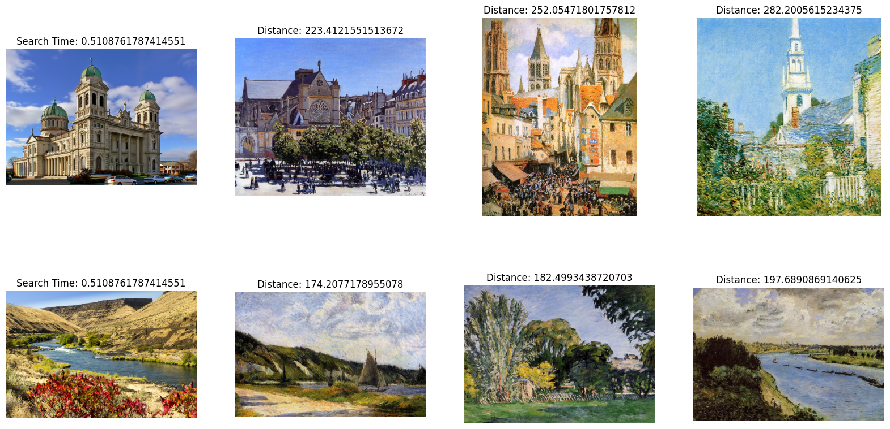

# 使用 Milvus 进行图像搜索

在这个页面中，我们将讨论如何使用 Milvus 进行简单的图像搜索示例。我们将搜索的数据集是在 [Kaggle](https://www.kaggle.com/datasets/delayedkarma/impressionist-classifier-data) 上找到的印象派分类数据集。在这个示例中，我们已经将数据重新托管到了一个公共的 Google Drive 上。

在这个示例中，我们将使用 Torchvision 预训练的 Resnet50 模型来生成嵌入向量。让我们开始吧！

## 安装所需软件包

在这个示例中，我们将使用 `pymilvus` 来连接 Milvus，`torch` 来运行嵌入模型，`torchvision` 来使用实际模型和预处理，`gdown` 来下载示例数据集，`tqdm` 来显示加载进度条。

```shell
pip install pymilvus torch gdown torchvision tqdm
```

## 获取数据

我们将使用 `gdown` 从 Google Drive 上获取 zip 文件，然后使用内置的 `zipfile` 库进行解压。

```python
import gdown
import zipfile

url = 'https://drive.google.com/uc?id=1OYDHLEy992qu5C4C8HV5uDIkOWRTAR1_'
output = './paintings.zip'
gdown.download(url, output)

with zipfile.ZipFile("./paintings.zip","r") as zip_ref:
    zip_ref.extractall("./paintings")
```

<div class="alert note">

数据集大小为 2.35 GB，下载时间取决于您的网络状况。

</div>

## 全局参数

以下是我们将用于更轻松跟踪和更新的一些主要全局参数。

```python
# Milvus 设置参数
COLLECTION_NAME = 'image_search'  # 集合名称
DIMENSION = 2048  # 在本示例中的嵌入向量大小
MILVUS_HOST = "localhost"
MILVUS_PORT = "19530"

# 推理参数
BATCH_SIZE = 128
TOP_K = 3
```

## 设置 Milvus

此时，我们将开始设置 Milvus。步骤如下：

1. 使用提供的 URI 连接到 Milvus 实例。

    ```python
    from pymilvus import connections

    # 连接到实例
    connections.connect(host=MILVUS_HOST, port=MILVUS_PORT)
    ```

2. 如果集合已经存在，则删除它。

    ```python
    from pymilvus import utility

    # 删除任何具有相同名称的先前集合
    if utility.has_collection(COLLECTION_NAME):
        utility.drop_collection(COLLECTION_NAME)
    ```

3. 创建包含 ID、图像文件路径和其嵌入向量的集合。

    ```python
    from pymilvus import FieldSchema, CollectionSchema, DataType, Collection
    
    # 创建包含 ID、图像文件路径和图像嵌入向量的集合
    fields = [
        FieldSchema(name='id', dtype=DataType.INT64, is_primary=True, auto_id=True),
        FieldSchema(name='filepath', dtype=DataType.VARCHAR, max_length=200),  # VARCHAR 需要一个最大长度，在这个示例中设置为 200 个字符
```python
        FieldSchema(name='image_embedding', dtype=DataType.FLOAT_VECTOR, dim=DIMENSION)
    ]
    schema = CollectionSchema(fields=fields)
    collection = Collection(name=COLLECTION_NAME, schema=schema)
```

4. 在新创建的集合上创建索引并将其加载到内存中。

    ```python
    # 为集合创建 AutoIndex 索引
    index_params = {
    'metric_type':'L2',
    'index_type':"IVF_FLAT",
    'params':{'nlist': 16384}
    }
    collection.create_index(field_name="image_embedding", index_params=index_params)
    collection.load()
    ```

完成这些步骤后，集合已准备好用于插入和搜索。任何添加的数据都将自动建立索引，并立即可供搜索。如果数据非常新鲜，则搜索可能会较慢，因为仍在处理索引的数据将使用暴力搜索。

## 插入数据

在本示例中，我们将使用 `torch` 提供的 ResNet50 模型及其模型中心。为了获得嵌入，我们去掉了最后的分类层，这样模型会给出 2048 维的嵌入。`torch` 中的所有视觉模型都使用我们在这里包含的相同预处理。

在接下来的几个步骤中，我们将：

1. 加载数据。

    ```python
    import glob

    # 获取图像的文件路径
    paths = glob.glob('./paintings/paintings/**/*.jpg', recursive=True)
    len(paths)
    ```

2. 将数据预处理成批量。

    ```python
    import torch

    # 加载嵌入模型并去掉最后一层
    model = torch.hub.load('pytorch/vision:v0.10.0', 'resnet50', pretrained=True)
    model = torch.nn.Sequential(*(list(model.children())[:-1]))
    model.eval()
    ```

3. 对数据进行嵌入。

    ```python
    from torchvision import transforms

    # 图像的预处理
    preprocess = transforms.Compose([
        transforms.Resize(256),
        transforms.CenterCrop(224),
        transforms.ToTensor(),
        transforms.Normalize(mean=[0.485, 0.456, 0.406], std=[0.229, 0.224, 0.225]),
    ])
    ```

4. 插入数据。

    ```python
    from PIL import Image
    from tqdm import tqdm
    
    # 嵌入批量数据并插入的函数
    def embed(data):
        with torch.no_grad():
            output = model(torch.stack(data[0])).squeeze()
            collection.insert([data[1], output.tolist()])
    
    data_batch = [[],[]]
    
    # 将图像读入批量进行嵌入和插入
    for path in tqdm(paths):
        im = Image.open(path).convert('RGB')
        data_batch[0].append(preprocess(im))
        data_batch[1].append(path)
        if len(data_batch[0]) % BATCH_SIZE == 0:
            embed(data_batch)
            data_batch = [[],[]]
    
    # 嵌入并插入剩余数据
    if len(data_batch[0]) != 0:
        embed(data_batch)
    
    # 调用 flush 来索引任何未封存的段。
    collection.flush()
    ```
```
<div class="alert note">

- 这一步相对耗时，因为嵌入需要时间。喝口咖啡，放松一下。
- PyTorch 可能与 Python 3.9 及更早版本不兼容。考虑改用 Python 3.10 及更高版本。

</div>

## 执行搜索

当所有数据插入 Milvus 后，我们可以开始执行搜索。在这个示例中，我们将搜索两幅示例图像。由于我们进行的是批量搜索，搜索时间将在批处理的图像之间共享。

```python
import glob

# 获取搜索图像的文件路径
search_paths = glob.glob('./paintings/test_paintings/**/*.jpg', recursive=True)
len(search_paths)
```

```python
import time
from matplotlib import pyplot as plt

# 嵌入搜索图像
def embed(data):
    with torch.no_grad():
        ret = model(torch.stack(data))
        # 如果有多个图像，使用 squeeze
        if len(ret) > 1:
            return ret.squeeze().tolist()
        # 对于单个图像，squeeze 会移除批处理，因此使用 flatten
        else:
            return torch.flatten(ret, start_dim=1).tolist()

data_batch = [[],[]]

for path in search_paths:
    im = Image.open(path).convert('RGB')
    data_batch[0].append(preprocess(im))
    data_batch[1].append(path)

embeds = embed(data_batch[0])
start = time.time()
res = collection.search(embeds, anns_field='image_embedding', param={'nprobe': 128}, limit=TOP_K, output_fields=['filepath'])
finish = time.time()
```

```python
# 显示图像搜索结果
f, axarr = plt.subplots(len(data_batch[1]), TOP_K + 1, figsize=(20, 10), squeeze=False)

for hits_i, hits in enumerate(res):
    axarr[hits_i][0].imshow(Image.open(data_batch[1][hits_i]))
    axarr[hits_i][0].set_axis_off()
    axarr[hits_i][0].set_title('搜索时间: ' + str(finish - start))
    for hit_i, hit in enumerate(hits):
        axarr[hits_i][hit_i + 1].imshow(Image.open(hit.entity.get('filepath')))
        axarr[hits_i][hit_i + 1].set_axis_off()
        axarr[hits_i][hit_i + 1].set_title('距离: ' + str(hit.distance))

# 将搜索结果保存在与您的脚本相邻的单独图像文件中。
plt.savefig('search_result.png')
```

搜索结果图像应类似于以下内容：

