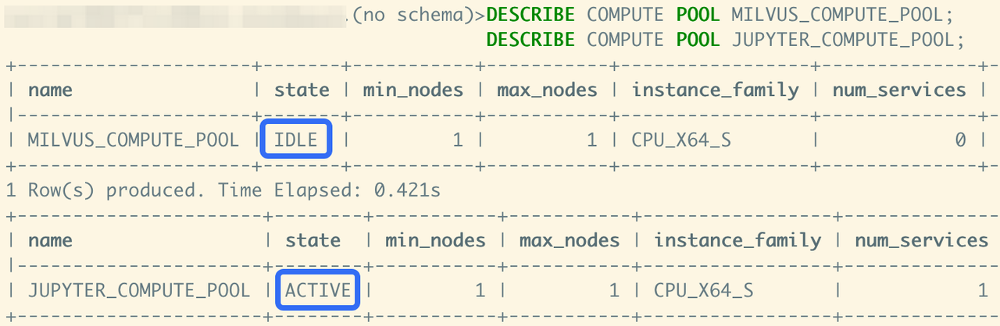
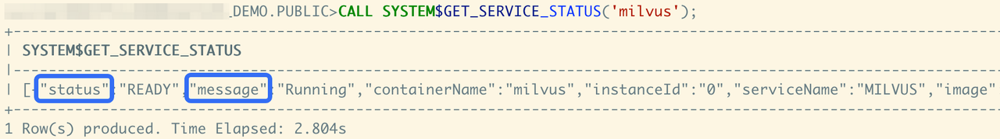
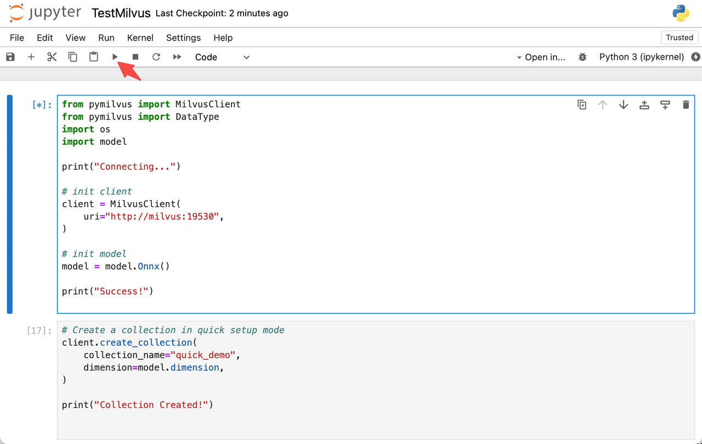
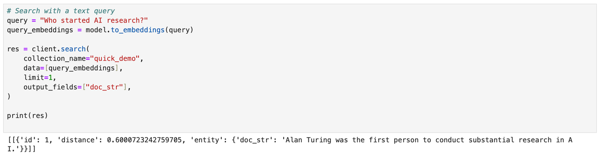

# Milvus 在 Snowpark 容器服务上的应用

本指南演示了如何在 Snowpark 容器服务上启动 Milvus 演示。

## 关于 Snowpark 容器服务

Snowpark 容器服务是一个完全托管的容器服务，旨在促进在 Snowflake 生态系统内部部署、管理和扩展容器化应用程序。该服务使用户能够直接在 Snowflake 中运行容器化工作负载，确保数据无需移出 Snowflake 环境进行处理。欲了解更多信息，请参阅官方介绍：[Snowpark 容器服务](https://docs.snowflake.com/en/developer-guide/snowpark-container-services/overview)。

## 配置 Milvus 演示

以下内容将帮助用户了解 Milvus 的功能以及如何通过配置和代码在 Snowpark 容器服务中使用 Milvus。

### 1. 获取账户信息

下载 SPCS 客户端：[SnowSQL](https://docs.snowflake.com/en/user-guide/snowsql-install-config)，然后登录您的账户。

```shell
snowsql -a ${instance_name} -u ${user_name}
```

`${instance_name}` 的规则是 `${org_name}-${acct_name}`。相关信息可通过登录 [app.snowflake.com](http://app.snowflake.com/sn) 并查看个人账户信息来获取。


### 2. 配置角色和权限

配置 OAUTH 集成。

```sql
USE ROLE ACCOUNTADMIN;
CREATE SECURITY INTEGRATION SNOWSERVICES_INGRESS_OAUTH
  TYPE=oauth
  OAUTH_CLIENT=snowservices_ingress
  ENABLED=true;
  
USE ROLE ACCOUNTADMIN;
GRANT BIND SERVICE ENDPOINT ON ACCOUNT TO ROLE SYSADMIN;
```

为服务创建一个角色，注意这里的 `${PASSWORD}` 部分在演示时需要用户替换。

```sql
USE ROLE SECURITYADMIN;
CREATE ROLE MILVUS_ROLE;

USE ROLE USERADMIN;
CREATE USER milvus_user
  PASSWORD='milvususerok'
  DEFAULT_ROLE = MILVUS_ROLE
  DEFAULT_SECONDARY_ROLES = ('ALL')
  MUST_CHANGE_PASSWORD = FALSE;
  
USE ROLE SECURITYADMIN;
GRANT ROLE MILVUS_ROLE TO USER milvus_user;
```

### 3. 创建数据存储配置

- 创建仓库和数据库

    ```sql
    USE ROLE SYSADMIN;
    CREATE OR REPLACE WAREHOUSE MILVUS_WAREHOUSE WITH
    WAREHOUSE_SIZE='X-SMALL'
    AUTO_SUSPEND = 180
    AUTO_RESUME = true
    INITIALLY_SUSPENDED=false;
    
    USE ROLE SYSADMIN;
    CREATE DATABASE IF NOT EXISTS MILVUS_DEMO;
    USE DATABASE MILVUS_DEMO;
    CREATE IMAGE REPOSITORY MILVUS_DEMO.PUBLIC.MILVUS_REPO;
    CREATE OR REPLACE STAGE YAML_STAGE;
    CREATE OR REPLACE STAGE DATA ENCRYPTION = (TYPE = 'SNOWFLAKE_SSE');
```
```sql
    CREATE OR REPLACE STAGE FILES ENCRYPTION = (TYPE = 'SNOWFLAKE_SSE');
```

- 授予角色权限

    ```sql
    USE ROLE SECURITYADMIN;
    GRANT ALL PRIVILEGES ON DATABASE MILVUS_DEMO TO MILVUS_ROLE;
    GRANT ALL PRIVILEGES ON SCHEMA MILVUS_DEMO.PUBLIC TO MILVUS_ROLE;
    GRANT ALL PRIVILEGES ON WAREHOUSE MILVUS_WAREHOUSE TO MILVUS_ROLE;
    GRANT ALL PRIVILEGES ON STAGE MILVUS_DEMO.PUBLIC.FILES TO MILVUS_ROLE;
    ```

- 配置 ACL

    ```sql
    USE ROLE ACCOUNTADMIN;
    USE DATABASE MILVUS_DEMO;
    USE SCHEMA PUBLIC;
    CREATE NETWORK RULE allow_all_rule
    TYPE = 'HOST_PORT'
    MODE= 'EGRESS'
    VALUE_LIST = ('0.0.0.0:443','0.0.0.0:80');
    
    CREATE EXTERNAL ACCESS INTEGRATION allow_all_eai
    ALLOWED_NETWORK_RULES=(allow_all_rule)
    ENABLED=TRUE;
    
    GRANT USAGE ON INTEGRATION allow_all_eai TO ROLE SYSADMIN;
    ```

### 4. 创建镜像

Milvus 使用的镜像需要在本地构建，然后由用户上传。有关镜像的相关配置，请参考[此存储库](https://github.com/dald001/milvus_on_spcs)。克隆代码后，转到项目的根目录准备构建镜像。

- 在本地构建镜像

    打开本地 shell 并开始构建镜像。

    ```shell
    cd ${repo_git_root_path}
    docker build --rm --no-cache --platform linux/amd64 -t milvus ./images/milvus
    docker build --rm --no-cache --platform linux/amd64 -t jupyter ./images/jupyter
    ```

    这里有两个镜像，第一个是运行 Milvus 数据库的，第二个是用于显示的笔记本。

    构建本地镜像后，准备标记并上传它们。

- 标记构建的镜像

    登录到 SPCS 的 Docker Hub。

    ```shell
    docker login ${instance_name}.registry.snowflakecomputing.com -u ${user_name}
    ```

    现在可以为 spcs 标记镜像了。

    ```shell
    docker tag milvus ${instance_name}.registry.snowflakecomputing.com/milvus_demo/public/milvus_repo/milvus
    docker tag jupyter ${instance_name}.registry.snowflakecomputing.com/milvus_demo/public/milvus_repo/jupyter
    ```

    然后在本地 shell 中使用 `docker images | grep milvus` 检查镜像是否已成功打包和标记。

    ```shell
    docker images | grep milvus

    ${instance_name}.registry.snowflakecomputing.com/milvus_demo/public/milvus_repo/milvus    latest        3721bbb8f62b   2 days ago    2.95GB
    ${instance_name}.registry.snowflakecomputing.com/milvus_demo/public/milvus_repo/jupyter   latest        20633f5bcadf   2 days ago    2GB
    ```

- 将镜像推送到 SPCS

    ```shell
    docker push ${instance_name}.registry.snowflakecomputing.com/milvus_demo/public/milvus_repo/milvus
    docker push ${instance_name}.registry.snowflakecomputing.com/milvus_demo/public/milvus_repo/jupyter
    ```

### 5. 创建并启动服务

让我们回到 SnowSQL shell。

- 创建计算池
```
```sql
使用 SYSADMIN 角色;
创建计算池（如果不存在）MILVUS_COMPUTE_POOL
  最小节点数 = 1
  最大节点数 = 1
  实例族 = CPU_X64_S
  自动恢复 = true;
创建计算池（如果不存在）JUPYTER_COMPUTE_POOL
  最小节点数 = 1
  最大节点数 = 1
  实例族 = CPU_X64_S
  自动恢复 = true;
```
检查计算池，直到状态为`ACTIVE`或`IDLE`。

```sql
DESCRIBE COMPUTE POOL MILVUS_COMPUTE_POOL;
DESCRIBE COMPUTE POOL JUPYTER_COMPUTE_POOL;
```



- 上传规范文件

创建计算池后，开始准备服务的规范文件。这些文件也在[此存储库](https://github.com/dald001/milvus_on_spcs)中。请参考规范目录。

打开这两个服务的规范文件，在规范文件中找到`${org_name}-${acct_name}`，将其替换为您自己帐户的`${instance_name}`。修改后，使用 SnowSQL 完成上传。

```sql
PUT file://${path/to/jupyter.yaml} @yaml_stage overwrite=true auto_compress=false;
PUT file://${path/to/milvus.yaml} @yaml_stage overwrite=true auto_compress=false;
```

- 创建服务

上传完成后，您可以开始创建服务，继续完成创建服务的过程。

```sql
USE ROLE SYSADMIN;
USE DATABASE MILVUS_DEMO;
USE SCHEMA PUBLIC;

CREATE SERVICE MILVUS
  IN COMPUTE POOL MILVUS_COMPUTE_POOL 
  FROM @YAML_STAGE
  SPEC='milvus.yaml'
  MIN_INSTANCES=1
  MAX_INSTANCES=1;

CREATE SERVICE JUPYTER
  IN COMPUTE POOL JUPYTER_COMPUTE_POOL 
  FROM @YAML_STAGE
  SPEC='jupyter.yaml'
  MIN_INSTANCES=1
  MAX_INSTANCES=1;
```

服务也可以通过`SHOW SERVICES;`查看。

```sql
SHOW SERVICES;

+---------+---------------+-------------+----------+----------------------+--------------------------------------------------------+-----------------
| name    | database_name | schema_name | owner    | compute_pool         | dns_name                                               | ......
|---------+---------------+-------------+----------+----------------------+--------------------------------------------------------+-----------------
| JUPYTER | MILVUS_DEMO   | PUBLIC      | SYSADMIN | JUPYTER_COMPUTE_POOL | jupyter.public.milvus-demo.snowflakecomputing.internal | ...... 
| MILVUS  | MILVUS_DEMO   | PUBLIC      | SYSADMIN | MILVUS_COMPUTE_POOL  | milvus.public.milvus-demo.snowflakecomputing.internal  | ......
+---------+---------------+-------------+----------+----------------------+--------------------------------------------------------+-----------------
```

如果在启动服务时遇到问题，可以通过`CALL SYSTEM$GET_SERVICE_STATUS('milvus');`查看服务信息。



可以通过`CALL SYSTEM$GET_SERVICE_LOGS('milvus', '0', 'milvus', 10);`获取更多信息。

## 使用笔记本

使用**SnowSQL**授予权限。

```sql
USE ROLE SECURITYADMIN;
GRANT USAGE ON SERVICE MILVUS_DEMO.PUBLIC.JUPYTER TO ROLE MILVUS_ROLE;
```

然后查看并记录 Jupyter 笔记本的端点。

```sql
USE ROLE SYSADMIN;
SHOW ENDPOINTS IN SERVICE MILVUS_DEMO.PUBLIC.JUPYTER;
```
记录`ingress_url`部分的信息，然后打开浏览器，输入`ingress_url`，使用`milvus_user`账户登录网站。


通过`ingress_url`打开笔记本，在页面上双击`TestMilvus.ipynb`文件以尝试使用Milvus。选择代码块的第一部分，然后点击**运行**按钮开始建立连接并初始化嵌入函数。



建立连接后，继续点击**运行**。在嵌入处理后，代码将把一段文本转换为向量数据，然后插入到Milvus中。

```python
docs = [
    "人工智能学科成立于1956年。",
    "艾伦·图灵是进行大量AI研究的第一人。",
    "图灵出生于伦敦梅达维尔，成长在英格兰南部。",
]
```

然后使用文本作为查询："谁开始了AI研究？"，在嵌入处理后执行查询，最终获取并显示最相关的结果。



要了解更多关于Milvus客户端的用法，可以参考[Milvus文档](quickstart.md)部分。

## 7. 清理

验证完成后，可以使用SnowSQL清理服务、角色和数据资源。

```sql
USE ROLE ACCOUNTADMIN;
DROP USER milvus_user;

USE ROLE SYSADMIN;
DROP SERVICE MILVUS;
DROP SERVICE JUPYTER;

DROP COMPUTE POOL MILVUS_COMPUTE_POOL;
DROP COMPUTE POOL JUPYTER_COMPUTE_POOL;

DROP IMAGE REPOSITORY MILVUS_DEMO.PUBLIC.MILVUS_REPO;
DROP DATABASE MILVUS_DEMO;
DROP WAREHOUSE MILVUS_WAREHOUSE;

USE ROLE ACCOUNTADMIN;
DROP ROLE MILVUS_ROLE;
DROP SECURITY INTEGRATION SNOWSERVICES_INGRESS_OAUTH;
```

## 关于Milvus

要了解更多关于Milvus的信息，可以从[Milvus简介](overview.md)和[快速入门](quickstart.md)开始。当然，还有关于API的更详细介绍，可以参考[Python](https://milvus.io/api-reference/pymilvus/v2.4.x/About.md)和[Java](https://milvus.io/api-reference/java/v2.3.x/About.md)版本，还有关于[嵌入](https://milvus.io/docs/embeddings.md)和[集成](https://milvus.io/docs/integrate_with_openai.md)的信息供参考。