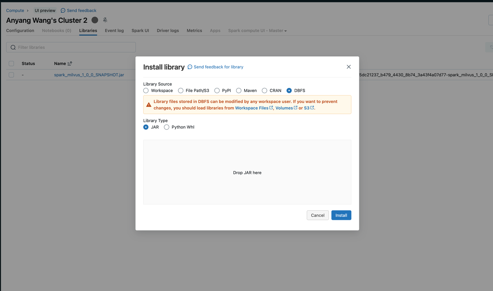

# Spark-Milvus 连接器用户指南

Spark-Milvus 连接器 (https://github.com/zilliztech/spark-milvus) 实现了 Apache Spark 和 Milvus 之间的无缝集成，将 Apache Spark 的数据处理和机器学习功能与 Milvus 的向量数据存储和搜索能力结合起来。这种集成实现了各种有趣的应用，包括：

- 高效地将向量数据批量加载到 Milvus 中，
- 在 Milvus 和其他存储系统或数据库之间移动数据，
- 利用 Spark MLlib 和其他人工智能工具分析 Milvus 中的数据。

## 快速开始

### 准备工作

Spark-Milvus 连接器支持 Scala 和 Python 编程语言。用户可以在 **Pyspark** 或 **Spark-shell** 中使用它。要运行此演示，请按照以下步骤设置包含 Spark-Milvus 连接器依赖项的 Spark 环境：

1. 安装 Apache Spark (版本 >= 3.3.0)

    您可以参考 [官方文档](https://spark.apache.org/docs/latest/) 安装 Apache Spark。

2. 下载 **spark-milvus** jar 文件。

    ```
    wget https://github.com/zilliztech/spark-milvus/raw/1.0.0-SNAPSHOT/output/spark-milvus-1.0.0-SNAPSHOT.jar
    ```

3. 使用 **spark-milvus** jar 作为依赖项启动 Spark 运行时。

    要启动带有 Spark-Milvus 连接器的 Spark 运行时，请将下载的 **spark-milvus** 添加为依赖项。

    - **pyspark**

        ```
        ./bin/pyspark --jars spark-milvus-1.0.0-SNAPSHOT.jar
        ```

    - **spark-shell**

        ```
        ./bin/spark-shell --jars spark-milvus-1.0.0-SNAPSHOT.jar
        ```

### 演示

在此演示中，我们创建一个带有向量数据的示例 Spark DataFrame，并通过 Spark-Milvus 连接器将其写入 Milvus。将根据模式和指定的选项自动在 Milvus 中创建一个集合。

<div class="multipleCode">
  <a href="#python">Python </a>
  <a href="#scala">Scala</a>
</div>

```python
from pyspark.sql import SparkSession

columns = ["id", "text", "vec"]
data = [(1, "a", [1.0,2.0,3.0,4.0,5.0,6.0,7.0,8.0]),
    (2, "b", [1.0,2.0,3.0,4.0,5.0,6.0,7.0,8.0]),
    (3, "c", [1.0,2.0,3.0,4.0,5.0,6.0,7.0,8.0]),
    (4, "d", [1.0,2.0,3.0,4.0,5.0,6.0,7.0,8.0])]
sample_df = spark.sparkContext.parallelize(data).toDF(columns)
sample_df.write \
    .mode("append") \
    .option("milvus.host", "localhost") \
    .option("milvus.port", "19530") \
    .option("milvus.collection.name", "hello_spark_milvus") \
    .option("milvus.collection.vectorField", "vec") \
    .option("milvus.collection.vectorDim", "8") \
    .option("milvus.collection.primaryKeyField", "id") \
    .format("milvus") \
    .save()
```
```scala
import org.apache.spark.sql.{SaveMode, SparkSession}

object Hello extends App {

  val spark = SparkSession.builder().master("local[*]")
    .appName("HelloSparkMilvus")
    .getOrCreate()

  import spark.implicits._

  // 创建 DataFrame
  val sampleDF = Seq(
    (1, "a", Seq(1.0,2.0,3.0,4.0,5.0)),
    (2, "b", Seq(1.0,2.0,3.0,4.0,5.0)),
    (3, "c", Seq(1.0,2.0,3.0,4.0,5.0)),
    (4, "d", Seq(1.0,2.0,3.0,4.0,5.0))
  ).toDF("id", "text", "vec")

  // 设置 Milvus 选项
  val milvusOptions = Map(
      "milvus.host" -> "localhost" -> uri,
      "milvus.port" -> "19530",
      "milvus.collection.name" -> "hello_spark_milvus",
      "milvus.collection.vectorField" -> "vec",
      "milvus.collection.vectorDim" -> "5",
      "milvus.collection.primaryKeyField", "id"
    )
    
  sampleDF.write.format("milvus")
    .options(milvusOptions)
    .mode(SaveMode.Append)
    .save()
}
```
在执行上述代码后，您可以使用 SDK 或 Attu（一个 Milvus 仪表板）查看 Milvus 中插入的数据。您可以找到一个名为 `hello_spark_milvus` 的集合，其中已经插入了 4 个实体。

## 特性与概念

### Milvus 选项

在[快速入门](#Quick-start)部分，我们展示了在与 Milvus 进行操作时设置选项。这些选项被抽象为 Milvus 选项。它们用于创建与 Milvus 的连接并控制其他 Milvus 行为。并非所有选项都是必需的。

| 选项键 | 默认值 | 描述 |
| ------ | ------ | ---- |
| `milvus.host` | `localhost` | Milvus 服务器主机。详细信息请参阅[管理 Milvus 连接](https://milvus.io/docs/manage_connection.md)。 |
| `milvus.port` | `19530` | Milvus 服务器端口。详细信息请参阅[管理 Milvus 连接](https://milvus.io/docs/manage_connection.md)。 |
| `milvus.username` | `root` | Milvus 服务器的用户名。详细信息请参阅[管理 Milvus 连接](https://milvus.io/docs/manage_connection.md)。 |
| `milvus.password` | `Milvus` | Milvus 服务器的密码。详细信息请参阅[管理 Milvus 连接](https://milvus.io/docs/manage_connection.md)。 |
| `milvus.uri` | `--` | Milvus 服务器 URI。详细信息请参阅[管理 Milvus 连接](https://milvus.io/docs/manage_connection.md)。 |
| `milvus.token` | `--` | Milvus 服务器令牌。详细信息请参阅[管理 Milvus 连接](https://milvus.io/docs/manage_connection.md)。 |
| `milvus.database.name` | `default` | 要读取或写入的 Milvus 数据库名称。 |
| `milvus.collection.name` | `hello_milvus` | 要读取或写入的 Milvus 集合名称。 |
| `milvus.collection.primaryKeyField` | `None` | 集合中主键字段的名称。如果集合不存在，则此项为必填。 |
| `milvus.collection.vectorField` | `None` | 集合中向量字段的名称。如果集合不存在，则此项为必填。 |
| `milvus.collection.vectorDim` | `None` | 集合中向量字段的维度。如果集合不存在，则此项为必填。 |
| `milvus.collection.autoID` | `false` | 如果集合不存在，此选项指定是否为实体自动生成 ID。有关更多信息，请参阅[create_collection](https://milvus.io/docs/create_collection.md)。 |
| `milvus.bucket` | `a-bucket` | Milvus 存储中的存储桶名称。这应与 [milvus.yaml](https://github.com/milvus-io/milvus/blob/master/configs/milvus.yaml) 中的 `minio.bucketName` 相同。 |
| `milvus.rootpath` | `files` | Milvus 存储的根路径。这应与 [milvus.yaml](https://github.com/milvus-io/milvus/blob/master/configs/milvus.yaml) 中的 `minio.rootpath` 相同。 |
| `milvus.fs` | `s3a://` | Milvus 存储的文件系统。值 `s3a://` 适用于开源 Spark。对于 Databricks，请使用 `s3://`。 |
| `milvus.storage.endpoint` | `localhost:9000` | Milvus 存储的端点。这应该与 [milvus.yaml](https://github.com/milvus-io/milvus/blob/master/configs/milvus.yaml) 中的 `minio.address`:`minio.port` 相同。 |
| `milvus.storage.user` | `minioadmin` | Milvus 存储的用户。这应该与 [milvus.yaml](https://github.com/milvus-io/milvus/blob/master/configs/milvus.yaml) 中的 `minio.accessKeyID` 相同。 |
| `milvus.storage.password` | `minioadmin` | Milvus 存储的密码。这应该与 [milvus.yaml](https://github.com/milvus-io/milvus/blob/master/configs/milvus.yaml) 中的 `minio.secretAccessKey` 相同。 |
| `milvus.storage.useSSL` | `false` | 是否在 Milvus 存储中使用 SSL。这应该与 [milvus.yaml](https://github.com/milvus-io/milvus/blob/master/configs/milvus.yaml) 中的 `minio.useSSL` 相同。 |

## Milvus 数据格式

Spark-Milvus 连接器支持以下 Milvus 数据格式的读取和写入：

- `milvus`：Milvus 数据格式，用于将 Spark DataFrame 无缝转换为 Milvus 实体。
- `milvusbinlog`：用于读取 Milvus 内置 binlog 数据的 Milvus 数据格式。
- `mjson`：用于将数据批量插入 Milvus 的 Milvus JSON 格式。

### milvus

在 [快速入门](#Quick-start) 中，我们使用 **milvus** 格式将示例数据写入 Milvus 集群。**milvus** 格式是一种新的数据格式，支持将 Spark DataFrame 数据无缝写入 Milvus 集合。这是通过对 Milvus SDK 的插入 API 进行批量调用来实现的。如果 Milvus 中不存在集合，则将根据 Dataframe 的模式创建新集合。但是，自动创建的集合可能不支持集合模式的所有功能。因此，建议先通过 SDK 创建集合，然后使用 spark-milvus 进行写入。有关更多信息，请参阅 [演示](https://github.com/zilliztech/spark-milvus/blob/main/examples/src/main/scala/InsertDemo.scala)。

### milvusbinlog

新的数据格式 **milvusbinlog** 用于读取 Milvus 内置的 binlog 数据。Binlog 是基于 Parquet 的 Milvus 内部数据存储格式。不幸的是，它无法被常规的 Parquet 库读取，因此我们实现了这种新的数据格式来帮助 Spark 作业读取它。
不建议直接使用 **milvusbinlog**，除非您熟悉 Milvus 的内部存储细节。我们建议使用下一节中将介绍的 [MilvusUtils](#MilvusUtils) 函数。

```scalar
val df = spark.read
  .format("milvusbinlog")
  .load(path)
  .withColumnRenamed("val", "embedding")
```

### mjson

Milvus 提供了 [Bulkinsert](https://milvus.io/docs/bulk_insert.md) 功能，用于在处理大型数据集时提供更好的写入性能。然而，Milvus 使用的 JSON 格式与 Spark 的默认 JSON 输出格式略有不同。
为了解决这个问题，我们引入了 **mjson** 数据格式，以生成符合 Milvus 要求的数据。以下是一个示例，展示了 JSON-lines 和 **mjson** 之间的区别：

- JSON-lines:

    ```json
    {"book_id": 101, "word_count": 13, "book_intro": [1.1, 1.2]}
    {"book_id": 102, "word_count": 25, "book_intro": [2.1, 2.2]}
    {"book_id": 103, "word_count": 7, "book_intro": [3.1, 3.2]}
    {"book_id": 104, "word_count": 12, "book_intro": [4.1, 4.2]}
    {"book_id": 105, "word_count": 34, "book_intro": [5.1, 5.2]}
    ```

- mjson (Milvus Bulkinsert 所需):

    ```json
    {
        "rows":[
            {"book_id": 101, "word_count": 13, "book_intro": [1.1, 1.2]},
            {"book_id": 102, "word_count": 25, "book_intro": [2.1, 2.2]},
            {"book_id": 103, "word_count": 7, "book_intro": [3.1, 3.2]},
            {"book_id": 104, "word_count": 12, "book_intro": [4.1, 4.2]},
            {"book_id": 105, "word_count": 34, "book_intro": [5.1, 5.2]}
        ]
    }
    ```

这将在未来得到改进。如果您的 Milvus 版本是 v2.3.7+，支持 Parquet 格式的 bulkinsert，我们建议在 spark-milvus 集成中使用 parquet 格式。请参阅 [Demo](https://github.com/zilliztech/spark-milvus/blob/main/examples/src/main/scala/BulkInsertDemo.scala) 在 Github 上的示例。

## MilvusUtils

MilvusUtils 包含几个有用的工具函数。目前仅支持 Scala。更多用法示例请参见 [Advanced Usage](#Advanced-Usage) 部分。

### MilvusUtils.readMilvusCollection

**MilvusUtils.readMilvusCollection** 是一个简单的接口，用于将整个 Milvus 集合加载到 Spark Dataframe 中。它封装了各种操作，包括调用 Milvus SDK、读取 **milvusbinlog** 和常见的 union/join 操作。

```scala
val collectionDF = MilvusUtils.readMilvusCollection(spark, milvusOptions)
```

### MilvusUtils.bulkInsertFromSpark

**MilvusUtils.bulkInsertFromSpark** 提供了一种方便的方式，将 Spark 输出文件批量导入 Milvus。它封装了 Milvus SDK 的 **Bullkinsert** API。

```scala
df.write.format("parquet").save(outputPath)
MilvusUtils.bulkInsertFromSpark(spark, milvusOptions, outputPath, "parquet")
```

## Advanced Usage

在本节中，您将找到 Spark-Milvus 连接器用于数据分析和迁移的高级用法示例。更多演示，请参见 [examples](https://github.com/zilliztech/spark-milvus/tree/main/examples/src/main/scala)。

### MySQL -> embedding -> Milvus

在这个演示中，我们将

1. 通过 Spark-MySQL 连接器从 MySQL 中读取数据，
2. 生成嵌入（以 Word2Vec 为例），以及
3. 将嵌入数据写入 Milvus。

要启用 Spark-MySQL 连接器，您需要将以下依赖项添加到您的 Spark 环境中：

```
spark-shell --jars spark-milvus-1.0.0-SNAPSHOT.jar,mysql-connector-j-x.x.x.jar
```
```scala
import org.apache.spark.ml.feature.{Tokenizer, Word2Vec}
import org.apache.spark.sql.functions.udf
import org.apache.spark.sql.{SaveMode, SparkSession}
import zilliztech.spark.milvus.MilvusOptions._

import org.apache.spark.ml.linalg.Vector

object Mysql2MilvusDemo extends App {

  val spark = SparkSession.builder().master("local[*]")
    .appName("Mysql2MilvusDemo")
    .getOrCreate()

  import spark.implicits_

  // 创建 DataFrame
  val sampleDF = Seq(
    (1, "Milvus was created in 2019 with a singular goal: store, index, and manage massive embedding vectors generated by deep neural networks and other machine learning (ML) models."),
    (2, "As a database specifically designed to handle queries over input vectors, it is capable of indexing vectors on a trillion scale. "),
    (3, "Unlike existing relational databases which mainly deal with structured data following a pre-defined pattern, Milvus is designed from the bottom-up to handle embedding vectors converted from unstructured data."),
    (4, "As the Internet grew and evolved, unstructured data became more and more common, including emails, papers, IoT sensor data, Facebook photos, protein structures, and much more.")
  ).toDF("id", "text")

  // 写入到 MySQL 表
  sampleDF.write
    .mode(SaveMode.Append)
    .format("jdbc")
    .option("driver", "com.mysql.cj.jdbc.Driver")
    .option("url", "jdbc:mysql://localhost:3306/test")
    .option("dbtable", "demo")
    .option("user", "root")
    .option("password", "123456")
    .save()

  // 从 MySQL 表中读取数据
  val dfMysql = spark.read
    .format("jdbc")
    .option("driver", "com.mysql.cj.jdbc.Driver")
    .option("url", "jdbc:mysql://localhost:3306/test")
    .option("dbtable", "demo")
    .option("user", "root")
    .option("password", "123456")
    .load()

  val tokenizer = new Tokenizer().setInputCol("text").setOutputCol("tokens")
  val tokenizedDf = tokenizer.transform(dfMysql)

  // 学习从单词到向量的映射
  val word2Vec = new Word2Vec()
    .setInputCol("tokens")
    .setOutputCol("vectors")
    .setVectorSize(128)
    .setMinCount(0)
  val model = word2Vec.fit(tokenizedDf)

  val result = model.transform(tokenizedDf)

  val vectorToArrayUDF = udf((v: Vector) => v.toArray)
  // 将 UDF 应用到 DataFrame
  val resultDF = result.withColumn("embedding", vectorToArrayUDF($"vectors"))
  val milvusDf = resultDF.drop("tokens").drop("vectors")

  milvusDf.write.format("milvus")
    .option(MILVUS_HOST, "localhost")
    .option(MILVUS_PORT, "19530")
    .option(MILVUS_COLLECTION_NAME, "text_embedding")
    .option(MILVUS_COLLECTION_VECTOR_FIELD, "embedding")
    .option(MILVUS_COLLECTION_VECTOR_DIM, "128")
    .option(MILVUS_COLLECTION_PRIMARY_KEY, "id")
    .mode(SaveMode.Append)
    .save()
}
```
### Milvus -> 转换 -> Milvus

在这个演示中，我们将：

1. 从 Milvus 集合中读取数据，
2. 应用一个转换（以 PCA 为例），以及
3. 将转换后的数据通过 Bulkinsert API 写入另一个 Milvus。

<div class="alert notes">

PCA 模型是一个降低嵌入向量维度的转换模型，在机器学习中是一种常见操作。
您可以在转换步骤中添加任何其他处理操作，比如过滤、连接或标准化。

</div>
```scala
import org.apache.spark.ml.feature.PCA
import org.apache.spark.ml.linalg.{Vector, Vectors}
import org.apache.spark.SparkConf
import org.apache.spark.sql.SparkSession
import org.apache.spark.sql.functions.udf
import org.apache.spark.sql.util.CaseInsensitiveStringMap
import zilliztech.spark.milvus.{MilvusOptions, MilvusUtils}

import scala.collection.JavaConverters._

object TransformDemo extends App {
  val sparkConf = new SparkConf().setMaster("local")
  val spark = SparkSession.builder().config(sparkConf).getOrCreate()

  import spark.implicits._

  val host = "localhost"
  val port = 19530
  val user = "root"
  val password = "Milvus"
  val fs = "s3a://"
  val bucketName = "a-bucket"
  val rootPath = "files"
  val minioAK = "minioadmin"
  val minioSK = "minioadmin"
  val minioEndpoint = "localhost:9000"
  val collectionName = "hello_spark_milvus1"
  val targetCollectionName = "hello_spark_milvus2"

  val properties = Map(
    MilvusOptions.MILVUS_HOST -> host,
    MilvusOptions.MILVUS_PORT -> port.toString,
    MilvusOptions.MILVUS_COLLECTION_NAME -> collectionName,
    MilvusOptions.MILVUS_BUCKET -> bucketName,
    MilvusOptions.MILVUS_ROOTPATH -> rootPath,
    MilvusOptions.MILVUS_FS -> fs,
    MilvusOptions.MILVUS_STORAGE_ENDPOINT -> minioEndpoint,
    MilvusOptions.MILVUS_STORAGE_USER -> minioAK,
    MilvusOptions.MILVUS_STORAGE_PASSWORD -> minioSK,
  )

  // 1, 配置
  val milvusOptions = new MilvusOptions(new CaseInsensitiveStringMap(properties.asJava))

  // 2, 批量读取 milvus 集合数据到 dataframe
  //  Schema: `embeddings` 的维度为 8
  // +-+------------+------------+------------------+
  // | | 字段名     | 字段类型    | 其他属性          |
  // +-+------------+------------+------------------+
  // |1|    "pk"    |    Int64   |  is_primary=True |
  // | |            |            |   auto_id=False  |
  // +-+------------+------------+------------------+
  // |2|  "random"  |    Double  |                  |
  // +-+------------+------------+------------------+
  // |3|"embeddings"| FloatVector|     dim=8        |
  // +-+------------+------------+------------------+
  val arrayToVectorUDF = udf((arr: Seq[Double]) => Vectors.dense(arr.toArray[Double]))
  val collectionDF = MilvusUtils.readMilvusCollection(spark, milvusOptions)
    .withColumn("embeddings_vec", arrayToVectorUDF($"embeddings"))
    .drop("embeddings")
  
  // 3. 使用 PCA 降低向量维度
  val dim = 4
  val pca = new PCA()
    .setInputCol("embeddings_vec")
    .setOutputCol("pca_vec")
    .setK(dim)
    .fit(collectionDF)
  val vectorToArrayUDF = udf((v: Vector) => v.toArray)
  // embeddings 维度降至 4
  // +-+------------+------------+------------------+
  // | | 字段名     | 字段类型    | 其他属性          |
  // +-+------------+------------+------------------+
  // |1|    "pk"    |    Int64   |  is_primary=True |
  // | |            |            |   auto_id=False  |
  // +-+------------+------------+------------------+
  // |2|  "random"  |    Double  |                  |
  // +-+------------+------------+------------------+
  // |3|"embeddings"| FloatVector|     dim=4        |
  // +-+------------+------------+------------------+
  val pcaDf = pca.transform(collectionDF)
    .withColumn("embeddings", vectorToArrayUDF($"pca_vec"))
    .select("pk", "random", "embeddings")

  // 4. 将 PCA 处理后的数据写入 S3
  val outputPath = "s3a://a-bucket/result"
  pcaDf.write
    .mode("overwrite")
    .format("parquet")
    .save(outputPath)

  // 5. 配置目标表的 MilvusOptions  
  val targetProperties = Map(
    MilvusOptions.MILVUS_HOST -> host,
    MilvusOptions.MILVUS_PORT -> port.toString,
    MilvusOptions.MILVUS_COLLECTION_NAME -> targetCollectionName,
    MilvusOptions.MILVUS_BUCKET -> bucketName,
    MilvusOptions.MILVUS_ROOTPATH -> rootPath,
    MilvusOptions.MILVUS_FS -> fs,
    MilvusOptions.MILVUS_STORAGE_ENDPOINT -> minioEndpoint,
    MilvusOptions.MILVUS_STORAGE_USER -> minioAK,
    MilvusOptions.MILVUS_STORAGE_PASSWORD -> minioSK,
  )
  val targetMilvusOptions = new MilvusOptions(new CaseInsensitiveStringMap(targetProperties.asJava))
  
  // 6. 将 Spark 输出文件批量插入到 milvus
  MilvusUtils.bulkInsertFromSpark(spark, targetMilvusOptions, outputPath, "parquet")
}
```
### Databricks -> Zilliz Cloud

如果您正在使用 Zilliz Cloud（托管的 Milvus 服务），您可以利用其便捷的数据导入 API。Zilliz Cloud 提供了全面的工具和文档，帮助您高效地将数据从各种数据源（包括 Spark 和 Databricks）迁移至 Zilliz Cloud。只需将一个 S3 存储桶设置为中介，并将其访问权限开放给您的 Zilliz Cloud 账户。Zilliz Cloud 的数据导入 API 将自动将完整批量的数据从 S3 存储桶加载到您的 Zilliz Cloud 集群中。

**准备工作**

1. 通过向 Databricks 集群添加一个 jar 文件来加载 Spark 运行时。

    您可以以不同的方式安装库。此截图显示了从本地上传 jar 文件到集群。有关更多信息，请参阅 Databricks 文档中的 [Cluster Libraries](https://docs.databricks.com/en/libraries/cluster-libraries.html)。

    

2. 创建一个 S3 存储桶，并将其配置为 Databricks 集群的外部存储位置。

    Bulkinsert 需要将所需数据存储在临时存储桶中，以便 Zilliz Cloud 可以批量导入数据。您可以创建一个 S3 存储桶，并将其配置为 databricks 的外部位置。请参阅 [External locations](https://docs.databricks.com/en/sql/language-manual/sql-ref-external-locations.html) 了解详情。

3. 保护您的 Databricks 凭据。

    有关更多详细信息，请参阅博客文章 [Securely Managing Credentials in Databricks](https://www.databricks.com/blog/2018/06/04/securely-managing-credentials-in-databricks.html) 中的说明。

**演示**

以下是展示批量数据迁移过程的代码片段。与上述 Milvus 示例类似，您只需替换凭据和 S3 存储桶地址。

```scala
// 将数据批量写入 Milvus 存储桶。
val outputPath = "s3://my-temp-bucket/result"
df.write
  .mode("overwrite")
  .format("mjson")
  .save(outputPath)
// 指定 Milvus 选项。
val targetProperties = Map(
  MilvusOptions.MILVUS_URI -> zilliz_uri,
  MilvusOptions.MILVUS_TOKEN -> zilliz_token,
  MilvusOptions.MILVUS_COLLECTION_NAME -> targetCollectionName,
  MilvusOptions.MILVUS_BUCKET -> bucketName,
  MilvusOptions.MILVUS_ROOTPATH -> rootPath,
  MilvusOptions.MILVUS_FS -> fs,
  MilvusOptions.MILVUS_STORAGE_ENDPOINT -> minioEndpoint,
  MilvusOptions.MILVUS_STORAGE_USER -> minioAK,
  MilvusOptions.MILVUS_STORAGE_PASSWORD -> minioSK,
)
val targetMilvusOptions = new MilvusOptions(new CaseInsensitiveStringMap(targetProperties.asJava))
  
// 将 Spark 输出文件批量插入 Milvus
MilvusUtils.bulkInsertFromSpark(spark, targetMilvusOptions, outputPath, "mjson")
```

## 实践操作

为了帮助您快速开始使用 Spark-Milvus 连接器，我们准备了一个笔记本，指导您完成使用 Milvus 和 Zilliz Cloud 进行流式处理和批量数据传输的过程。
- [Spark-Milvus 连接器实战](https://zilliz.com/databricks_zilliz_demos)