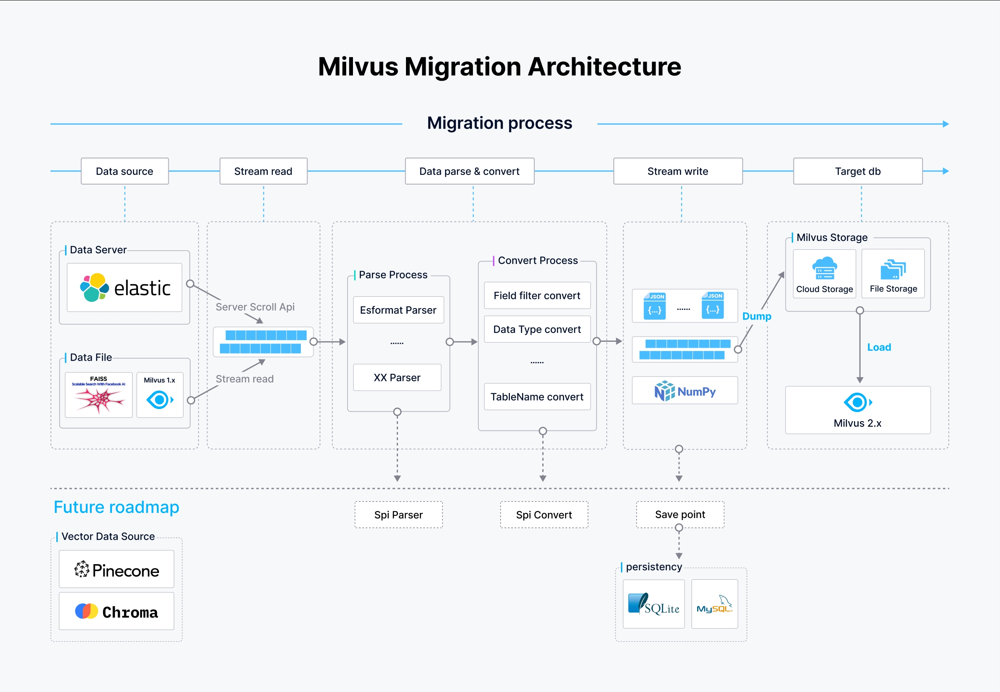

# 概述

为了满足用户群体多样化的需求，Milvus 扩展了其迁移工具，不仅可以方便地升级早期的 Milvus 1.x 版本，还可以实现与其他系统（如 [Elasticsearch](https://www.elastic.co/guide/en/elasticsearch/reference/current/elasticsearch-intro.html) 和 [Faiss](https://github.com/facebookresearch/faiss)）的数据无缝集成。[Milvus 迁移工具](https://github.com/zilliztech/milvus-migration) 项目旨在弥合这些不同数据环境与 Milvus 技术最新进展之间的差距，确保您可以无缝地利用改进的功能和性能。

## 支持的迁移

[Milvus 迁移工具](https://github.com/zilliztech/milvus-migration) 支持多种迁移路径，以满足不同用户需求：

- [从 Elasticsearch 迁移到 Milvus 2.x](es2m.md)：使用户能够迁移来自 Elasticsearch 环境的数据，以充分利用 Milvus 优化的向量搜索功能。
- [从 Faiss 迁移到 Milvus 2.x](f2m.md)：提供实验性支持，用于从 Faiss 迁移数据，Faiss 是一种用于高效相似度搜索的流行库。
- [从 Milvus 1.x 迁移到 Milvus 2.x](m2m.md)：确保早期版本的数据平稳过渡到最新的框架。

## 功能

Milvus 迁移工具具有强大的功能，可处理各种迁移场景：

- 多种交互方式：您可以通过命令行界面或 Restful API 执行迁移，灵活选择迁移执行方式。
- 支持各种文件格式和云存储：[Milvus 迁移工具](https://github.com/zilliztech/milvus-migration) 可处理存储在本地文件以及在云存储解决方案（如 S3、OSS 和 GCP）中的数据，确保广泛兼容性。
- 数据类型处理：[Milvus 迁移工具](https://github.com/zilliztech/milvus-migration) 能够处理向量数据和标量字段，是不同数据迁移需求的多功能选择。

## 架构

[Milvus 迁移工具](https://github.com/zilliztech/milvus-migration) 的架构经过精心设计，以促进高效的数据流处理、解析和写入过程，实现在各种数据源之间强大的迁移能力。

在上图中：

- **数据源**：[Milvus 迁移工具](https://github.com/zilliztech/milvus-migration) 支持多个数据源，包括通过 [scroll API](https://www.elastic.co/guide/en/elasticsearch/reference/current/scroll-api.html) 访问的 Elasticsearch、本地或云存储数据文件，以及 Milvus 1.x 数据库。这些数据源被流畅地访问和读取，以启动迁移过程。
- **流水线**：
    - **解析过程**：来自数据源的数据根据其格式进行解析。例如，对于来自Elasticsearch的数据源，将使用Elasticsearch格式解析器，而其他格式则使用相应的解析器。这一步对将原始数据转换为可进一步处理的结构化格式至关重要。
    - **转换过程**：在解析后，数据经过转换，字段被过滤，数据类型被转换，表名根据目标Milvus 2.x模式进行调整。这确保数据符合Milvus中预期的结构和类型。

- **数据写入和加载**：
    - **写入数据**：处理后的数据被写入中间JSON或NumPy文件，准备加载到Milvus 2.x中。
    - **加载数据**：数据最终通过[BulkInsert](https://milvus.io/api-reference/pymilvus/v2.4.x/ORM/utility/do_bulk_insert.md)操作加载到Milvus 2.x中，该操作可以高效地将大量数据写入Milvus存储系统，无论是基于云的还是文件存储。

## 未来计划

开发团队致力于增强[Milvus-migration](https://github.com/zilliztech/milvus-migration)，包括以下功能：

- **支持更多数据源**：计划扩展对其他数据库和文件系统的支持，如Pinecone、Chroma、Qdrant。如果您需要特定数据源的支持，请通过此[GitHub问题链接](https://github.com/zilliztech/milvus-migration/issues)提交请求。
- **简化命令**：努力简化命令流程，以便更容易执行。
- **SPI解析器** / **转换器**：架构预计包括用于解析和转换的服务提供者接口（SPI）工具。这些工具允许用户插入自定义实现到迁移过程中，以处理特定数据格式或转换规则。
- **检查点恢复**：使迁移能够从上次检查点恢复，以增强在中断情况下的可靠性和效率。保存点将被创建以确保数据完整性，并存储在诸如SQLite或MySQL之类的数据库中，以跟踪迁移过程的进展。