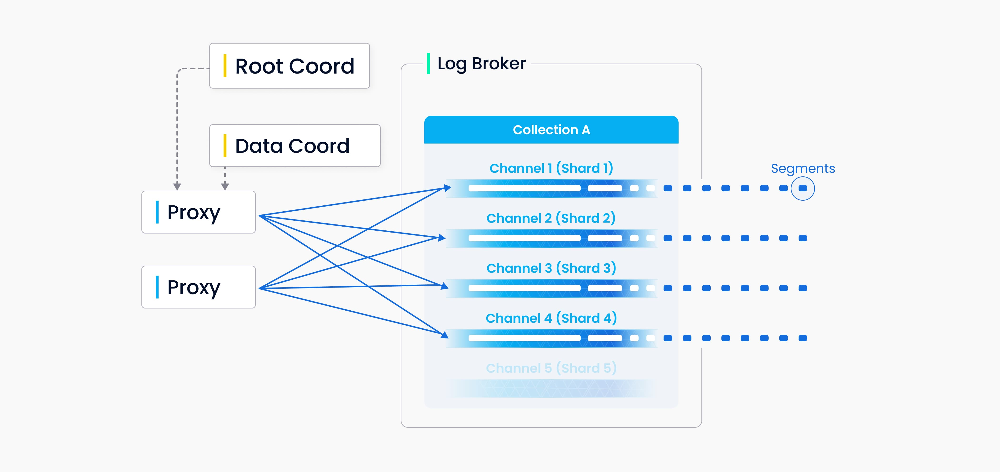
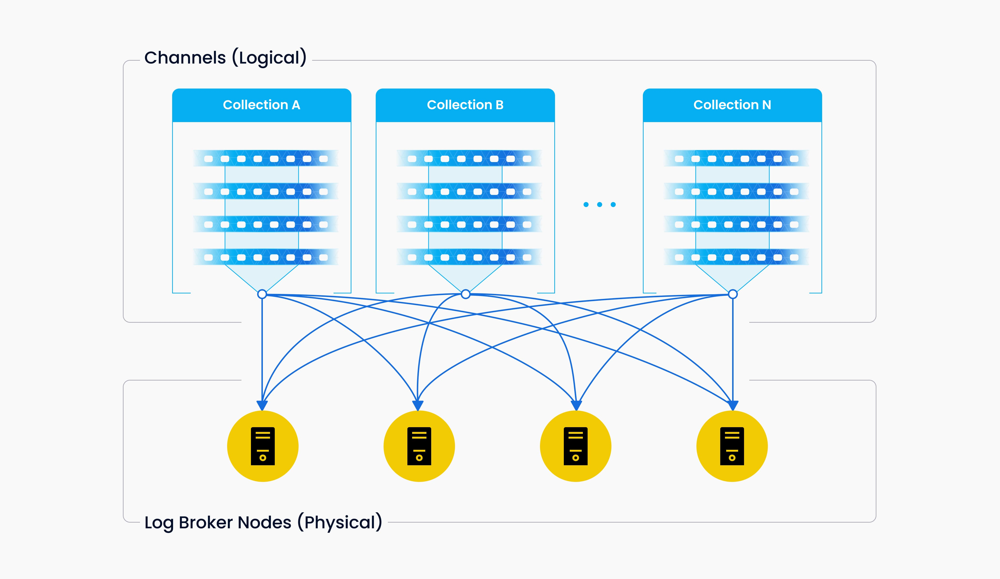
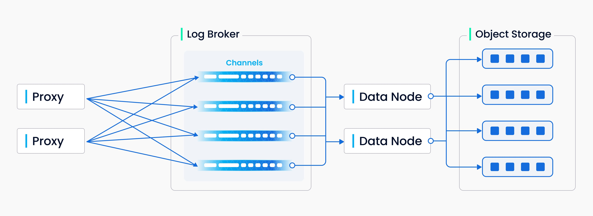
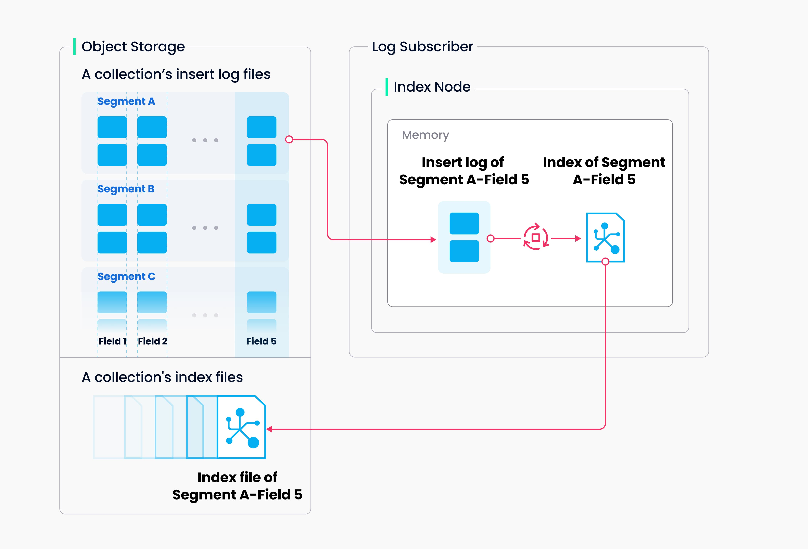
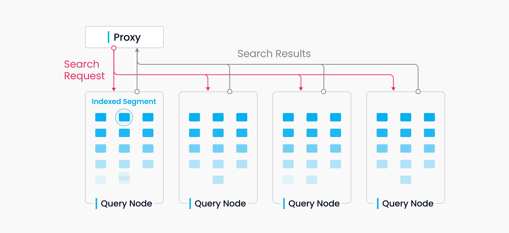
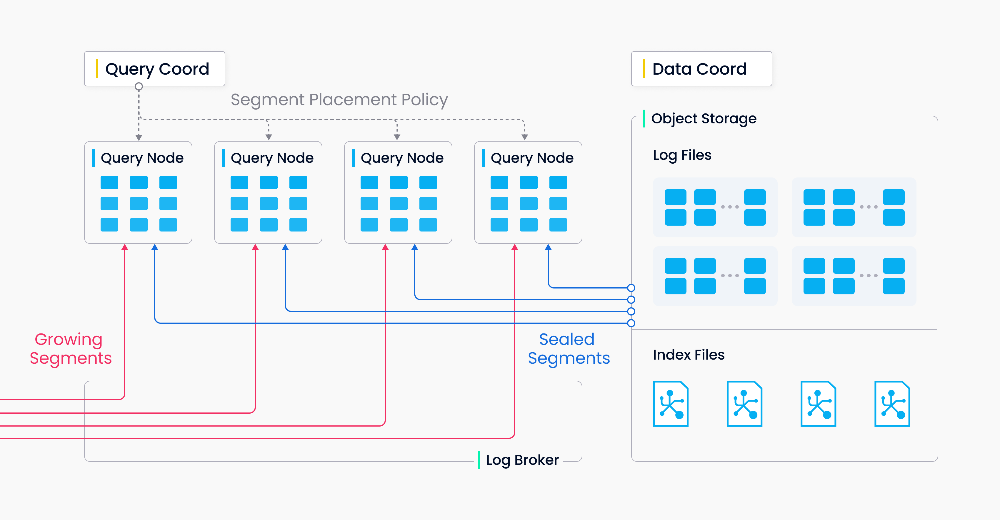

# 数据处理

本文详细描述了 Milvus 中数据插入、索引构建和数据查询的实现过程。

## 数据插入

在 Milvus 中，您可以为每个集合指定多个分片，每个分片对应一个虚拟通道（*vchannel*）。如下图所示，Milvus 为日志代理中的每个 vchannel 分配一个物理通道（*pchannel*）。任何传入的插入/删除请求都会根据主键的哈希值路由到分片。

由于 Milvus 没有复杂的事务，DML 请求的验证被提前移至代理。代理会向 TSO（时间戳 Oracle）请求每个插入/删除请求的时间戳，TSO 与根协调器共存，用于分配时间戳。较旧的时间戳会被较新的时间戳覆盖，时间戳用于确定正在处理的数据请求的顺序。代理会批量从数据协调器中检索信息，包括实体的段和主键，以增加整体吞吐量，避免过度拖累中心节点。

DML（数据操作语言）操作和 DDL（数据定义语言）操作都写入日志序列，但由于 DDL 操作发生频率较低，只分配一个通道。

*vchannel* 保存在底层的日志代理节点中。每个通道在物理上不可分割，可供任何一个节点使用，但只能供一个节点使用。当数据摄入速率达到瓶颈时，需考虑两个因素：日志代理节点是否过载需要扩展，以及是否有足够的分片以确保每个节点的负载平衡。

上图概括了写入日志序列过程中涉及的四个组件：代理、日志代理、数据节点和对象存储。该过程包括四个任务：验证 DML 请求、发布-订阅日志序列、将流式日志转换为日志快照，以及持久化日志快照。这四个任务相互解耦，以确保每个任务由其对应的节点类型处理。相同类型的节点是相等的，可以弹性扩展和独立扩展，以适应各种数据负载，特别是大规模和高度波动的流式数据。

## 索引构建

索引构建由索引节点执行。为避免针对数据更新频繁进行索引构建，在 Milvus 中，集合进一步划分为段，每个段都有自己的索引。

Milvus支持为每个向量字段、标量字段和主字段构建索引。索引构建的输入和输出都涉及对象存储：索引节点从段（位于对象存储中）加载日志快照到内存中进行索引构建，反序列化相应的数据和元数据以构建索引，在索引构建完成时序列化索引，并将其写回对象存储。

索引构建主要涉及向量和矩阵运算，因此对计算和内存要求较高。由于向量具有高维特性，传统基于树的索引无法高效索引向量，但可以使用在这一主题上更成熟的技术进行索引，例如基于聚类或图的索引。无论其类型如何，构建索引都涉及大规模向量的大量迭代计算，例如Kmeans或图遍历。

与标量数据的索引不同，构建向量索引必须充分利用SIMD（单指令，多数据）加速。Milvus天生支持SIMD指令集，例如SSE、AVX2和AVX512。鉴于向量索引构建的“暂停”和资源密集型特性，在经济方面，弹性变得至关重要。未来的Milvus版本将进一步探索异构计算和无服务器计算，以降低相关成本。

此外，Milvus还支持标量过滤和主字段查询。它具有内置索引以提高查询效率，例如Bloom过滤器索引、哈希索引、基于树的索引和倒排索引，并计划引入更多外部索引，例如位图索引和粗糙索引。

## 数据查询

数据查询是指在指定集合中搜索距离目标向量最近的*k*个向量或在指定距离范围内搜索*所有*向量的过程。返回的向量与其对应的主键和字段一起。

Milvus中的集合被分割为多个段，查询节点按段加载索引。当搜索请求到达时，它会广播到所有查询节点进行并发搜索。然后每个节点修剪本地段，搜索符合条件的向量，并减少并返回搜索结果。

数据查询中的查询节点彼此独立。每个节点只负责两项任务：根据查询协调器的指令加载或释放段；在本地段内进行搜索。代理负责从每个查询节点减少搜索结果，并将最终结果返回给客户端。

有两种类型的段，增长段（用于增量数据）和封存段（用于历史数据）。查询节点订阅 vchannel 以接收最新更新（增量数据）作为增长段。当增长段达到预定义的阈值时，数据协调器对其进行封存并开始索引构建。然后由查询协调器发起 *移交* 操作，将增量数据转换为历史数据。查询协调器将根据内存使用、CPU 开销和段数将封存段均匀分配给所有查询节点。

## 下一步

- 了解如何[使用 Milvus 向量数据库进行实时查询](https://milvus.io/blog/deep-dive-5-real-time-query.md)。
- 了解在 Milvus 中[数据插入和数据持久化](https://milvus.io/blog/deep-dive-4-data-insertion-and-data-persistence.md)。
- 了解在 Milvus 中数据是如何[处理的](https://milvus.io/blog/deep-dive-3-data-processing.md)。