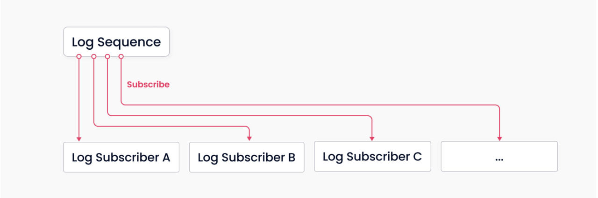

# 存储/计算分离

遵循数据平面和控制平面分离的原则，Milvus包括四个层，这些层在可扩展性和灾难恢复方面是相互独立的。

## 访问层

访问层由一组无状态代理组成，是系统的前端层，也是用户的端点。它验证客户端请求并减少返回的结果：

- 代理本身是无状态的。它使用诸如Nginx、Kubernetes Ingress、NodePort和LVS等负载平衡组件提供统一的服务地址。
- 由于Milvus采用了大规模并行处理（MPP）架构，代理在将最终结果返回给客户端之前会聚合和后处理中间结果。

## 协调器服务

协调器服务分配任务给工作节点，并充当系统的大脑。它承担的任务包括集群拓扑管理、负载均衡、时间戳生成、数据声明和数据管理。

有三种协调器类型：根协调器（root coord）、数据协调器（data coord）和查询协调器（query coord）。

### 根协调器（root coord）

根协调器处理数据定义语言（DDL）和数据控制语言（DCL）请求，例如创建或删除集合、分区或索引，以及管理TSO（时间戳Oracle）和时间标记的发布。

### 查询协调器（query coord）

查询协调器管理查询节点的拓扑和负载均衡，并从增长段切换到封存段。

### 数据协调器（data coord）

数据协调器管理数据节点和索引节点的拓扑，维护元数据，并触发刷新、压缩和索引构建等后台数据操作。

## 工作节点

工作节点是系统的手臂和腿。工作节点是根据协调器服务的指令执行数据操作语言（DML）命令的哑执行器。由于存储和计算分离，工作节点是无状态的，可以在Kubernetes上部署，实现系统的横向扩展和灾难恢复。有三种类型的工作节点：

### 查询节点

查询节点检索增量日志数据，并通过订阅日志代理将其转换为增长段，从对象存储加载历史数据，并在向量和标量数据之间运行混合搜索。

### 数据节点

数据节点通过订阅日志代理检索增量日志数据，处理变更请求，并将日志数据打包成日志快照并存储在对象存储中。

### 索引节点

索引节点构建索引。索引节点无需驻留在内存中，可以使用无服务器框架实现。

## 存储
存储是系统的骨干，负责数据持久性。它包括元存储、日志代理和对象存储。

### 元存储

元存储存储元数据的快照，如集合模式和消息消费检查点。存储元数据需要极高的可用性、强一致性和事务支持，因此 Milvus 选择了 etcd 作为元存储。Milvus 还使用 etcd 进行服务注册和健康检查。

### 对象存储

对象存储存储日志的快照文件，标量和向量数据的索引文件，以及中间查询结果。Milvus 使用 MinIO 作为对象存储，可以轻松部署在 AWS S3 和 Azure Blob 上，这两者是全球最流行、性价比最高的存储服务之一。然而，对象存储具有较高的访问延迟，并按查询次数收费。为了提高性能并降低成本，Milvus 计划在基于内存或 SSD 的缓存池上实现冷热数据分离。

### 日志代理

日志代理是支持回放的发布-订阅系统。它负责流数据持久性和事件通知。在工作节点从系统故障中恢复时，还确保增量数据的完整性。Milvus 集群使用 Pulsar 作为日志代理；Milvus 独立使用 RocksDB 作为日志代理。此外，日志代理可以轻松替换为流数据存储平台，如 Kafka。

Milvus 是围绕日志代理构建的，并遵循“日志即数据”的原则，因此 Milvus 不维护物理表，而是通过日志持久性和快照日志来保证数据可靠性。

日志代理是 Milvus 的支柱。由于其固有的发布-订阅机制，它负责数据持久性和读写分离。上图简要展示了该机制，系统分为两个角色，日志代理（用于维护日志序列）和日志订阅者。前者记录所有改变集合状态的操作；后者订阅日志序列以更新本地数据，并以只读副本的形式提供服务。发布-订阅机制还为系统的可扩展性提供了空间，例如变更数据捕获（CDC）和全球分布式部署。

## 接下来

- 阅读 [主要组件](main_components.md) 以获取有关 Milvus 架构的更多详细信息。