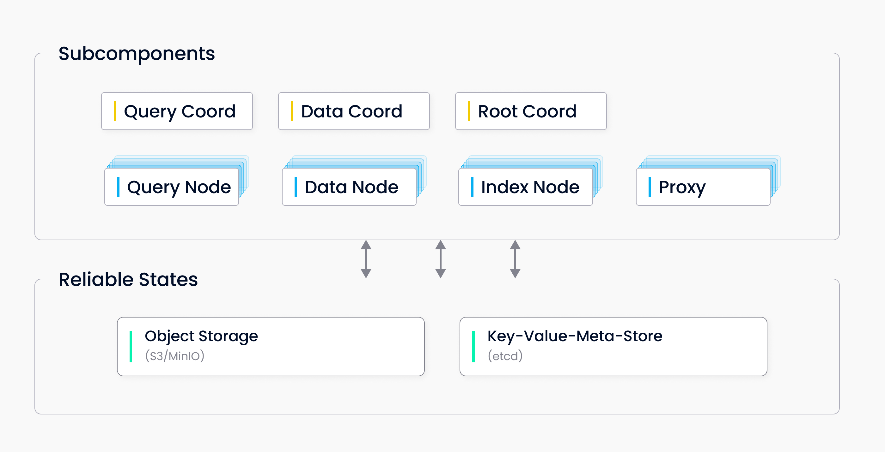

# 主要组件

Milvus 有两种运行模式：独立版和集群版。这两种模式共享相同的功能。您可以根据数据集大小、流量数据等选择最适合您的模式。目前，Milvus 独立版无法在线升级为 Milvus 集群版。

## Milvus 独立版

Milvus 独立版包括三个组件：

- **Milvus：** 核心功能组件。

- **元数据存储：** 元数据引擎，用于访问和存储 Milvus 内部组件的元数据，包括代理、索引节点等。

- **对象存储：** 存储引擎，负责 Milvus 的数据持久化。

## Milvus 集群版

**Milvus 集群版** 包括七个微服务组件和三个第三方依赖。所有微服务组件可以独立部署在 Kubernetes 上。

### 微服务组件

- Root coord
- 代理
- 查询协调器
- 查询节点
- 数据协调器
- 索引节点
- 数据节点

### 第三方依赖

- **元数据存储：** 用于存储集群中各个组件的元数据，例如 etcd。
- **对象存储：** 负责集群中大文件的数据持久化，如索引和二进制日志文件，例如 S3。
- **日志代理：** 管理最近的变更操作日志，输出流式日志，并提供日志发布订阅服务，例如 Pulsar。

## 下一步

- 阅读 [计算/存储分离](four_layers.md) 以了解 Milvus 的机制和设计原则。