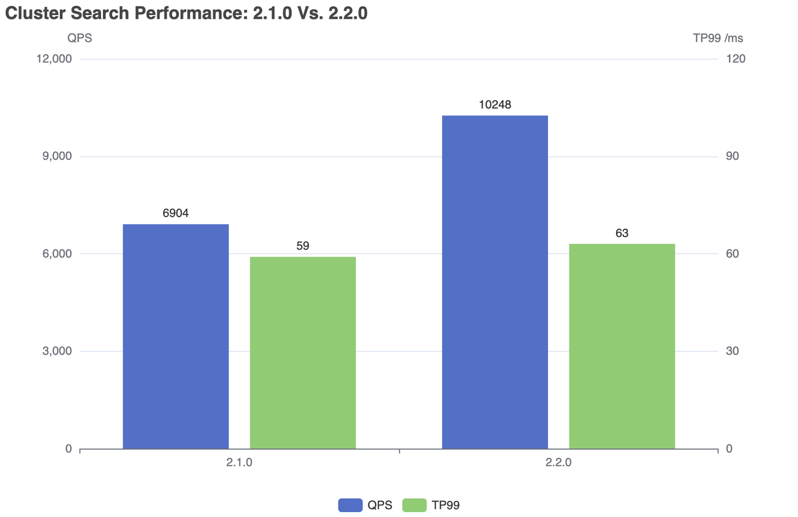
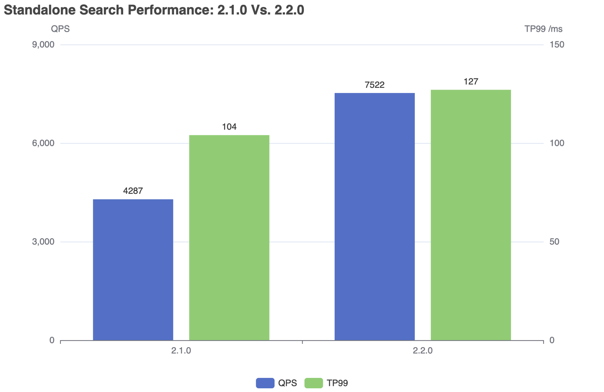
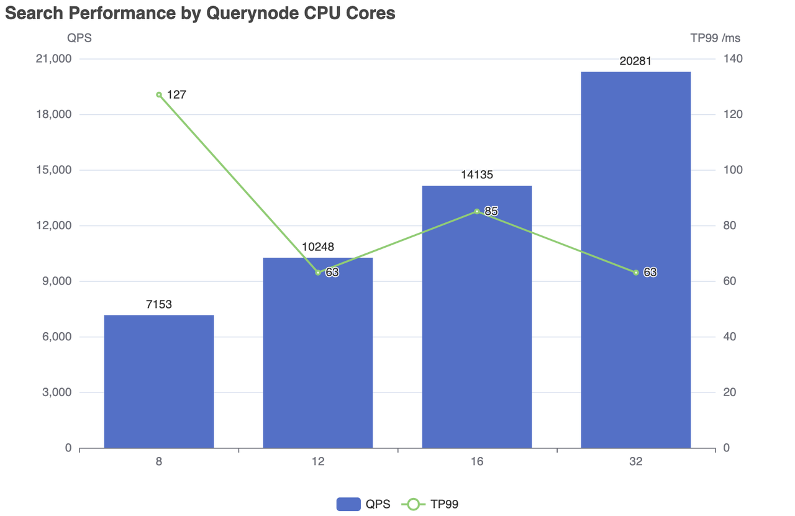

# Milvus 2.2基准测试报告

本报告展示了Milvus 2.2.0的主要测试结果。旨在展示Milvus 2.2.0在搜索性能方面的情况，特别是在扩展性能和横向扩展能力方面。

<div class="alert note">
  <div style="display: flex;">
      <div style="flex:0.3;">
      
  </div>
  <div style="flex:1; padding: 10px; ">
    <p>我们最近对Milvus 2.2.3进行了基准测试，得出以下主要发现：</p>
    <ul>
      <li>搜索延迟减少了2.5倍</li>
      <li>QPS提高了4.5倍</li>
      <li>十亿规模的相似度搜索性能几乎没有下降</li>
      <li>使用多个副本时具有线性可扩展性</li>
    </ul>
    <p>详情请参考<a href="https://zilliz.com/resources/whitepaper/milvus-performance-benchmark">此白皮书</a>和<a href="https://github.com/zilliztech/VectorDBBench">相关基准测试代码</a>。</p>
  </div>
</div>

## 摘要

- 与Milvus 2.1相比，Milvus 2.2.0在集群模式下的QPS增长超过48%，在独立模式下增长超过75%。
- Milvus 2.2.0具有令人印象深刻的扩展和横向扩展能力：
  - 当将CPU核心从8扩展到32时，QPS呈线性增长。
  - 当将Querynode副本从1扩展到8时，QPS呈线性增长。

## 术语

<details>
    <summary>点击查看测试中使用的术语详情</summary>
    <table class="terminology">
        <thead>
            <tr>
                <th>术语</th>
                <th>描述</th>
            </tr>
        </thead>
        <tbody>
            <tr>
                <td>nq</td>
                <td>每个搜索请求中要搜索的向量数量</td>
            </tr>
            <tr>
                <td>topk</td>
                <td>每个搜索请求中要检索的每个向量（在nq中）的最近向量数量</td>
            </tr>
            <tr>
                <td>ef</td>
                <td>一种特定于[HNSW索引](https://milvus.io/docs/v2.2.x/index.md)的搜索参数</td>
            </tr>
            <tr>
                <td>RT</td>
                <td>从发送请求到接收响应的响应时间</td>
            </tr>
            <tr>
                <td>QPS</td>
                <td>每秒成功处理的搜索请求数量</td>
            </tr>
        </tbody>
    </table>
</details>

## 测试环境

所有测试均在以下环境下进行。

### 硬件环境

| 硬件     | 规格                                     |
| -------- | ----------------------------------------- |
| CPU      | Intel(R) Xeon(R) Gold 6226R CPU @ 2.90GHz |
| 内存     | 16\*\32 GB RDIMM, 3200 MT/s               |
| SSD      | SATA 6 Gbps                               |

### 软件环境

|    软件       |                                版本                                |
| ------------- | --------------------------------------------------------------------- |
|    Milvus     | v2.2.0                                                                |
| Milvus GO SDK | v2.2.0                                                                |

### 部署方案

- Milvus 实例（独立或集群）通过 [Helm](https://milvus.io/docs/install_standalone-helm.md) 部署在基于物理或虚拟机的 Kubernetes 集群上。
- 不同的测试仅在 CPU 核心数、内存大小和副本数（工作节点）上有所不同，这仅适用于 Milvus 集群。
- 未指定的配置与[默认配置](https://github.com/milvus-io/milvus-helm/blob/master/charts/milvus/values.yaml)相同。
- Milvus 依赖项（MinIO、Pulsar 和 Etcd）在每个节点的本地 SSD 上存储数据。
- 搜索请求通过[Milvus GO SDK](https://github.com/milvus-io/milvus-sdk-go/tree/master/tests)发送到 Milvus 实例。

### 数据集

该测试使用来自[ANN-Benchmarks](https://github.com/erikbern/ann-benchmarks/#data-sets)的开源数据集 SIFT（128维）。

## 测试流程

1. 使用 Helm 启动 Milvus 实例，并根据每个测试中列出的相应服务器配置连接到 Milvus 实例。
2. 通过 Milvus GO SDK 连接到 Milvus 实例并获取相应的测试结果。
3. 创建一个集合。
4. 插入100万个 SIFT 向量。构建 HNSW 索引，并通过将 `M` 设置为 `8` 和 `efConstruction` 设置为 `200` 配置索引参数。
5. 加载集合。
6. 使用不同的并发数进行搜索，搜索参数为 `nq=1, topk=1, ef=64`，每个并发的持续时间至少为1小时。

## 测试结果

### Milvus 2.2.0 对比 Milvus 2.1.0 

#### 集群

<details>
    <summary><b>服务器配置（集群）</b></summary>

```yaml
queryNode:
  replicas: 1
  resources:
    limits:
      cpu: "12.0"
      memory: 8Gi
    requests:
      cpu: "12.0"
      memory: 8Gi
```

</details>

**搜索性能**

| Milvus | QPS   | RT(TP99) / ms | RT(TP50) / ms | 失败率 |
| ------ |------ |---------------|---------------|--------|
| 2.1.0  | 6904  | 59            | 28            | 0      |
| 2.2.0  | 10248 | 63            | 24            | 0      |



#### 独立

<details>
    <summary><b>服务器配置（独立）</b></summary>

```yaml
standalone:
  replicas: 1
  resources:
    limits:
      cpu: "12.0"
      memory: 16Gi
    requests:
      cpu: "12.0"
      memory: 16Gi
```

</details>

**搜索性能**

| Milvus | QPS  | RT(TP99) / ms  | RT(TP50) / ms | 失败率 |
|------  |------|--------------- |---------------|--------|
| 2.1.0  | 4287 | 104            | 76            | 0      |
| 2.2.0  | 7522 | 127            | 79            | 0      |



### Milvus 2.2.0 单机扩展

扩展一个查询节点的 CPU 核心，以检查其扩展能力。

<details>
    <summary><b>服务器配置（集群）</b></summary>

 ```yaml   
queryNode:
  replicas: 1
  resources:
    limits:
      cpu: "8.0" /"12.0" /"16.0" /"32.0"
      memory: 8Gi
    requests:
      cpu: "8.0" /"12.0" /"16.0" /"32.0"
      memory: 8Gi
```

</details>

**搜索性能**

| CPU 核心 | 并发数 | QPS  | RT(TP99) / 毫秒 | RT(TP50) / 毫秒 | 失败数/s |
| ------|------|------|---------------|---------------|--------|
| 8 | 500 | 7153 | 127            | 83            | 0      |
| 12 | 300 | 10248 | 63            | 24            | 0      |
| 16 | 600 | 14135 | 85            | 42            | 0      |
| 32 | 600 | 20281 | 63            | 28            | 0      |



### Milvus 2.2.0 水平扩展

通过增加更多副本和更多查询节点来检查其水平扩展能力。

<div class="alert note">

注意：在加载集合时，查询节点的数量等于`replica_number`。

</div>

<details>
    <summary><b>服务器配置（集群）</b></summary>

```yaml
queryNode:
  replicas: 1 / 2 / 4 / 8      
  resources:
    limits:
      cpu: "8.0"
      memory: 8Gi
    requests:
      cpu: "8.0"
      memory: 8Gi  