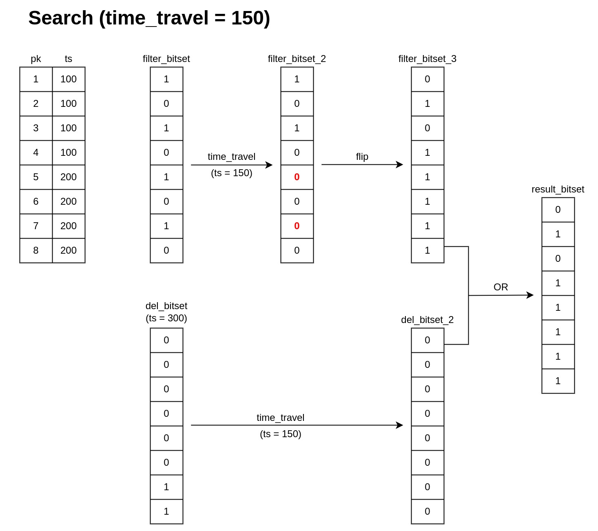
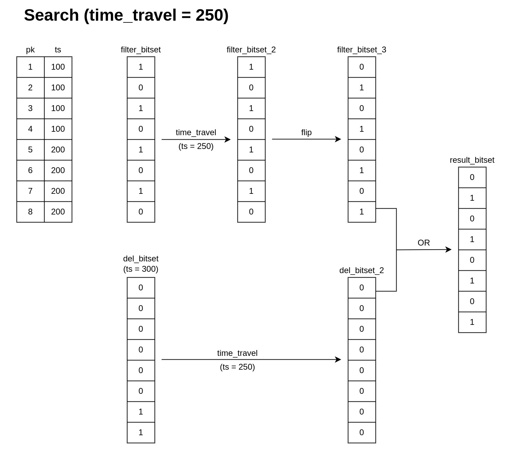
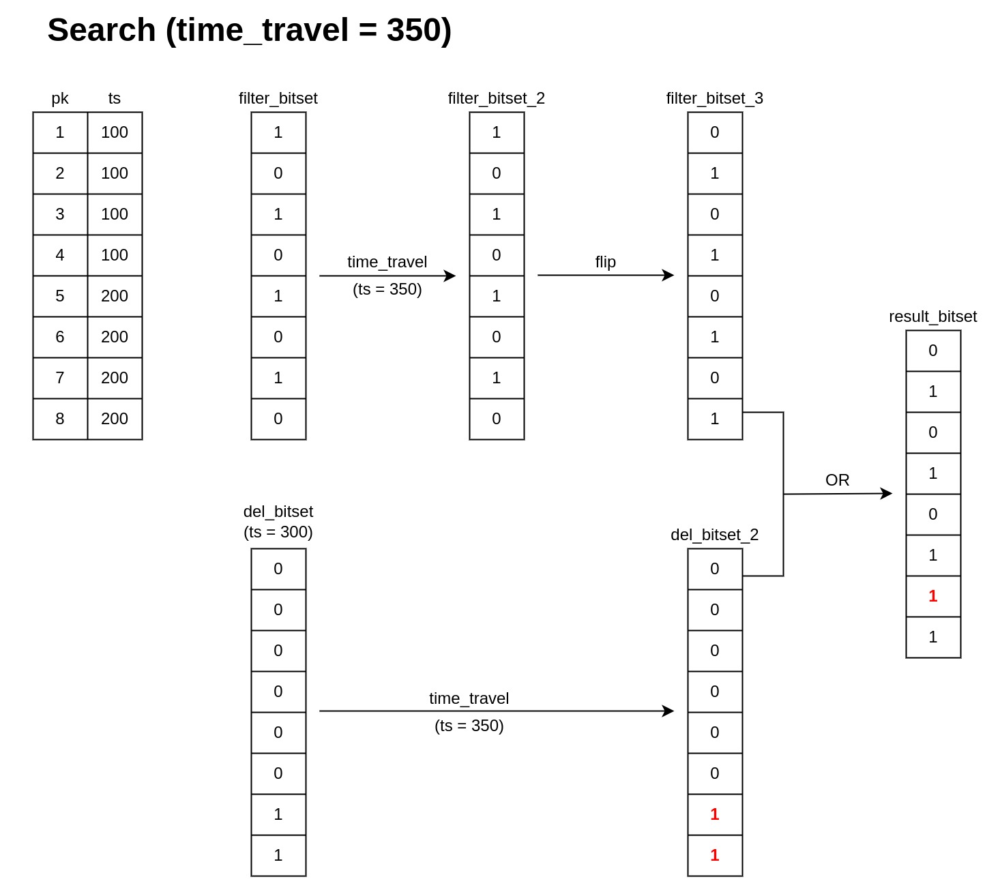

# 位集

本主题介绍了位集机制，该机制有助于在 Milvus 中实现属性过滤和[删除操作](https://milvus.io/blog/2022-02-07-how-milvus-deletes-streaming-data-in-distributed-cluster.md)等关键功能。

## 概述

位集是一组位。位是仅具有两个可能值的元素，通常是 `0` 和 `1`，或布尔值 `true` 和 `false`。在 Milvus 中，位集是由位数字 `0` 和 `1` 组成的数组，可用于紧凑高效地表示某些数据，而不是使用整数、浮点数或字符。位数字默认为 `0`，只有在满足某些条件时才会设置为 `1`。

位集上的操作使用[布尔逻辑](boolean.md)进行，根据该逻辑，输出值要么有效，要么无效，分别用 `1` 和 `0` 表示。例如，[逻辑运算符](https://milvus.io/docs/v2.1.x/boolean.md#Logical-operators) `AND` 可用于比较两个位集中相同索引位置的项目，并生成具有结果的新位集。如果两个位置上的项目相同，则在新位集中将写入 `1`；如果它们不同，则写入 `0`。

## 实现

位集是一个简单而强大的机制，有助于 Milvus 执行属性过滤、数据删除和带有时间旅行的查询。

### 属性过滤

由于位集仅包含两个可能值，因此非常适合存储[属性过滤](https://milvus.io/docs/v2.1.x/hybridsearch.md)的结果。满足给定属性过滤器要求的数据将标记为 `1`。

### 数据删除

位集可作为一种紧凑的方式来存储有关段中行是否已删除的信息。已删除的实体在相应的位集中标记为 `1`，在搜索或查询过程中[不会被计算](https://milvus.io/blog/deleting-data-in-milvus.md)。

## 示例

这里我们提供三个示例，展示位集在 Milvus 中的使用方式，并参考上述讨论的三种主要位集实现。在所有三种情况下，都有一个包含 8 个实体的段，然后按照以下顺序进行一系列数据操作语言（DML）事件。

- 当时间戳 ``ts`` 等于 100 时，插入了四个 `primary_key` 分别为 [1, 2, 3, 4] 的实体。  
- 当时间戳 ``ts`` 等于 200 时，插入了另外四个 `primary_key` 分别为 [5, 6, 7, 8] 的实体。  
- 当时间戳 ``ts`` 等于 300 时，删除了 `primary_key` 为 [7, 8] 的实体。  
- 只有 `primary_key` 为 [1, 3, 5, 7] 的实体满足属性过滤条件。

### 案例一

在这种情况下，用户将 `time_travel` 设置为 150，这意味着用户对满足 `ts = 150` 的数据进行查询。位集生成过程如图 1 所示。
在初始过滤阶段，`filter_bitset` 应为 `[1, 0, 1, 0, 1, 0, 1, 0]`，其中实体 [1, 3, 5, 7] 被标记为 `1`，因为它们是有效的过滤结果。

然而，当 `ts` 等于 150 时，实体 [4, 5, 6, 7] 没有被插入到向量数据库中。因此，这四个实体无论过滤条件如何，都应标记为 0。现在位集的结果应为 `[1, 0, 1, 0, 0, 0, 0, 0]`。

如 [数据删除](#data-deletion) 中讨论的那样，被标记为 `1` 的实体在搜索或查询时会被忽略。现在位集的结果需要翻转，以便与删除位图结合，得到 `[0, 1, 0, 1, 1, 1, 1, 1]`。

至于删除位集 `del_bitset`，初始值应为 `[0, 0, 0, 0, 0, 0, 1, 1]`。然而，直到 `ts` 为 300 时，实体 7 和 8 才被删除。因此，当 `ts` 为 150 时，实体 7 和 8 仍然有效。因此，时光旅行后 `del_bitset` 的值为 `[0, 0, 0, 0, 0, 0, 0, 0]`。

现在我们在时光旅行和属性过滤后有两个位集：`filter_bitset` `[0, 1, 0, 1, 1, 1, 1, 1]` 和 `del_bitset` `[0, 0, 0, 0, 0, 0, 0, 0]`。将这两个位集与 `OR` 二进制逻辑运算符结合。结果位集的最终值为 `[0, 1, 0, 1, 1, 1, 1, 1]`，意味着只有实体 1 和 3 将在接下来的搜索或查询阶段中被计算。

### 案例二

在这种情况下，用户将 `time_travel` 设置为 250。位集生成过程如图 2 所示。

与案例一类似，初始的 `filter_bitset` 是 `[1, 0, 1, 0, 1, 0, 1, 0]`。

当 `ts` = 250 时，所有实体都在向量数据库中。因此，考虑时间戳时，`filter_bitset` 保持不变。再次需要翻转结果，得到 `[0, 1, 0, 1, 0, 1, 0, 1]`。

至于删除位集 `del_bitset`，初始值为 `[0, 0, 0, 0, 0, 0, 1, 1]`。然而，直到 `ts` 为 300 时，实体 7 和 8 才被删除。因此，当 `ts` 为 250 时，实体 7 和 8 仍然有效。因此，时光旅行后 `del_bitset` 为 `[0, 0, 0, 0, 0, 0, 0, 0]`。

现在我们在时光旅行和属性过滤后有两个位集：`filter_bitset` `[0, 1, 0, 1, 0, 1, 0, 1]` 和 `del_bitset` `[0, 0, 0, 0, 0, 0, 0, 0]`。将这两个位集与 `OR` 二进制逻辑运算符结合。结果位集为 `[0, 1, 0, 1, 0, 1, 0, 1]`。也就是说，只有实体 [1, 3, 5, 7] 将在接下来的搜索或查询阶段中被计算。

### 案例三

在这种情况下，用户将 `time_travel` 设置为 350。位集生成过程如图 3 所示。

与之前的案例一样，初始的 `filter_bitset` 是 `[0, 1, 0, 1, 0, 1, 0, 1]`。
当`ts`= 350 时，所有实体都在向量数据库中。因此，最终翻转后的`filter_bitset`为`[0, 1, 0, 1, 0, 1, 0, 1]`，与第二种情况相同。

至于删除位集`del_bitset`，由于在`ts = 350`时实体7和8已被删除，因此，`del_bitset`的结果为`[0, 0, 0, 0, 0, 0, 1, 1]`。

现在，在时间旅行和属性过滤后，我们有两个位集：`filter_bitset` `[0, 1, 0, 1, 0, 1, 0, 1]` 和 `del_bitset` `[0, 0, 0, 0, 0, 0, 1, 1]`。将这两个位集与`OR`二进制逻辑运算符结合起来。最终的`result_bitset`是`[0, 1, 0, 1, 0, 1, 1, 1]`。也就是说，只有实体[1, 3, 5]将在接下来的搜索或查询阶段中被计算。

## 接下来

现在您已经了解了Milvus中位集的工作原理，您可能还想：

- 学习如何[使用字符串进行过滤](https://milvus.io/blog/2022-08-08-How-to-use-string-data-to-empower-your-similarity-search-applications.md)您的搜索结果，或者参考我们文档中的[混合搜索](https://milvus.io/docs/hybridsearch.md)。
- 了解Milvus中数据是如何被处理的。