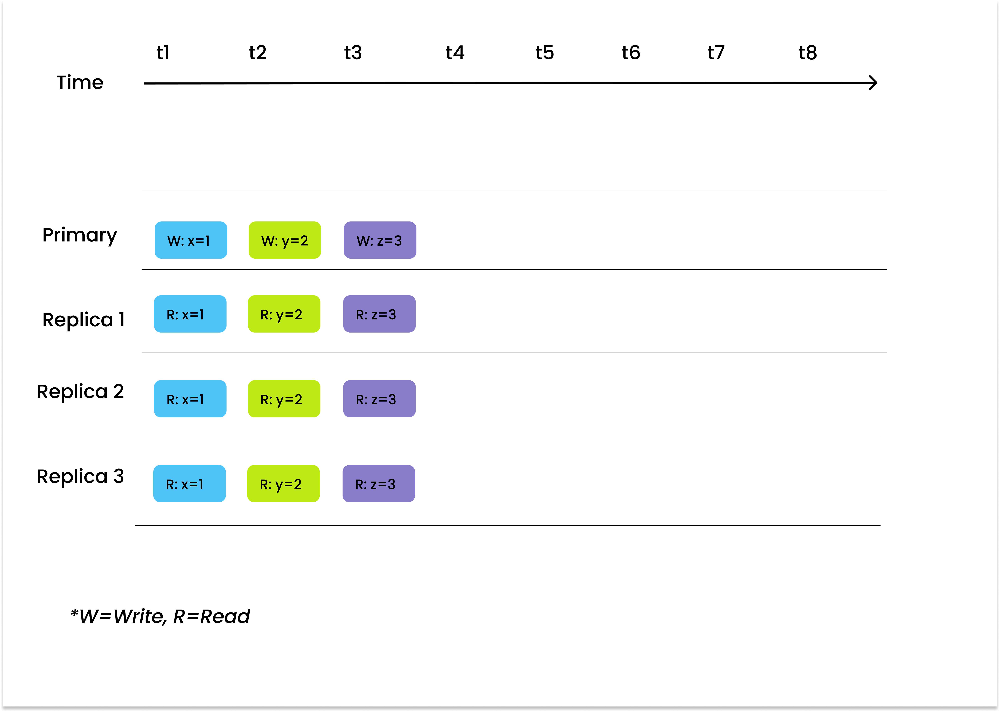
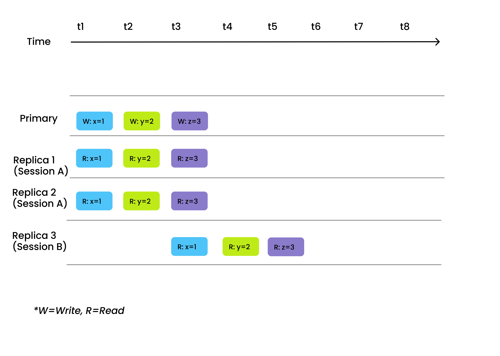
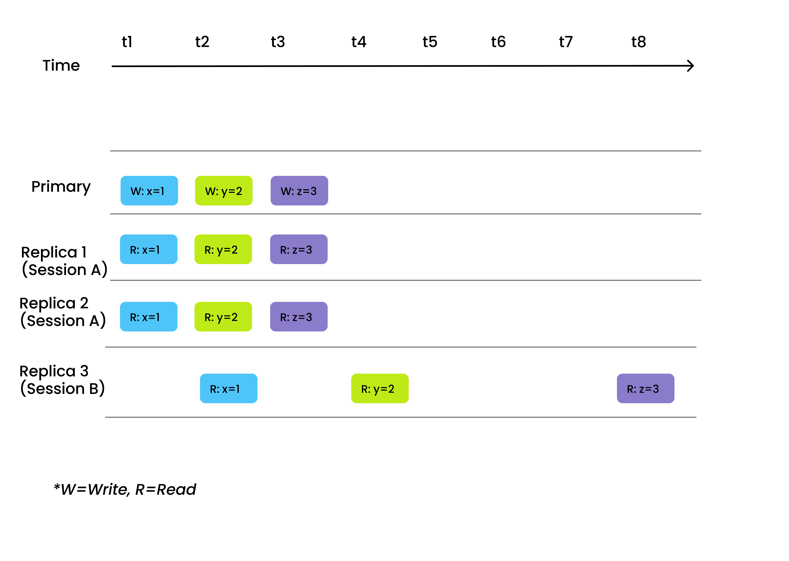
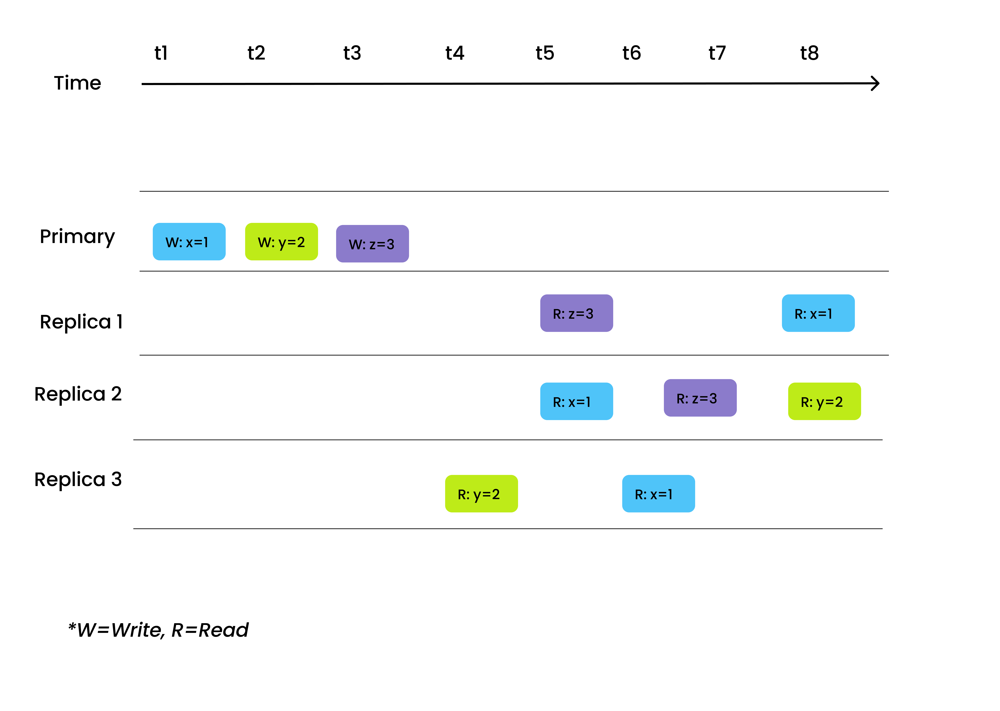

# 一致性

本主题介绍了 Milvus 中的四种一致性级别及它们最适合的场景。同时也涵盖了确保 Milvus 一致性的机制。

## 概述

分布式数据库中的一致性特指确保每个节点或副本在写入或读取数据时具有相同的数据视图的属性。

Milvus 支持四种一致性级别：强一致性、有界陈旧度、会话一致性和最终一致性。Milvus 的默认一致性级别是有界陈旧度。在进行[单向量搜索](single-vector-search.md)、[多向量搜索](multi-vector-search.md)或[查询](get-and-scalar-query.md)时，您可以轻松调整一致性级别，使其最适合您的应用程序。

## 一致性级别

根据[PACELC](https://en.wikipedia.org/wiki/PACELC_theorem)定理的定义，分布式数据库必须在一致性、可用性和延迟之间进行权衡。高一致性意味着高准确性，但也会导致高搜索延迟，而低一致性则会导致快速搜索速度，但会造成一定程度的数据不可见性。因此，不同级别的一致性适用于不同的场景。

以下解释了 Milvus 支持的四种一致性级别之间的差异以及它们各自适用的场景。

### 强一致性

强一致性是最高严格的一致性级别。它确保用户可以读取数据的最新版本。

根据 PACELC 定理，如果将一致性级别设置为强一致性，延迟将会增加。因此，我们建议在功能测试期间选择强一致性，以确保测试结果的准确性。强一致性也最适合对数据一致性有严格要求的应用程序，即以搜索速度为代价。例如，在处理订单支付和结算的在线金融系统中就可以采用强一致性。

### 有界陈旧度

有界陈旧度，顾名思义，允许在一定时间内存在数据不一致性。然而，通常情况下，在该时间段之外，数据始终是全局一致的。

有界陈旧度适用于需要控制搜索延迟并且可以接受偶发数据不可见性的场景。例如，在推荐系统中，如视频推荐引擎，数据不可见性有时对整体召回率影响不大，但可以显著提升推荐系统的性能。

### 会话
会话一致性确保在同一会话中进行的所有数据写入可以立即在读取中感知到。换句话说，当您通过一个客户端写入数据时，新插入的数据会立即变得可搜索。

我们建议在对数据一致性要求较高的情况下选择会话作为一致性级别。一个例子是从图书馆系统中删除书目数据，在确认删除并刷新页面（不同会话）后，该书目不应再在搜索结果中可见。

### 最终一致性

读取和写入没有保证的顺序，副本最终会收敛到相同状态，前提是不再进行进一步的写操作。在“最终一致性”下，副本开始使用最新更新的值处理读取请求。最终一致性是四种级别中最弱的。

然而，根据PACELC定理，牺牲一致性可以极大地缩短搜索延迟。因此，最终一致性最适用于对数据一致性要求不高但需要极快搜索性能的场景。一个例子是使用最终一致性级别检索亚马逊产品的评论和评分。

## 保证时间戳

Milvus通过引入[保证时间戳](https://github.com/milvus-io/milvus/blob/f3f46d3bb2dcae2de0bdb7bc0f7b20a72efceaab/docs/developer_guides/how-guarantee-ts-works.md)（GuaranteeTs）实现不同的一致性级别。

保证时间戳用于通知查询节点，在保证时间戳之前的所有数据可以被查询节点看到之前，不会执行搜索或查询请求。当您指定一致性级别时，一致性级别将映射到特定的保证时间戳值。不同的保证时间戳值对应不同的一致性级别：

- **强一致性**：保证时间戳设置为与最新系统时间戳相同，查询节点在处理搜索或查询请求之前等待在最新系统时间戳之前的所有数据可以被看到。

- **有界过时性**：保证时间戳相对较小于最新系统时间戳，查询节点在可容忍的、较旧的数据视图上进行搜索。

- **会话一致性**：客户端使用最新写操作的时间戳作为保证时间戳，以便每个客户端至少可以检索由同一客户端插入的数据。

- **最终一致性**：保证时间戳设置为一个非常小的值以跳过一致性检查。查询节点立即在现有数据视图上进行搜索。
请查看 [GuaranteeTs 工作原理](https://github.com/milvus-io/milvus/blob/f3f46d3bb2dcae2de0bdb7bc0f7b20a72efceaab/docs/developer_guides/how-guarantee-ts-works.md) 以获取有关 Milvus 中确保不同一致性级别的机制的更多信息。

## 下一步是什么

- 学习如何在以下情况下调整一致性级别：
  - [进行单向量搜索](single-vector-search.md)
  - [进行多向量搜索](multi-vector-search.md)
  - [进行标量查询](get-and-scalar-query.md)