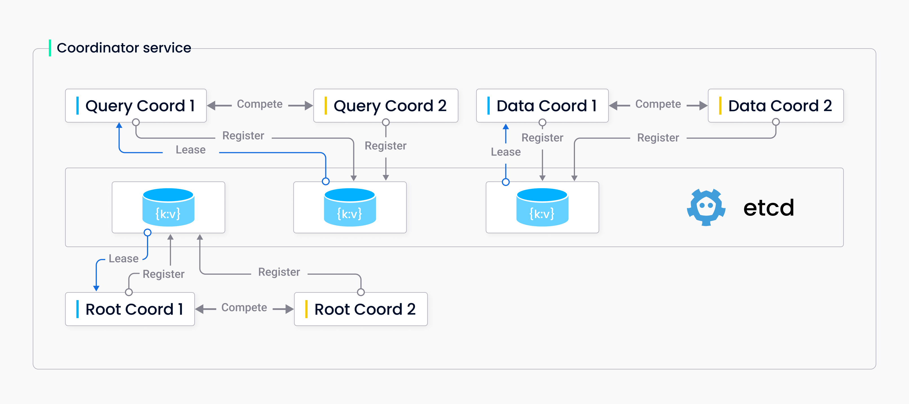

# 协调器高可用性

如 [Milvus 架构](architecture_overview.md) 所示，Milvus 由许多组件组成，并以分布式方式运行。在所有组件中，Milvus 通过对节点进行 [横向扩展和纵向扩展](scaleout.md) 来确保工作节点的高可用性，使协调器成为链条中唯一的薄弱环节。

## 概述

在 2.2.3 版本中，Milvus 实现了协调器的高可用性，使其能够在主备模式下工作，从而减轻可能导致服务不可用的单点故障（SPoFs）。



上图说明了协调器如何在主备模式下工作。当一对协调器启动时，它们使用其服务器 ID 在 etcd 中注册并竞争活动角色。成功从 etcd 获取活动角色的协调器将开始提供服务，而另一个协调器将保持待命状态，监视活动角色，并在活动协调器死机时准备提供服务。

## 启用协调器高可用性

### 使用 Helm

要启动多个协调器并使其在主备模式下工作，您应对 `values.yaml` 文件进行以下更改。

- 将 `xxxCoordinator.replicas` 设置为 `2`。
- 将 `xxxCoordinator.activeStandby.enabled` 设置为 `true`。

以下代码片段以 RootCoord 为例。您可以对其他类型的协调器执行相同操作。

```yaml
rootCoordinator:
  enabled: true
  # 仅当您还需要将 activeStandby.enabled 设置为 true 时，才能将副本数设置为大于 1。
  replicas: 2  # 否则，请删除此配置项。
  resources: {}
  nodeSelector: {}
  affinity: {}
  tolerations: []
  extraEnv: []
  heaptrack:
    enabled: false
  profiling:
    enabled: false  # 启用实时性能分析
  activeStandby:
    enabled: true  # 将此设置为 true 以使 RootCoordinators 在主备模式下工作。
```

### 使用 Docker

要启动多个协调器并使其在主备模式下工作，您可以向用于启动 Milvus 集群的 `docker-compose` 文件添加一些定义。

以下代码片段以 RootCoord 为例。您可以对其他类型的协调器执行相同操作。
```yaml
  rootcoord:
    container_name: milvus-rootcoord
    image: milvusdb/milvus:v2.2.3
    command: ["milvus", "run", "rootcoord"]
    environment:
      ETCD_ENDPOINTS: etcd:2379
      MINIO_ADDRESS: minio:9000
      PULSAR_ADDRESS: pulsar://pulsar:6650
      ROOT_COORD_ADDRESS: rootcoord:53100
      # 添加 ROOT_COORD_ENABLE_ACTIVE_STANDBY 以启用主备模式
      ROOT_COORD_ENABLE_ACTIVE_STANDBY: true
    depends_on:
      - "etcd"
      - "pulsar"
      - "minio"

#   若要使 RootCoords 在主备模式下工作，请添加以下内容
#   rootcoord-1:
#    container_name: milvus-rootcoord-1
#    image: milvusdb/milvus:v2.2.3
#    command: ["milvus", "run", "rootcoord"]
#    environment:
#      ETCD_ENDPOINTS: etcd:2379
#      MINIO_ADDRESS: minio:9000
#      PULSAR_ADDRESS: pulsar://pulsar:6650
#      ROOT_COORD_ADDRESS: rootcoord-1:53100
#      # 添加 ROOT_COORD_ENABLE_ACTIVE_STANDBY 以启用主备模式
#      ROOT_COORD_ENABLE_ACTIVE_STANDBY: true
#    depends_on:
#      - "etcd"
#      - "pulsar"
#      - "minio"
```
### 在 Mac/Linux shell 中

要启动多个协调者并使它们以主备模式工作，您可以：

1. 将 Milvus 源代码下载到本地驱动器，并按照以下步骤[从源代码启动 Milvus 集群](https://github.com/milvus-io/milvus/blob/master/DEVELOPMENT.md)：

    ```shell
    sudo ./scripts/start_cluster.sh
    ```

    在此步骤结束时，Milvus 将只运行每种类型的一个协调者。

2. 更新 `milvus.yaml` 文件以更改每种类型协调者的端口号。以下以 **rootCoord** 为例。

    ```yaml
    rootCoord:
      address: localhost
      port: 53100 # 更改为 53001
    ```

3. 启动备用协调者。

    ```shell
    sudo nohup ./bin/milvus run rootcoord > /tmp/rootcoord2.log 2>&1 &
    ```

    在此步骤结束时，运行以下命令验证存在两个协调者进程。

    ```shell
    ps aux|grep milvus
    ```

    输出应类似于

    ```shell
    > ps aux|grep milvus
    root        12813   0.7 0.2 410709648   82432   ??  S   5:18PM  0:33.28 ./bin/milvus run rootcoord
    root        12816   0.5 0.2 409487968   62352   ??  S   5:18PM  0:22.69 ./bin/milvus run proxy
    root        17739   0.1 0.3 410289872   91792 s003  SN  6:01PM  0:00.30 ./bin/milvus run rootcoord
    ...
    ```

    备用协调者每十秒输出一次日志条目，内容如下：

    ```shell
    [INFO] [sessionutil/session_util.go:649] ["serverName: rootcoord is in STANDBY ..."]
    ```

4. 终止一对中的活动协调者并观察备用协调者的行为。

    您会发现备用协调者需要 60 秒来接管活动角色。

    ```shell
    [2022/09/21 11:58:33.855 +08:00] [DEBUG] [sessionutil/session_util.go:677] ["watch the ACTIVE key"] [DELETE="key:\"by-dev/meta/session/rootcoord\" mod_revision:167 "]
    [2022/09/21 11:58:33.856 +08:00] [DEBUG] [sessionutil/session_util.go:677] ["watch the ACTIVE key"] [DELETE="key:\"by-dev/meta/session/rootcoord-15\" mod_revision:167 "]
    [2022/09/21 11:58:33.856 +08:00] [INFO] [sessionutil/session_util.go:683] ["stop watching ACTIVE key"]
    [2022/09/21 11:58:33.856 +08:00] [INFO] [sessionutil/session_util.go:655] ["start retrying to register as ACTIVE service..."]
    [2022/09/21 11:58:33.859 +08:00] [INFO] [sessionutil/session_util.go:641] ["register ACTIVE service successfully"] [ServerID=19]
    [2022/09/21 11:58:33.859 +08:00] [INFO] [sessionutil/session_util.go:690] ["quit STANDBY mode, this node will become ACTIVE"]
    [2022/09/21 11:58:33.859 +08:00] [INFO] [rootcoord/root_coord.go:638] ["rootcoord switch from standby to active, activating"]
    [2022/09/21 11:58:33.859 +08:00] [INFO] [rootcoord/root_coord.go:306] ["RootCoord Register Finished"]
    [2022/09/21 11:58:33.859 +08:00] [DEBUG] [rootcoord/service.go:148] ["RootCoord start done ..."]
```markdown
## 相关配置项

协调器 HA 默认情况下处于禁用状态。您可以通过手动更改 Milvus 配置文件中的以下项来启用此功能。

- [rootCoord.activeStandby.enabled](configure_rootcoord.md#rootCoordactiveStandbyenabled)
- [queryCoord.activeStandby.enabled](configure_querycoord.md#queryCoordactiveStandbyenabled)
- [dataCoord.activeStandby.enabled](configure_datacoord.md#dataCoordactiveStandbyenabled)

## 限制

目前，活动服务和备用服务之间没有强一致性保证。因此，在接管活动角色时，备用协调器需要重新加载元数据。

Etcd 仅在当前会话超时后释放租约。会话超时默认为 60 秒。因此，在活动协调器停止运行和备用协调器接管活动角色之间存在 60 秒的间隙。
```