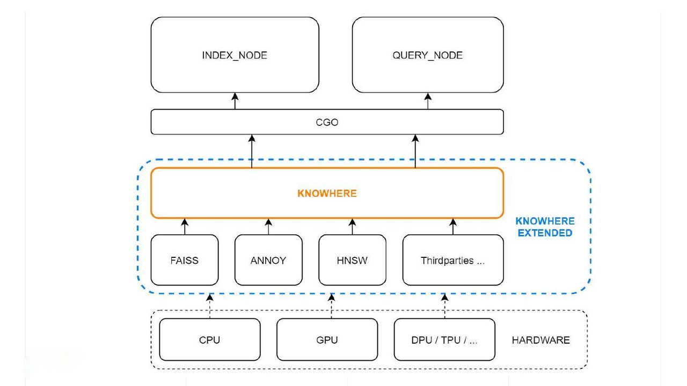
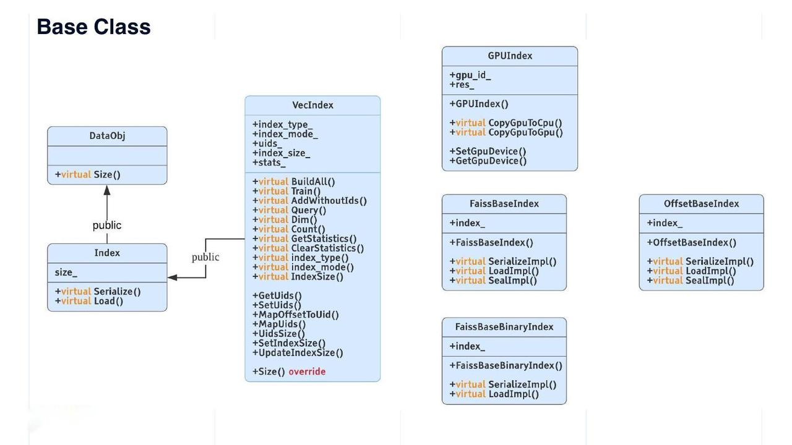
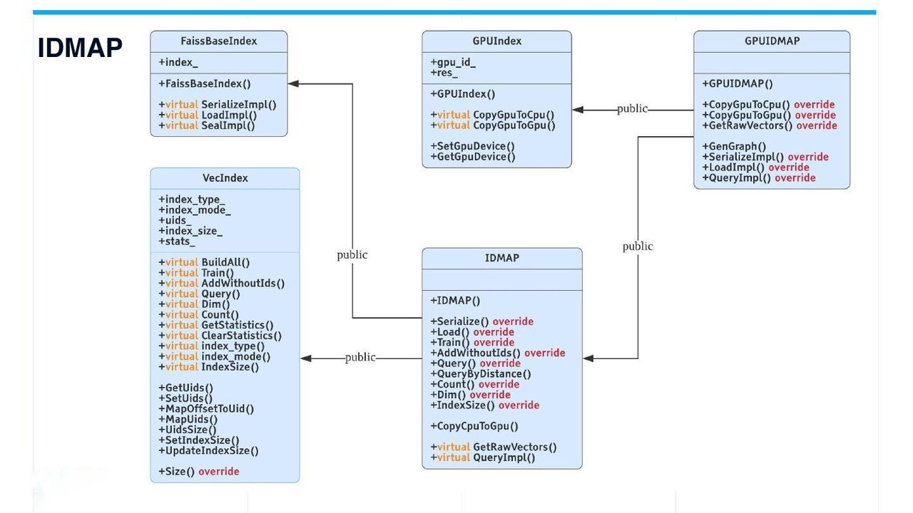
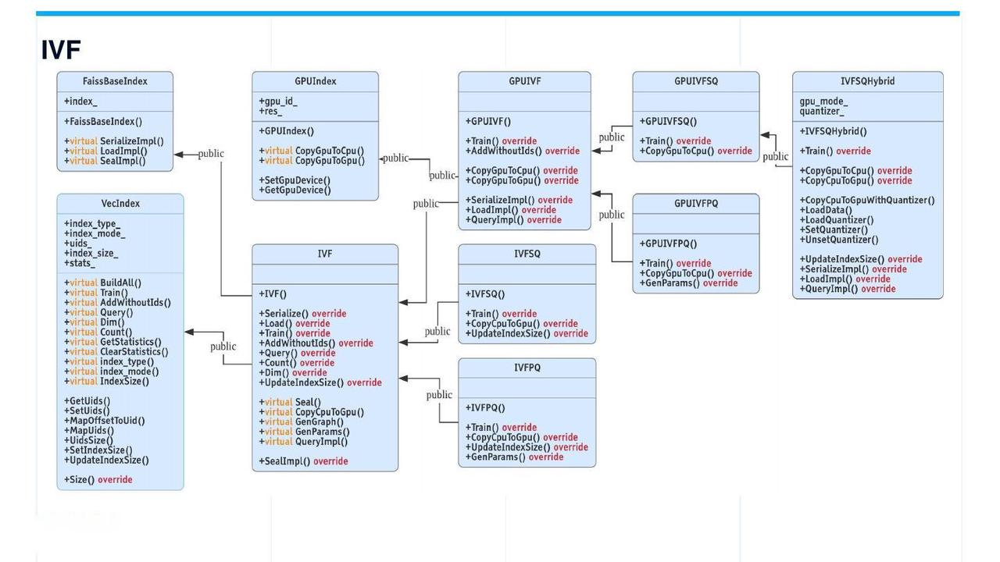
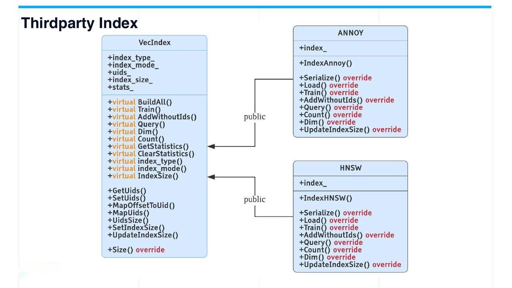

# Knowhere

本主题介绍了 Milvus 的核心向量执行引擎 Knowhere。

## 概述

Knowhere 是 Milvus 的核心向量执行引擎，集成了几个向量相似度搜索库，包括 [Faiss](https://github.com/facebookresearch/faiss)、[Hnswlib](https://github.com/nmslib/hnswlib) 和 [Annoy](https://github.com/spotify/annoy)。Knowhere 还设计为支持异构计算。它控制在哪种硬件（CPU 或 GPU）上执行索引构建和搜索请求。这就是 Knowhere 名称的由来 - 知道在哪里执行操作。未来版本将支持更多类型的硬件，包括 DPU 和 TPU。

## Milvus 架构中的 Knowhere

下图展示了 Knowhere 在 Milvus 架构中的位置。

最底层是系统硬件。第三方索引库位于硬件之上。然后 Knowhere 通过 CGO 与顶部的索引节点和查询节点进行交互，CGO 允许 Go 包调用 C 代码。

## Knowhere 优势

以下是 Knowhere 相对于 Faiss 的优势。

#### 支持 BitsetView

Milvus 引入了位集机制来实现“软删除”。软删除的向量仍然存在于数据库中，但在向量相似度搜索或查询期间不会被计算。

位集中的每个位对应一个索引向量。如果位集中的向量标记为“1”，则表示此向量已被软删除，在向量搜索期间不会参与。位集参数应用于 Knowhere 中所有暴露的 Faiss 索引查询 API，包括 CPU 和 GPU 索引。

有关位集机制的更多信息，请查看 [bitset](bitset.md)。

#### 支持为二进制向量建立多种相似度度量

Knowhere 支持 [Hamming](metric.md#Hamming-distance)、[Jaccard](metric.md#Jaccard-distance)、[Tanimoto](metric.md#Tanimoto-distance)、[Superstructure](metric.md#Superstructure) 和 [Substructure](metric.md#Substructure)。Jaccard 和 Tanimoto 可用于衡量两个样本集之间的相似度，而 Superstructure 和 Substructure 可用于衡量化学结构的相似度。

#### 支持 AVX512 指令集

除了 Faiss 已经支持的指令集 [AArch64](https://en.wikipedia.org/wiki/AArch64)、[SSE4.2](https://en.wikipedia.org/wiki/SSE4#SSE4.2) 和 [AVX2](https://en.wikipedia.org/wiki/Advanced_Vector_Extensions) 外，Knowhere 还支持 [AVX512](https://en.wikipedia.org/wiki/AVX-512)，相较于 AVX2，它可以 [提高索引构建和查询的性能 20% 到 30%](https://milvus.io/blog/milvus-performance-AVX-512-vs-AVX2.md)。

#### 自动 SIMD 指令选择

Knowhere 支持在任何 CPU 处理器上（包括本地和云平台）自动调用适当的 SIMD 指令（例如 SIMD SSE、AVX、AVX2 和 AVX512），因此用户在编译时无需手动指定 SIMD 标志（例如“-msse4”）。

Knowhere 是通过重构 Faiss 的代码库构建的。将依赖于 SIMD 加速的常见功能（例如相似度计算）进行了重构。然后，针对每个功能，实现了四个版本（即 SSE、AVX、AVX2、AVX512），并将每个版本放入单独的源文件中。然后，进一步使用相应的 SIMD 标志单独编译源文件。因此，在运行时，Knowhere 可以根据当前 CPU 标志自动选择最适合的 SIMD 指令，然后使用 hooking 链接正确的函数指针。

#### 其他性能优化

阅读 [Milvus: A Purpose-Built Vector Data Management System](https://www.cs.purdue.edu/homes/csjgwang/pubs/SIGMOD21_Milvus.pdf) 了解更多关于 Knowhere 性能优化的信息。

## Knowhere 代码结构

Milvus 中的计算主要涉及矢量和标量操作。Knowhere 仅处理矢量索引操作。

索引是与原始矢量数据无关的数据结构。通常，索引需要四个步骤：创建索引、训练数据、插入数据和构建索引。在一些 AI 应用中，数据集训练与矢量搜索是分开的。数据集中的数据首先经过训练，然后插入到像 Milvus 这样的矢量数据库中进行相似度搜索。例如，开放数据集 sift1M 和 sift1B 区分了用于训练的数据和用于测试的数据。

然而，在 Knowhere 中，用于训练和搜索的数据是相同的。Knowhere 对一个 [segment](https://milvus.io/blog/deep-dive-1-milvus-architecture-overview.md#Segments) 中的所有数据进行训练，然后插入所有经过训练的数据并为它们构建索引。

#### `DataObj`：基类

`DataObj` 是 Knowhere 中所有数据结构的基类。`Size()` 是 `DataObj` 中唯一的虚拟方法。Index 类从 `DataObj` 继承，具有名为 "size_" 的字段。Index 类还具有两个虚拟方法 - `Serialize()` 和 `Load()`。从 `Index` 派生的 `VecIndex` 类是所有矢量索引的虚拟基类。`VecIndex` 提供了包括 `Train()`、`Query()`、`GetStatistics()` 和 `ClearStatistics()` 在内的方法。

图中右侧列出了一些其他索引类型。

- Faiss 索引有两个基类：`FaissBaseIndex` 用于所有浮点矢量上的索引，`FaissBaseBinaryIndex` 用于所有二进制矢量上的索引。

- `GPUIndex` 是所有 Faiss GPU 索引的基类。

- `OffsetBaseIndex` 是所有自行开发的索引的基类。由于索引文件中仅存储矢量 ID，因此对于 128 维矢量，文件大小可以减少 2 个数量级。
#### `IDMAP`：暴力搜索

从技术角度来看，`IDMAP` 不是一个索引，而是用于暴力搜索。当向数据库插入向量时，不需要进行数据训练或索引构建。搜索将直接在插入的向量数据上进行。

然而，为了代码一致性，`IDMAP` 也继承自 `VecIndex` 类，并具有其所有虚拟接口。`IDMAP` 的使用方式与其他索引相同。

#### IVF 索引

IVF（倒排文件）索引是最常用的。`IVF` 类派生自 `VecIndex` 和 `FaissBaseIndex`，进一步扩展为 `IVFSQ` 和 `IVFPQ`。`GPUIVF` 派生自 `GPUIndex` 和 `IVF`。然后 `GPUIVF` 进一步扩展为 `GPUIVFSQ` 和 `GPUIVFPQ`。

`IVFSQHybrid` 是一种自主开发的混合索引。在 GPU 上执行粗量化器，而在 CPU 上搜索桶。这种类型的索引可以通过利用 GPU 的计算能力减少 CPU 和 GPU 之间的内存复制次数。`IVFSQHybrid` 与 `GPUIVFSQ` 具有相同的召回率，但性能更好。

二进制索引的基类结构相对较简单。`BinaryIDMAP` 和 `BinaryIVF` 派生自 `FaissBaseBinaryIndex` 和 `VecIndex`。

#### 第三方索引

目前，除 Faiss 外，仅支持两种类型的第三方索引：基于树的索引 `Annoy` 和基于图的索引 `HNSW`。这两种常见且经常使用的第三方索引都派生自 `VecIndex`。

## 将索引添加到 Knowhere

如果要将新索引添加到 Knowhere，首先可以参考现有的索引：

- 要添加基于量化的索引，请参考 `IVF_FLAT`。

- 要添加基于图的索引，请参考 `HNSW`。

- 要添加基于树的索引，请参考 `Annoy`。

在参考现有索引之后，您可以按照以下步骤将新索引添加到 Knowhere。

1. 在 `IndexEnum` 中添加新索引的名称。数据类型为字符串。

2. 在文件 `ConfAdapter.cpp` 中对新索引进行数据验证检查。验证检查主要是为了验证数据训练和查询的参数。

3. 为新索引创建一个新文件。新索引的基类应包括 `VecIndex`，以及 `VecIndex` 的必要虚拟接口。

4. 在 `VecIndexFactory::CreateVecIndex()` 中为新索引添加索引构建逻辑。

5. 在 `unittest` 目录下添加单元测试。

## 接下来做什么

在了解了 Milvus 中 Knowhere 的工作原理之后，您可能还想：

- 了解 Milvus 支持的[各种类型的索引](index.md)。
- 了解[位集合机制](bitset.md)。

- 了解 Milvus 中数据是如何[处理的](data_processing.md)。