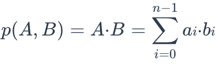
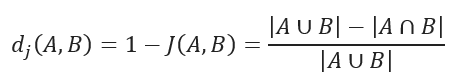

# 相似度度量

在Milvus中，相似度度量方法用于衡量向量之间的相似性。选择一个好的距离度量方法可以显著提高分类和聚类的性能。

以下表格展示了这些广泛使用的相似度度量方法如何与各种输入数据形式和Milvus索引相匹配。

  <a href="#floating">浮点数嵌入</a>
  <a href="#binary">二进制嵌入</a>
  <a href="#sparse">稀疏嵌入</a>

<table class="tg">
<thead>
  <tr>
    <th class="tg-0pky" style="width: 204px;">度量类型</th>
    <th class="tg-0pky">索引类型</th>
  </tr>
</thead>
<tbody>
  <tr>
    <td class="tg-0pky"><ul><li>欧氏距离 (L2)</li><li>内积 (IP)</li><li>余弦相似度 (COSINE)</li></td>
    <td class="tg-0pky" rowspan="2"><ul><li>FLAT</li><li>IVF_FLAT</li><li>IVF_SQ8</li><li>IVF_PQ</li><li>GPU_IVF_FLAT</li><li>GPU_IVF_PQ</li><li>HNSW</li><li>DISKANN</li></ul></td>
  </tr>
</tbody>
</table>

<table class="tg">
<thead>
  <tr>
    <th class="tg-0pky" style="width: 204px;">度量类型</th>
    <th class="tg-0pky">索引类型</th>
  </tr>
</thead>
<tbody>
  <tr>
    <td class="tg-0pky"><ul><li>Jaccard</li><li>汉明距离</li></ul></td>
    <td class="tg-0pky"><ul><li>BIN_FLAT</li><li>BIN_IVF_FLAT</li></ul></td>
  </tr>
</tbody>
</table>

<table class="tg">
<thead>
  <tr>
    <th class="tg-0pky" style="width: 204px;">度量类型</th>
    <th class="tg-0pky">索引类型</th>
  </tr>
</thead>
<tbody>
  <tr>
    <td class="tg-0pky">IP</td>
    <td class="tg-0pky"><ul><li>SPARSE_INVERTED_INDEX</li><li>SPARSE_WAND</li></ul></td>
  </tr>
</tbody>
</table>

### 欧氏距离 (L2)

从本质上讲，欧氏距离衡量了连接两点的线段的长度。

欧氏距离的公式如下：

其中 **a** = (a0, a1,..., an-1) 和 **b** = (b0, b0,..., bn-1) 是n维欧氏空间中的两个点。

这是最常用的距离度量方法，在数据连续时非常有用。

当选择欧氏距离作为距离度量方法时，Milvus仅计算应用平方根之前的值。

### 内积 (IP)

两个嵌入之间的内积距离定义如下：

如果需要比较非归一化数据或关心大小和角度时，内积更有用。

如果将 IP 距离度量应用于归一化嵌入，结果将等同于计算嵌入之间的余弦相似度。

假设 X 的归一化结果为 X'：

两个嵌入之间的相关性如下：

### 余弦相似度

余弦相似度使用两组向量之间的夹角余弦来衡量它们的相似程度。您可以将这两组向量想象成从相同起点 ([0,0,...]) 开始但指向不同方向的两条线段。

要计算两组向量 **A = (a0, a1,..., an-1)** 和 **B = (b0, b1,..., bn-1)** 之间的余弦相似度，请使用以下公式：

余弦相似度始终在区间 **[-1, 1]** 内。例如，两个成比例的向量的余弦相似度为 **1**，两个正交向量的相似度为 **0**，两个相反向量的相似度为 **-1**。余弦值越大，表示两个向量之间的夹角越小，表明这两个向量彼此更相似。

通过将它们的余弦相似度从 1 中减去，您可以得到两个向量之间的余弦距离。

### Jaccard 距离

Jaccard 相似系数衡量两个样本集之间的相似度，定义为定义集合的交集的基数除以它们的并集的基数。它只能应用于有限的样本集。

Jaccard 距离衡量数据集之间的不相似度，通过从 1 中减去 Jaccard 相似系数得到。对于二元变量，Jaccard 距离等同于 Tanimoto 系数。

### 汉明距离

汉明距离衡量二进制数据字符串。相等长度的两个字符串之间的距离是位不同的位置数。

例如，假设有两个字符串，1101 1001 和 1001 1101。

11011001 ⊕ 10011101 = 01000100。由于其中包含两个 1，汉明距离，d (11011001, 10011101) = 2。

### 结构相似度

当化学结构作为较大化学结构的一部分出现时，前者称为亚结构，后者称为超结构。例如，乙醇是乙酸的亚结构，乙酸是乙醇的超结构。

结构相似度用于确定两个化学式是否相互类似，即一个是另一个的超结构或亚结构。
要确定A是否是B的超结构，请使用以下公式：

其中：

- A是要检索的化学式的二进制表示
- B是数据库中化学式的二进制表示

一旦返回`0`，**A**就不是**B**的超结构。否则，结果则相反。

要确定A是否是B的亚结构，请使用以下公式：

其中：

- A是要检索的化学式的二进制表示
- B是数据库中化学式的二进制表示

一旦返回`0`，**A**就不是**B**的亚结构。否则，结果则相反。

## 常见问题解答

如果度量类型为内积，为什么向量搜索的top1结果不是搜索向量本身？

{{fragments/faq_top1_not_target.md}}

什么是归一化？为什么需要归一化？

{{fragments/faq_normalize_embeddings.md}}

为什么使用欧氏距离（L2）和内积（IP）作为距离度量时会得到不同的结果？

{{fragments/faq_euclidean_ip_different_results.md}}

## 下一步

- 了解Milvus中支持的[索引类型](index.md)。