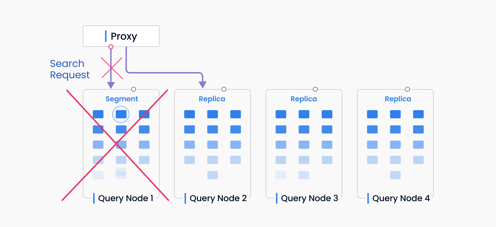

# 内存副本

本主题介绍了 Milvus 中的内存副本（复制）机制，该机制允许在工作内存中进行多个段的复制，以提高性能和可用性。

有关如何配置内存副本的信息，请参阅[查询节点相关配置](configure_querynode.md#queryNodereplicas)。

## 概述

通过内存副本，Milvus 可以在多个查询节点上加载相同的段。如果一个查询节点发生故障，或者正在处理当前的搜索请求时又来了一个新请求，系统可以将新请求发送到具有相同段复制的空闲查询节点。

### 性能

内存副本允许您利用额外的 CPU 和内存资源。如果您有一个相对较小的数据集，但希望通过额外的硬件资源增加读取吞吐量，这将非常有用。总体 QPS（每秒查询数）和吞吐量可以得到显着提高。

### 可用性

内存副本有助于 Milvus 在查询节点崩溃时更快地恢复。当查询节点失败时，段不需要在另一个查询节点上重新加载。相反，搜索请求可以立即重新发送到新的查询节点，而无需重新加载数据。同时维护多个段副本，系统在故障切换时更具弹性。

## 关键概念

内存副本组织为副本组。每个副本组包含[分片](https://milvus.io/docs/v2.1.x/glossary.md#Sharding)副本。每个分片副本都有一个流式副本和一个历史副本，对应于分片中正在增长和已封存的[段](https://milvus.io/docs/v2.1.x/glossary.md#Segment)（即 DML 通道）。

### 副本组

副本组由多个[查询节点](https://milvus.io/docs/v2.1.x/four_layers.md#Query-node)组成，负责处理历史数据和副本。

### 分片副本

分片副本包括一个流式副本和一个历史副本，两者都属于同一个[分片](https://milvus.io/blog/deep-dive-1-milvus-architecture-overview.md#Shard)。副本组中的分片副本数量由指定集合中的分片数量确定。

### 流式副本

流式副本包含来自同一 DML 通道的所有[增长段](https://milvus.io/docs/v2.1.x/glossary.md#Segment)。从技术上讲，一个流式副本应该由一个查询节点在一个副本中提供服务。

### 历史副本
一个历史复制品包含了来自同一 DML 通道的所有封存段。一个历史复制品的封存段可以分布在同一复制组内的多个查询节点上。

### 分片领导者

分片领导者是为分片复制品中的流式复制品提供服务的查询节点。

## 设计细节

### 平衡

需要加载的新段将被分配给多个不同的查询节点。只要至少一个复制品成功加载，搜索请求就可以被处理。

### 搜索

#### 缓存

代理维护一个将段映射到查询节点并定期更新的缓存。当代理收到请求时，Milvus 从缓存中获取所有需要搜索的封存段，并尝试将它们均匀分配给查询节点。

对于增长中的段，代理还维护一个通道到查询节点的缓存，并将请求发送到相应的查询节点。

#### 故障转移

代理上的缓存并不总是最新的。当请求到来时，一些段或通道可能已经被移动到其他查询节点。在这种情况下，代理将收到一个错误响应，更新缓存并尝试将其分配给另一个查询节点。

如果代理在更新缓存后仍然找不到段，该段将被忽略。如果段已经被压缩，这种情况可能会发生。

如果缓存不准确，代理可能会错过一些段。具有 DML 通道（增长段）的查询节点将返回搜索响应，同时附带一个可靠段列表，代理可以进行比较并更新缓存。

### 增强

代理无法将搜索请求完全均匀地分配给查询节点，而查询节点可能具有不同的资源来处理搜索请求。为避免资源的长尾分布，代理将其他查询节点上的活跃段分配给空闲查询节点，这些空闲节点也具有这些段。