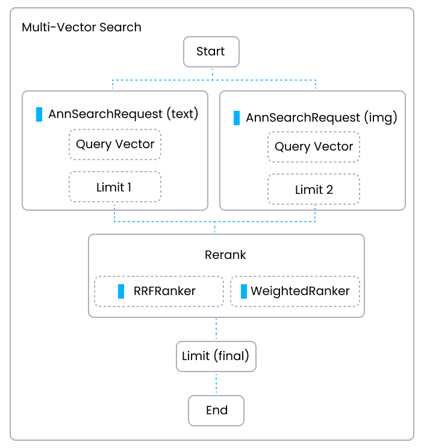

# 重新排序

Milvus 使用 [hybrid_search()](https://milvus.io/api-reference/pymilvus/v2.4.x/ORM/Collection/hybrid_search.md) API 实现多向量搜索功能，结合复杂的重新排序策略，以精细化搜索结果来自多个 `AnnSearchRequest` 实例。本主题涵盖了重新排序过程，解释了在 Milvus 中不同重新排序策略的重要性和实现方法。

## 概述

在多向量搜索中，重新排序是一个关键步骤，它 consololidates 了来自多个向量字段的结果，确保最终输出是相关的并且被准确地优先考虑。目前，Milvus 提供了两种重新排序策略：

- `WeightedRanker`：根据每个向量字段的重要性分配权重；

- `RRFRanker`：采用倒数秩融合（RRF）方法。

下图说明了在 Milvus 中执行多向量搜索的过程，并突出了重新排序在该过程中的作用。



## 加权评分（WeightedRanker）

加权评分重新排序策略为每个 `AnnSearchRequest` 的结果分配不同的权重，反映了每个单独向量字段与搜索相关性的重要性或置信度。

当每个向量字段的相关性不同时，`WeightedRanker` 是首选策略。该方法允许您通过为其分配更高的权重来强调某些向量字段而不是其他向量字段。分配的权重会修改每个结果来自向量字段的原始分数（距离或相似度）。例如，在多模态搜索中，文本描述可能比图像的颜色分布更重要。

Milvus 中加权评分算法的输入是一组与每个 `AnnSearchRequest` 结果对应的权重，格式为 `WeightedRanker(value1, value2, ..., valueN)`。这些权重值代表了该特定 `AnnSearchRequest` 相对于其他请求的重要性或相关性。对于每个 `AnnSearchRequest` 的结果，其原始分数（如距离或相似度）将与相应的权重相乘。这样做会根据分配的权重增强或减弱 `AnnSearchRequest` 结果的影响。然后将跨所有 `AnnSearchRequest` 实例聚合得出最终排名结果列表。具有较高权重值的 `AnnSearchRequest` 将对最终分数产生更大影响，而具有较低权重值的请求将影响较小。

要使用此策略，应用一个 `WeightedRanker` 实例，并通过传入多个数值参数来设置权重值。
```python
from pymilvus import WeightedRanker

# 使用 WeightedRanker 来结合指定权重的结果
rerank = WeightedRanker(0.8, 0.8, 0.7) 
```
注意：

- 每个权重值的范围从 0（最不重要）到 1（最重要），影响最终的聚合分数。

- 在 `WeightedRanker` 中提供的权重值总数应该等于之前创建的 `AnnSearchRequest` 实例数。

- 值得注意的是，由于不同度量类型的不同测量方式，我们对召回结果的距离进行归一化，使其落在区间 [0,1]，其中 0 表示不同，1 表示相似。最终分数将是权重值和距离的总和。

## 逆序秩融合（RRFRanker）

RRF 是一种数据融合方法，它基于排名的倒数来合并排名列表。这是一种有效的方法，可以平衡每个向量字段的影响，特别是当重要性没有明确的优先顺序时。当您希望平等考虑所有向量字段，或者对每个字段的相对重要性存在不确定性时，通常会使用这种策略。

`RRFRanker` 算法为每个结果分配一个分数，该分数基于其在其 `AnnSearchRequest` 中的排名的倒数加上一个阻尼因子 `k`。排名 `i` 是结果在其 `AnnSearchRequest` 中的位置，从 0 开始计算。然后计算该分数为 `1 / (k + i + 1)`，其中阻尼因子 `k` 有助于控制随着排名增加分数如何迅速减少。较大的 `k` 值意味着分数会减少得更慢。然后将这些逆序秩分数在所有 `AnnSearchRequest` 结果中聚合，以生成最终的结果排序列表。

要使用这种策略，请应用一个 `RRFRanker` 实例。

```python
from pymilvus import RRFRanker

# 默认 k 值为 60
ranker = RRFRanker()

# 或指定 k 值
ranker = RRFRanker(k=100)
```

RRF 允许在不指定显式权重的情况下平衡字段之间的影响。多个字段都同意的前几个匹配项将在最终排序中优先考虑。