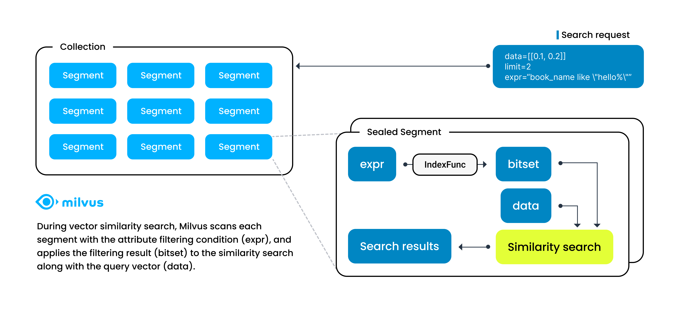
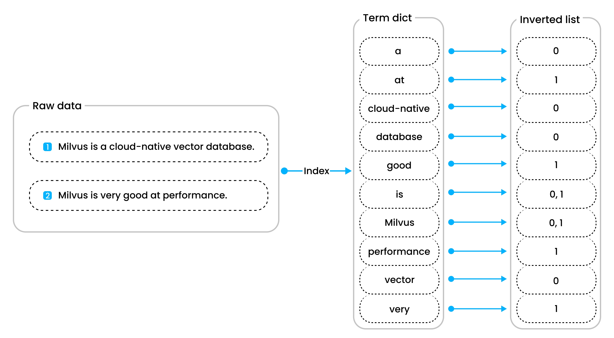

# 标量索引

Milvus支持结合标量和向量字段进行过滤搜索。为了增强涉及标量字段的搜索效率，Milvus从版本2.1.0开始引入了标量字段索引。本文概述了Milvus中的标量字段索引，帮助您了解其重要性和实现方式。

## 概述

在Milvus进行向量相似度搜索时，您可以使用逻辑运算符将标量字段组织成布尔表达式。

当Milvus收到带有这种布尔表达式的搜索请求时，它将该布尔表达式解析为抽象语法树（AST），以生成用于属性过滤的物理计划。然后Milvus在每个段中应用物理计划，生成一个[位集](bitset.md)作为过滤结果，并将结果作为向量搜索参数包含，以缩小搜索范围。在这种情况下，向量搜索的速度在很大程度上取决于属性过滤的速度。

标量字段索引是一种确保属性过滤速度的方法，通过以特定方式对标量字段值进行排序来加速信息检索。

## 标量字段索引算法

Milvus旨在通过其标量字段索引算法实现低内存使用、高过滤效率和短加载时间。这些算法分为两种主要类型：[默认索引](#default-indexing)和[倒排索引](#inverted-indexing)。

### 默认索引

Milvus会根据标量字段的数据类型自动创建默认索引，无需手动干预。这种默认索引适用于前缀匹配查询和频繁检索场景。

以下表格列出了Milvus支持的数据类型及其对应的默认索引算法。

| 数据类型                     | 默认索引算法        |
| ----------------------------- | --------------------------------- |
| VARCHAR                       | MARISA-trie                       |
| INT8                          | STL sort                          |
| INT16                         | STL sort                          |
| INT32                         | STL sort                          |
| INT64                         | STL sort                          |
| FLOAT                         | STL sort                          |
| DOUBLE                        | STL sort                          |

### 倒排索引

倒排索引是一种更灵活的方法，您可以通过指定索引参数来手动为标量字段创建倒排索引。这种方法适用于各种场景，包括点查询、模式匹配查询、全文搜索、JSON搜索、布尔搜索，甚至前缀匹配查询。
倒排索引由词典和倒排列表组成。词典包含所有按字母顺序排序的标记化单词，而倒排列表包含每个单词出现的文档列表。这种结构通过降低时间复杂度，使诸如点查询和范围查询等操作变得高效，相较于蛮力搜索。

使用倒排索引的优势在以下操作中尤为明显：

- **点查询**：例如，当搜索包含单词 **Milvus** 的文档时，流程从检查词典中是否存在 **Milvus** 开始。如果未找到，则没有文档包含该单词。但是，如果找到了，将检索与 **Milvus** 关联的倒排列表，指示包含该单词的文档。这种方法比蛮力搜索一百万个文档要高效得多，因为排序的词典显著降低了查找单词 **Milvus** 的时间复杂度。
- **范围查询**：范围查询的效率，例如查找单词按字母顺序大于 **very** 的文档，也受到排序词典的增强。这种方法比蛮力搜索更高效，提供更快速和更准确的结果。

## 性能建议

为充分利用 Milvus 在标量字段索引和释放其在向量相似度搜索中的潜力，您可能需要一个模型来根据您拥有的数据估算所需内存的大小。

以下表格列出了 Milvus 支持的所有数据类型的估算函数。

- 数值字段

    | 数据类型                      | 内存估算函数 (MB)      |
    | ------------------------------ | ------------------------------------ |
    | INT8                           | numOfRows * **12** / 1024 / 1024     |
    | INT16                          | numOfRows * **12** / 1024 / 1024     |
    | INT32                          | numOfRows * **12** / 1024 / 1024     |
    | INT64                          | numOfRows * **24** / 1024 / 1024     |
    | FLOAT32                        | numOfRows * **12** / 1024 / 1024     |
    | DOUBLE                         | numOfRows * **24** / 1024 / 1024     |

- 字符串字段

    | 字符串长度                  | 内存估算函数 (MB)      |
    | ------------------------------ | ------------------------------------ |
    | (0, 8]                         | numOfRows * **128** / 1024 / 1024    |
    | (8, 16]                        | numOfRows * **144** / 1024 / 1024    |
    | (16, 32]                       | numOfRows * **160** / 1024 / 1024    |
    | (32, 64]                       | numOfRows * **192** / 1024 / 1024    |
    | (64, 128]                      | numOfRows * **256** / 1024 / 1024    |
    | (128, 65535]                   | numOfRows * **strLen * 1.5** / 1024 / 1024    |

## 接下来做什么

- 要对标量字段进行索引，请阅读 [在标量上构建索引](index-scalar-fields.md)。
- 要了解更多关于上述相关术语和规则的信息，请阅读

    - [位集](bitset.md)
    - [多向量搜索](multi-vector-search.md)
    - [布尔表达式规则](boolean.md)
    - [支持的数据类型](schema.md#Supported-data-type)