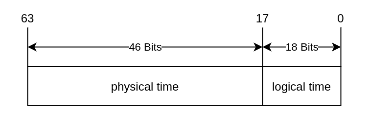
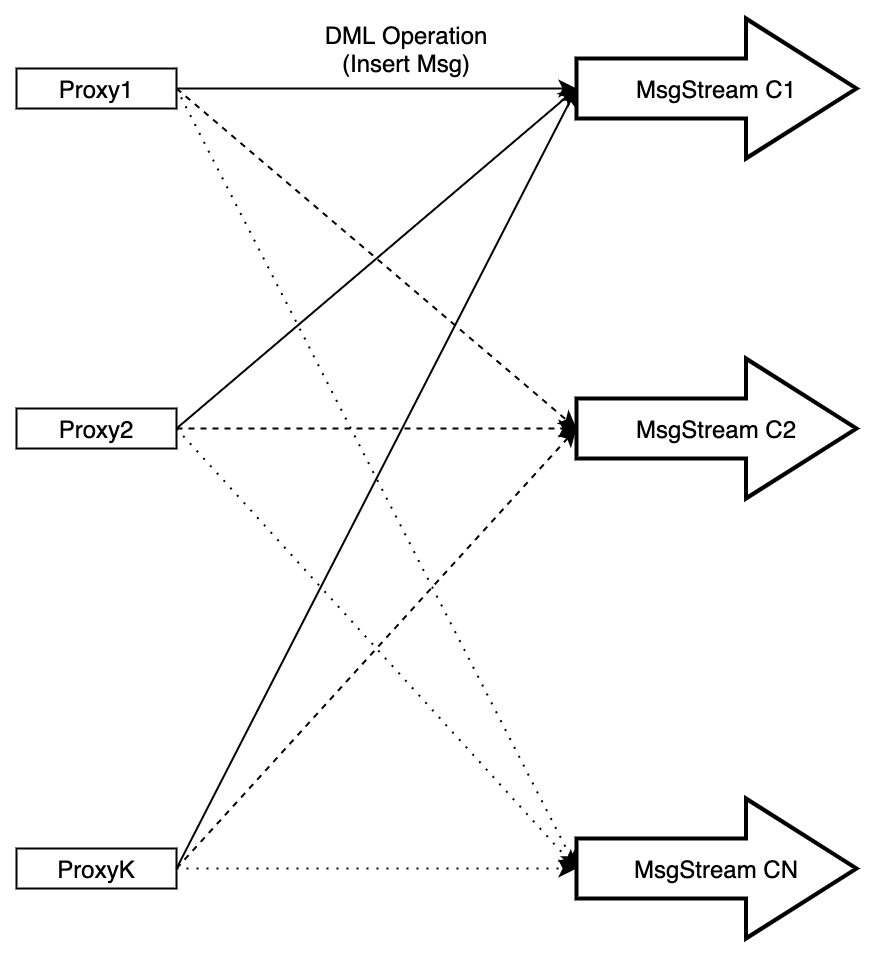
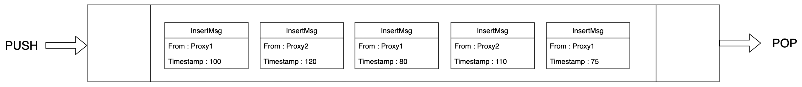
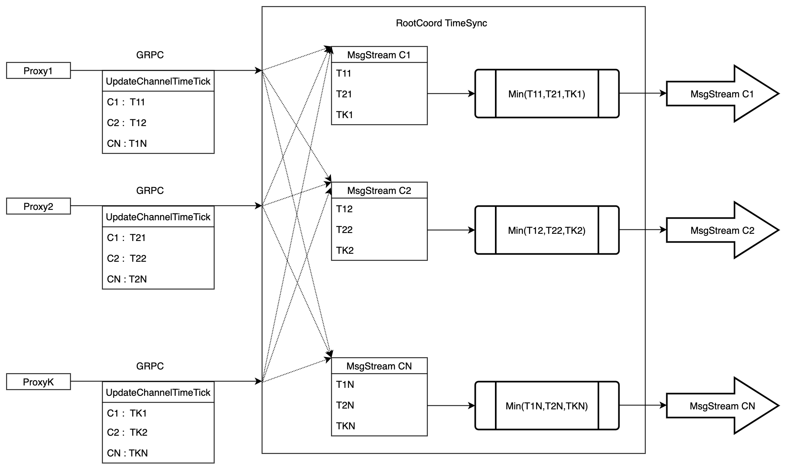
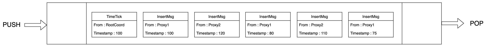

# 时间同步

本主题介绍了 Milvus 中的时间同步机制。

## 概述

Milvus 中的事件通常可以分为两种类型：

- 数据定义语言 (DDL) 事件：创建/删除集合，创建/删除分区等。

- 数据操作语言 (DML) 事件：插入，搜索等。

无论是 DDL 还是 DML 事件，每个事件都标记有一个时间戳，可以指示事件发生的时间。

假设有两个用户按照下表中显示的时间顺序在 Milvus 中发起一系列的 DML 和 DDL 事件。

| 时间戳 |                  用户 1                  |                 用户 2                 |
|:------:|:--------------------------------------:|:--------------------------------------:|
|   t0   |     创建了名为 `C0` 的集合。           |                    /                   |
|   t2   |                     /                    | 在集合 `C0` 上进行了搜索。             |
|   t5   | 将数据 `A1` 插入到集合 `C0` 中。       |                    /                   |
|   t7   |                     /                    | 在集合 `C0` 上进行了搜索。             |
|  t10   | 将数据 `A2` 插入到集合 `C0` 中。       |                    /                   |
|  t12   |                     /                    | 在集合 `C0` 上进行了搜索。             |
|  t15   |  从集合 `C0` 中删除了数据 `A1`。       |                    /                   |
|  t17   |                     /                    | 在集合 `C0` 上进行了搜索。             |

理想情况下，用户 2 应该能够看到：

- 在 `t2` 时看到空的集合 `C0`。

- 在 `t7` 时看到数据 `A1`。

- 在 `t12` 时同时看到数据 `A1` 和 `A2`。

- 在 `t17` 时只看到数据 `A2`（因为数据 `A1` 在此之前已从集合中删除）。

当只有一个单一节点时，可以轻松实现这种理想情况。然而，Milvus 是一个分布式向量数据库，为了确保不同节点中的所有 DML 和 DDL 操作保持顺序，Milvus 需要解决以下两个问题：

1. 如果上述示例中的两个用户位于不同节点上，则两个用户的时间时钟是不同步的。例如，如果用户 2 比用户 1 慢 24 小时，那么用户 1 的所有操作对用户 2 来说直到第二天才可见。

2. 可能存在网络延迟。如果用户 2 在 `t17` 时在集合 `C0` 上进行搜索，Milvus 应该能够保证 `t17` 之前的所有操作都已成功处理和完成。如果由于网络延迟导致 `t15` 时的删除操作延迟，那么在 `t17` 时用户 2 仍然可能看到应该已被删除的数据 `A1`。

因此，Milvus 采用了时间同步系统（timetick）来解决这些问题。

## 时间戳 Oracle（TSO）

为了解决前一节提到的第一个问题，Milvus像其他分布式系统一样提供了时间戳预言(TSO)服务。这意味着Milvus中的所有事件都必须从TSO而不是本地时钟分配时间戳。

TSO服务由Milvus中的根协调器提供。客户端可以在单个时间戳分配请求中分配一个或多个时间戳。

TSO时间戳是一种`uint64`值，由物理部分和逻辑部分组成。下图展示了时间戳的格式。

.

如图所示，开头的46位是物理部分，即UTC时间的毫秒数。最后的18位是逻辑部分。

## 时间同步系统（timetick）

本节以数据插入操作为例，解释Milvus中的时间同步机制。

当代理从SDK接收到数据插入请求时，它根据主键的哈希值将插入消息分成不同的消息流(`MsgStream`)。

每个插入消息(`InsertMsg`)在发送到`MsgStream`之前都会被分配一个时间戳。

  <code>MsgStream</code>是消息队列的包装器，在Milvus 2.0中默认为Pulsar。

一个通用原则是，在`MsgStream`中，来自同一代理的`InsertMsgs`的时间戳必须是递增的。然而，对于来自不同代理的`InsertMsgs`，则没有这样的规则。

下图是`MsgStream`中`InsertMsgs`的一个示例。这段代码包含了五个`InsertMsgs`，其中三个来自`Proxy1`，其余两个来自`Proxy2`。

来自`Proxy1`的三个`InsertMsgs`的时间戳是递增的，来自`Proxy2`的两个`InsertMsgs`也是如此。然而，`Proxy1`和`Proxy2`的`InsertMsgs`之间没有特定的顺序。

一个可能的情景是，当从`Proxy2`读取时间戳为`110`的消息时，Milvus发现`MsgStream`中仍然存在时间戳为`80`的来自`Proxy1`的消息。因此，Milvus引入了一个时间同步系统，timetick，以确保从`MsgStream`读取消息时，必须消费所有时间戳值较小的消息。

如上图所示，

- 每个代理定期（默认每200毫秒）向根协调器报告`MsgStream`中最新`InsertMsg`的最大时间戳值。
- Root coord 标识了这个 `Msgstream` 上的最小时间戳值，无论 `InsertMsgs` 属于哪个代理。然后 root coord 将这个最小时间戳插入到 `Msgstream` 中。这个时间戳也被称为 timetick。

- 当消费者组件读取 root coord 插入的 timetick 时，它们会理解所有具有更小时间戳值的插入消息已经被消费。因此，相关请求可以安全执行而不会打乱顺序。

下图是插入了 timetick 的 `Msgstream` 的示例。

`MsgStream` 根据时间戳批量处理消息，以确保输出消息符合时间戳的要求。

## 接下来
- 了解关于[时间戳](timestamp.md)的概念。
- 了解 Milvus 中的[数据处理工作流程](data_processing.md)。