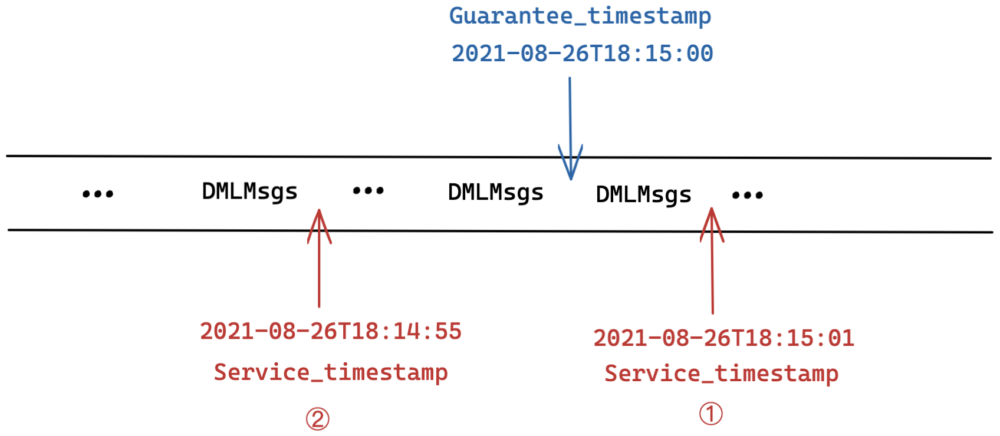
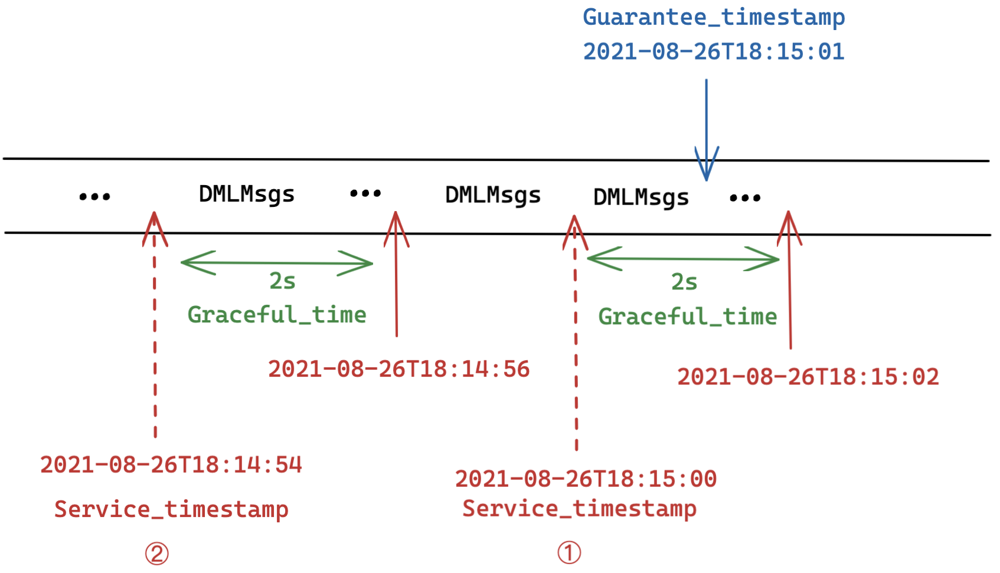

---
id: timestamp.md
title: Milvus 中的时间戳
summary: 了解时间戳的概念以及 Milvus 向量数据库中的四个主要与时间戳相关的参数。

# 时间戳

本主题解释了时间戳的概念，并介绍了 Milvus 向量数据库中的四个主要与时间戳相关的参数。

## 概述

Milvus 是一个向量数据库，可以搜索和查询从非结构化数据转换而来的向量。在进行数据操作语言（DML）操作时，包括[数据插入和删除](https://milvus.io/docs/v2.1.x/data_processing.md)，Milvus 会为参与操作的实体分配时间戳。因此，Milvus 中的所有实体都有一个时间戳属性。而同一 DML 操作中的实体批次共享相同的时间戳值。

## 时间戳参数

在 Milvus 进行向量相似度搜索或查询时，涉及到几个与时间戳相关的参数。

- `Guarantee_timestamp`

- `Service_timestamp`

- `Graceful_time`

- `Travel_timestamp`

### `Guarantee_timestamp`

`Guarantee_timestamp` 是一种时间戳类型，用于确保在进行向量相似度搜索或查询时，`Guarantee_timestamp` 之前的所有数据更新都是可见的。例如，如果你在下午 3 点插入了一批数据，在下午 5 点插入了另一批数据，并且在进行向量相似度搜索时将 `Guarantee_timestamp` 设置为下午 6 点。这意味着在搜索中应该包含分别在下午 3 点和 5 点插入的这两批数据。

如果未配置 `Guarantee_timestamp`，Milvus 会自动采用发出搜索请求时的时间点。因此，搜索是在进行搜索之前由 DML 操作更新的所有数据视图上进行的。

为了让用户免去理解 Milvus 中的[TSO](https://github.com/milvus-io/milvus/blob/master/docs/design_docs/20211214-milvus_hybrid_ts.md)的麻烦，作为用户，你无需直接配置 `Guarantee_timestamp` 参数。你只需要选择[一致性级别](https://milvus.io/docs/v2.1.x/consistency.md)，Milvus 会自动为你处理 `Guarantee_timestamp` 参数。每个一致性级别对应一个特定的 `Guarantee_timestamp` 值。

。

#### 示例

如上图所示，`Guarantee_timestamp` 的值设置为 `2021-08-26T18:15:00`（为简单起见，此示例中的时间戳用物理时间表示）。当进行搜索或查询时，将搜索或查询 2021-08-26T18:15:00 之前的所有数据。

### `Service_timestamp`

`Service_timestamp` 是由 Milvus 中的查询节点自动生成和管理的一种时间戳类型。它用于指示查询节点执行了哪些 DML 操作。

查询节点管理的数据可分为两种类型：

- 历史数据（也称为批量数据）
- 增量数据（又称为流式数据）。

在 Milvus 中，进行搜索或查询之前需要加载数据。因此，在发出搜索或查询请求之前，查询节点会加载集合中的批量数据。然而，流式数据会动态地被插入到 Milvus 中或从中删除，这要求查询节点保持 DML 操作和搜索或查询请求的时间轴。因此，查询节点使用 `Service_timestamp` 来维护这样一个时间轴。`Service_timestamp` 可以被视为某个数据可见的时间点，因为查询节点可以确保 `Service_timestamp` 之前的所有 DML 操作都已完成。

当有搜索或查询请求到来时，查询节点会比较 `Service_timestamp` 和 `Guarantee_timestamp` 的值。主要存在两种情况。

。

#### 情况1：`Service_timestamp` >= `Guarantee_timestamp`

如图1所示，`Guarantee_timestamp` 的值设置为 `2021-08-26T18:15:00`。当 `Service_timestamp` 的值增长到 `2021-08-26T18:15:01` 时，这意味着在此时间点之前的所有 DML 操作都已由查询节点执行并完成，包括那些在 `Guarantee_timestamp` 所指示的时间之前的 DML 操作。因此，搜索或查询请求可以立即执行。

#### 情况2：`Service_timestamp` < `Guarantee_timestamp`

如图2所示，`Guarantee_timestamp` 的值设置为 `2021-08-26T18:15:00`，而当前的 `Service_timestamp` 值仅为 `2021-08-26T18:14:55`。这意味着只有在 `2021-08-26T18:14:55` 之前的 DML 操作已执行并完成，留下了在此时间点之后但在 `Guarantee_timestamp` 之前的部分 DML 操作尚未完成。如果在此时执行搜索或查询，那么一些所需数据是不可见且不可用的，严重影响了搜索或查询结果的准确性。因此，查询节点需要推迟搜索或查询请求，直到 `Guarantee_timestamp` 之前的 DML 操作完成（即当 `Service_timestamp` >= `Guarantee_timestamp`）。

### `Graceful_time`

从技术角度来看，`Graceful_time` 不是一个时间戳，而是一个时间段（例如100毫秒）。然而，`Graceful_time` 值得一提，因为它与 `Guarantee_timestamp` 和 `Service_timestamp` 密切相关。`Graceful_time` 是 Milvus 配置文件中的一个可配置参数。它用于指示在某些数据变得可见之前可以容忍的时间段。简而言之，在 `Graceful_time` 内未完成的 DML 操作是可以容忍的。

当有搜索或查询请求到来时，可能存在两种情况。

。
#### 场景1：`Service_timestamp` + `Graceful_time` >= `Guarantee_timestamp`

如图1所示，`Guarantee_timestamp` 的值设置为 `2021-08-26T18:15:01`，`Graceful_time` 为 `2s`。`Service_timestamp` 的值增长到 `2021-08-26T18:15:00`。尽管 `Service_timestamp` 的值仍然小于 `Guarantee_timestamp`，且在 `2021-08-26T18:15:01` 之前并未完成所有 DML 操作，但根据 `Graceful_time` 的值，可以容忍2秒的数据不可见性。因此，可以立即执行传入的搜索或查询请求。

#### 场景2：`Service_timestamp` + `Graceful_time` < `Guarantee_timestamp`

如图2所示，`Guarantee_timestamp` 的值设置为 `2021-08-26T18:15:01`，`Graceful_time` 为 `2s`。当前的 `Service_timestamp` 值仅为 `2021-08-26T18:14:54`。这意味着预期的 DML 操作尚未完成，即使给予了2秒的宽限时间，数据不可见性仍然是不可容忍的。因此，查询节点需要推迟搜索或查询请求，直到完成某些 DML 请求（即当 `Service_timestamp` + `Graceful_time` >= `Guarantee_timestamp`）。

## 下一步

- 了解 [保证时间戳如何在 Milvus 中实现可调一致性](consistency.md)