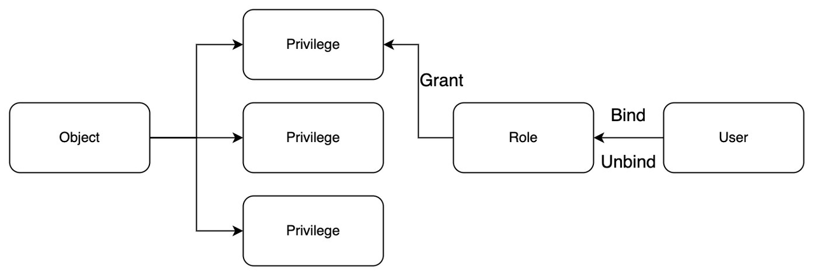

# 用户和角色

本主题解释了基于角色的访问控制（RBAC）中用户、角色、对象和权限的定义。

- **对象：** 用于授予或拒绝访问权限的对象。对象可以是一个集合、一个分区等。

- **用户：** 具有用户名和相应密码的用户身份。

- **权限：** 权限定义了可以执行的操作和可以访问的资源。权限不能直接授予给用户，必须首先授予给角色。

- **角色：** 角色定义了用户对某些对象拥有的权限。将角色绑定到用户后，用户将继承授予该角色的所有权限。

下图说明了对象、权限、角色和用户之间的关系。

对象、权限、角色和用户之间的关系。

Milvus 默认创建一个名为 `root` 的用户，密码为 `Milvus`。`root` 用户被授予 `admin` 权限，这意味着该 `root` 用户可以访问所有资源并执行所有操作。

如果用户绑定了一个 `public` 角色，该用户将有权利执行 `DescribeCollection`、`ShowCollections` 和 `IndexDetail` 的权限。

下表列出了在[启用 RBAC](rbac.md)时可以选择的值。

| 对象名称 | 权限名称              | 客户端端相关 API 描述       |
| -------- | --------------------- | ---------------------------- |
| 集合     | CreateIndex           | CreateIndex                  |
| 集合     | DropIndex             | DropIndex                    |
| 集合     | IndexDetail           | DescribeIndex/GetIndexState/GetIndexBuildProgress |
| 集合     | Load                  | LoadCollection/GetLoadingProgress/GetLoadState    |
| 集合     | GetLoadingProgress    | GetLoadingProgress                                |
| 集合     | GetLoadState          | GetLoadState                                      |
| 集合     | Release               | ReleaseCollection                                 |
| 集合     | Insert                | Insert                                            |
| 集合     | Delete                | Delete                                            |
| 集合     | Upsert                | Upsert                                            |
| 集合     | Search                | Search                                            |
| 集合     | Flush                 | Flush/GetFlushState                               |
| 集合     | GetFlushState         | GetFlushState                                     |
| 集合        | 查询                 | 查询统计                                           |
| 集合        | 获取统计信息         | 获取集合统计信息                                   |
| 集合        | 压缩                 | 压缩                                               |
| 集合        | 导入                 | 批量插入/导入                                     |
| 集合        | 负载均衡             | 负载均衡                                           |
| 集合        | 创建分区             | 创建分区                                           |
| 集合        | 删除分区             | 删除分区                                           |
| 集合        | 显示分区信息         | 显示分区信息                                       |
| 集合        | 是否有分区           | 是否有分区                                         |
| 全局        | 所有权限             | 此表中的所有 API 操作权限                           |
| 全局        | 创建集合             | 创建集合                                           |
| 全局        | 删除集合             | 删除集合                                           |
| 全局        | 描述集合             | 描述集合                                           |
| 全局        | 显示集合             | 显示集合                                           |
| 全局        | 重命名集合           | 重命名集合                                         |
| 全局        | 清空所有数据         | 清空所有数据                                       |
| 全局        | 创建所有权           | 创建用户 创建角色                                 |
| 全局        | 删除所有权           | 删除凭证 删除角色                                 |
| 全局        | 选择所有权           | 选择角色/选择授权                                 |
| 全局        | 管理所有权           | 操作用户角色 操作权限                             |
| 全局        | 创建资源组           | 创建资源组                                         |
| 全局        | 删除资源组           | 删除资源组                                         |
| 全局        | 描述资源组           | 描述资源组                                         |
| 全局        | 列出资源组           | 列出资源组                                         |
| 全局        | 转移节点             | 转移节点                                           |
| 全局        | 转移副本             | 转移副本                                           |
| 全局        | 创建数据库           | 创建数据库                                         |
| 全局        | 删除数据库           | 删除数据库                                         |
| 全局        | 列出数据库           | 列出数据库                                         |
| 全局        | 创建别名             | 创建别名                                           |
| 全局        | 删除别名             | 删除别名                                           |
| 全局        | 描述别名             | 描述别名                                           |
| 全局      | 列出别名           | 列出别名                                       |
| 用户        | 更新用户            | 更新凭据                                  |
| 用户        | 选择用户            | 选择用户                                        |

<li>对象和权限名称区分大小写。</li>
<li>要授予某种对象（如 Collection、Global、User）的所有权限，请在权限名称中使用“*”。</li>
<li>全局对象的“*”权限名称不包括“全部”权限，因为“全部”权限包括所有权限，包括任何集合和用户对象。</li>

## 接下来
- 学习如何[启用 RBAC](rbac.md)。