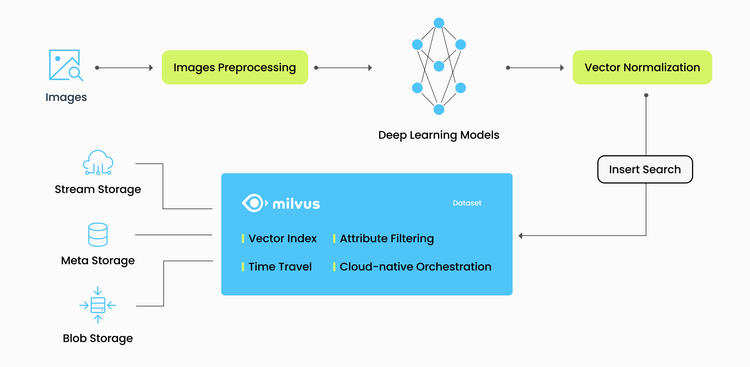

# 图像去重

本教程演示了如何使用 Milvus，这个开源向量数据库，构建一个图像去重系统。

- [打开笔记本](https://github.com/towhee-io/examples/blob/main/image/image_deduplication/image_deduplication.ipynb)

本教程使用的机器学习模型和第三方软件包括：

- ResNet-50

- [Towhee](https://www.google.com/url?sa=t&rct=j&q=&esrc=s&source=web&cd=&cad=rja&uact=8&ved=2ahUKEwjm8-KEjtj7AhVPcGwGHapPB40QFnoECAgQAQ&url=https%3A%2F%2Ftowhee.io%2F&usg=AOvVaw37IzMMiyxGtj82K7O4fInn)

近年来，用户生成的内容呈指数级增长。人们可以立即将他们拍摄的照片上传到社交媒体平台。然而，由于图像数据的丰富，我们看到许多重复的内容。为了提高用户体验，这些重复的图像必须被删除。图像去重系统使我们摆脱了逐个比较数据库中图像以找出重复图像的手动劳动。挑选出完全相同的图像并不是一项复杂的任务。然而，有时一张图片可能被放大，裁剪，或者亮度或灰度被调整。图像去重系统需要识别这些相似的图像并将它们消除。

在本教程中，您将学习如何构建一个图像去重系统。本教程使用 ResNet-50 模型提取图像的特征并将其转换为向量。然后这些图像向量被存储在 Milvus 向量数据库中，并且在 Milvus 中也进行了向量相似性搜索。

