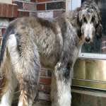
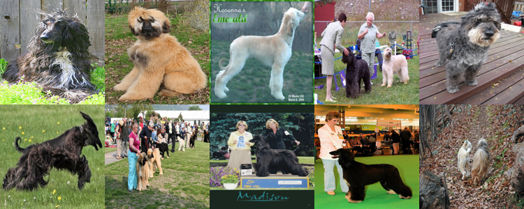

# 使用 Milvus 进行图像搜索

在这个笔记本中，我们将展示如何使用 Milvus 在数据集中搜索相似的图像。我们将使用 [ImageNet](https://www.image-net.org/) 数据集的一个子集，然后搜索阿富汗猎犬的图像来演示这一过程。

## 数据集准备
首先，我们需要加载数据集并解压以进行进一步处理。

```python
!wget https://github.com/milvus-io/pymilvus-assets/releases/download/imagedata/reverse_image_search.zip
!unzip -q -o reverse_image_search.zip
```

## 先决条件

要运行这个笔记本，您需要安装以下依赖项：
- pymilvus>=2.4.2
- timm
- torch
- numpy
- sklearn
- pillow 

为了在 Colab 中运行，我们提供了安装必要依赖项的便捷命令。

```python
$ pip install pymilvus --upgrade
$ pip install timm
```

<div class="alert note">

如果您正在使用 Google Colab，在启用刚安装的依赖项后，您可能需要**重新启动运行时**。

</div>

## 定义特征提取器
接下来，我们需要定义一个特征提取器，使用 timm 的 ResNet-34 模型从图像中提取嵌入。

```python
import torch
from PIL import Image
import timm
from sklearn.preprocessing import normalize
from timm.data import resolve_data_config
from timm.data.transforms_factory import create_transform

class FeatureExtractor:
    def __init__(self, modelname):
        # 加载预训练模型
        self.model = timm.create_model(
            modelname, pretrained=True, num_classes=0, global_pool="avg"
        )
        self.model.eval()

        # 获取模型所需的输入尺寸
        self.input_size = self.model.default_cfg["input_size"]

        config = resolve_data_config({}, model=modelname)
        # 使用 TIMM 为模型提供的预处理函数
        self.preprocess = create_transform(**config)

    def __call__(self, imagepath):
        # 对输入图像进行预处理
        input_image = Image.open(imagepath).convert("RGB")  # 如果需要，转换为 RGB
        input_image = self.preprocess(input_image)

        # 将图像转换为 PyTorch 张量并添加批处理维度
        input_tensor = input_image.unsqueeze(0)

        # 执行推理
        with torch.no_grad():
            output = self.model(input_tensor)

        # 提取特征向量
        feature_vector = output.squeeze().numpy()

        return normalize(feature_vector.reshape(1, -1), norm="l2").flatten()
```

## 创建一个 Milvus 集合
接下来，我们需要创建 Milvus 集合来存储图像嵌入。
```python
from pymilvus import MilvusClient

# 设置一个 Milvus 客户端
client = MilvusClient(uri="example.db")
# 在快速设置模式下创建一个集合
client.create_collection(
    collection_name="image_embeddings",
    vector_field_name="vector",
    dimension=512,
    auto_id=True,
    enable_dynamic_field=True,
    metric_type="COSINE",
)
```
## 将嵌入插入到Milvus中
我们将使用ResNet34模型提取每个图像的嵌入，并将训练集中的图像插入到Milvus中。

```python
import os

extractor = FeatureExtractor("resnet34")

root = "./train"
insert = True
if insert is True:
    for dirpath, foldername, filenames in os.walk(root):
        for filename in filenames:
            if filename.endswith(".JPEG"):
                filepath = dirpath + "/" + filename
                image_embedding = extractor(filepath)
                client.insert(
                    "image_embeddings",
                    {"vector": image_embedding, "filename": filepath},
                )
```

```python
from IPython.display import display

query_image = "./test/Afghan_hound/n02088094_4261.JPEG"

results = client.search(
    "image_embeddings",
    data=[extractor(query_image)],
    output_fields=["filename"],
    search_params={"metric_type": "COSINE"},
)
images = []
for result in results:
    for hit in result[:10]:
        filename = hit["entity"]["filename"]
        img = Image.open(filename)
        img = img.resize((150, 150))
        images.append(img)

width = 150 * 5
height = 150 * 2
concatenated_image = Image.new("RGB", (width, height))

for idx, img in enumerate(images):
    x = idx % 5
    y = idx // 5
    concatenated_image.paste(img, (x * 150, y * 150))
display("query")
display(Image.open(query_image).resize((150, 150)))
display("results")
display(concatenated_image)
```
display(concatenated_image)
```
'query'
display(concatenated_image)
```

display(concatenated_image)
```
'results'
display(concatenated_image)
```


我们可以看到大多数图像与搜索图像属于相同的类别，即阿富汗猎犬。这意味着我们找到了与搜索图像相似的图像。