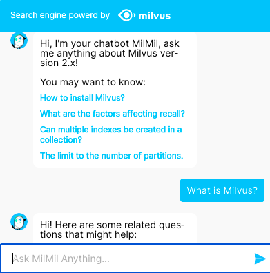

# 问答系统

本教程演示如何使用开源向量数据库 Milvus 构建一个问答（QA）系统。
- [打开 Jupyter 笔记本](https://github.com/towhee-io/examples/tree/main/nlp/question_answering)
- [在线演示](https://milvus.io/milvus-demos/)

使用的机器学习模型和第三方软件包括：
- BERT
- MySQL
- [Towhee](https://towhee.io/)

 

问答系统是一个常见的现实世界应用，属于自然语言处理领域。典型的问答系统包括在线客服系统、问答聊天机器人等。大多数问答系统可以分类为：生成式或检索式、单轮或多轮、开放领域或特定问题回答系统。

 

在本教程中，您将学习如何构建一个能够将新用户问题与事先存储在向量数据库中的大量答案相关联的问答系统。要构建这样的聊天机器人，首先准备自己的问题和相应答案的数据集。将问题和答案存储在关系型数据库 MySQL 中。然后使用 BERT，这是用于自然语言处理（NLP）的机器学习（ML）模型，将问题转换为向量。这些问题向量被存储并索引在 Milvus 中。当用户输入一个新问题时，BERT 模型也将其转换为一个向量，Milvus 搜索与这个新向量最相似的问题向量。问答系统返回与最相似问题对应的答案。

 

