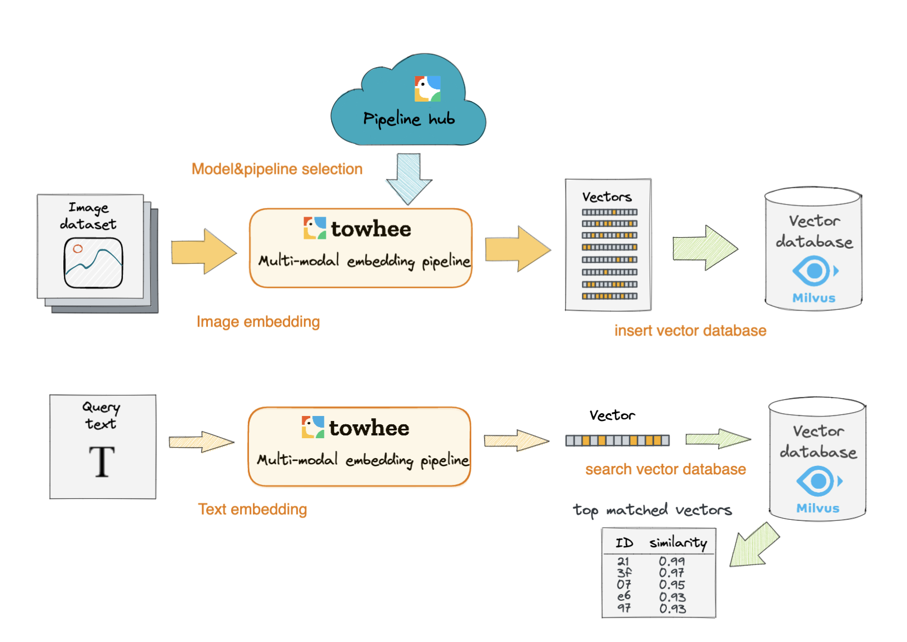

# 文本到图像搜索引擎

本教程演示了如何使用 Milvus，这个开源向量数据库，构建一个文本到图像搜索引擎。

您可以通过按照基本教程快速构建一个最小可行的文本到图像搜索引擎。或者，您也可以阅读深入教程，该教程涵盖了从模型选择到服务部署的所有内容。通过按照深入教程中的说明，您可以构建一个更高级的文本到图像搜索引擎，以满足您自己的业务需求。

- [笔记本中的基本教程](https://github.com/towhee-io/examples/blob/main/image/text_image_search/1_build_text_image_search_engine.ipynb)

- [笔记本中的深入教程](https://github.com/towhee-io/examples/blob/main/image/text_image_search/2_deep_dive_text_image_search.ipynb)

本教程使用的机器学习模型和第三方软件包括：

- [CLIP](https://openai.com/blog/clip/)

- [Towhee](https://towhee.io/)

- [Gradio](https://www.google.com/url?sa=t&rct=j&q=&esrc=s&source=web&cd=&cad=rja&uact=8&ved=2ahUKEwj3nvvEhNj7AhVZSGwGHUFuA6sQFnoECA0QAQ&url=https%3A%2F%2Fgradio.app%2F&usg=AOvVaw0Rmnp2xYgYvkDcMb9d-9TR)

- [OpenCV-Python](https://www.google.com/url?sa=t&rct=j&q=&esrc=s&source=web&cd=&cad=rja&uact=8&ved=2ahUKEwjawLa4hNj7AhWrSGwGHSWKD1sQFnoECA0QAQ&url=https%3A%2F%2Fdocs.opencv.org%2F4.x%2Fd6%2Fd00%2Ftutorial_py_root.html&usg=AOvVaw3YMr9iiY-FTDoGSWWqppvP)

如今，传统的文本搜索引擎正在失去魅力，越来越多的人将 TikTok 视为他们最喜爱的搜索引擎。在传统的文本搜索中，人们输入关键词，然后显示包含关键词的所有文本。然而，人们抱怨他们并不能总是在这样的搜索中找到他们想要的内容。更重要的是，结果不够直观。人们表示，他们发现图像和视频比起浏览一行行的文本更直观和愉悦。跨模态文本到图像搜索引擎应运而生。通过这种新型搜索引擎，人们可以通过输入一段文本或一些关键词来找到相关的图像。

在本教程中，您将学习如何构建一个文本到图像搜索引擎。本教程使用 CLIP 模型提取图像特征并将其转换为向量。然后，这些图像向量被存储在 Milvus 向量数据库中。当用户输入查询文本时，这些文本也会使用相同的 ML 模型 CLIP 转换为嵌入向量。随后，在 Milvus 中执行向量相似度搜索，以检索与输入文本向量最相似的图像向量。

