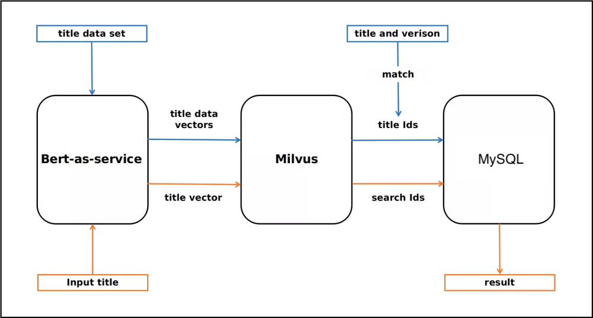
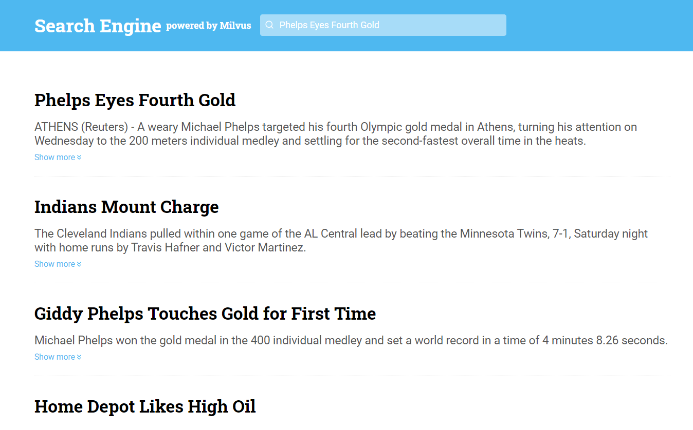

# 文本搜索引擎

在本教程中，您将学习如何使用开源向量数据库 Milvus 构建一个文本搜索引擎。
- [打开 Jupyter 笔记本](https://github.com/towhee-io/examples/tree/main/nlp/text_search)

本教程使用的机器学习模型和第三方软件包括：
- BERT
- MySQL
- [Towhee](https://towhee.io/)

 

Milvus 在自然语言处理（NLP）领域的一个主要应用是文本搜索引擎。它是一个强大的工具，可以帮助用户找到他们正在寻找的信息，甚至可以展示难以找到的信息。文本搜索引擎会将用户输入的关键词或语义与文本数据库进行比对，然后返回符合特定标准的结果。

 

在本教程中，您将学习如何构建一个文本搜索引擎。本教程使用 BERT 将文本转换为固定长度的向量。Milvus 用作向量数据库，用于存储和向量相似度搜索。然后使用 MySQL 将 Milvus 生成的向量 ID 映射到文本数据。

 

