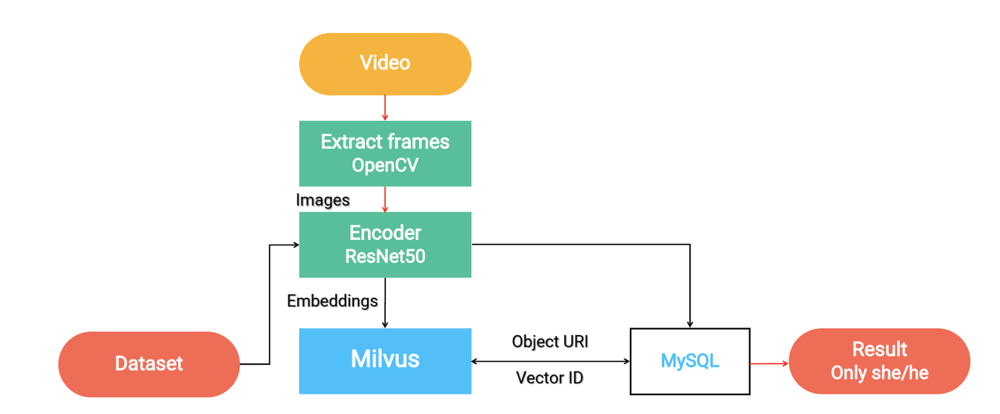

# 视频相似度搜索

本教程演示如何使用开源向量数据库 Milvus 构建一个视频相似度搜索系统。
- [打开 Jupyter 笔记本](https://github.com/towhee-io/examples/tree/main/video/reverse_video_search)

本教程使用的机器学习模型和第三方软件包括：
- OpenCV
- ResNet-50
- MySQL
- [Towhee](https://towhee.io/)

 

如今，观看电影或视频后，人们可以轻松地截取屏幕截图，并通过在各种社交平台上发布来分享他们的想法。当粉丝们看到这些截图时，如果帖子中没有明确标出电影名称，要想知道是哪部电影可能会很困难。为了找出电影的名称，人们可以利用视频相似度搜索系统。通过使用该系统，用户可以上传一张图片，然后获取包含与上传图片相似的关键帧的视频或电影。

 

在本教程中，您将学习如何构建一个视频相似度搜索系统。本教程使用大约 100 个 Tumblr 上的动态 GIF 来构建系统。但是，您也可以准备自己的视频数据集。系统首先使用 OpenCV 从视频中提取关键帧，然后使用 ResNet-50 获取每个关键帧的特征向量。所有向量都存储在 Milvus 中，并通过 Milvus 进行搜索，将返回相似向量的 ID。然后将这些 ID 映射到 MySQL 中存储的相应视频。

 

