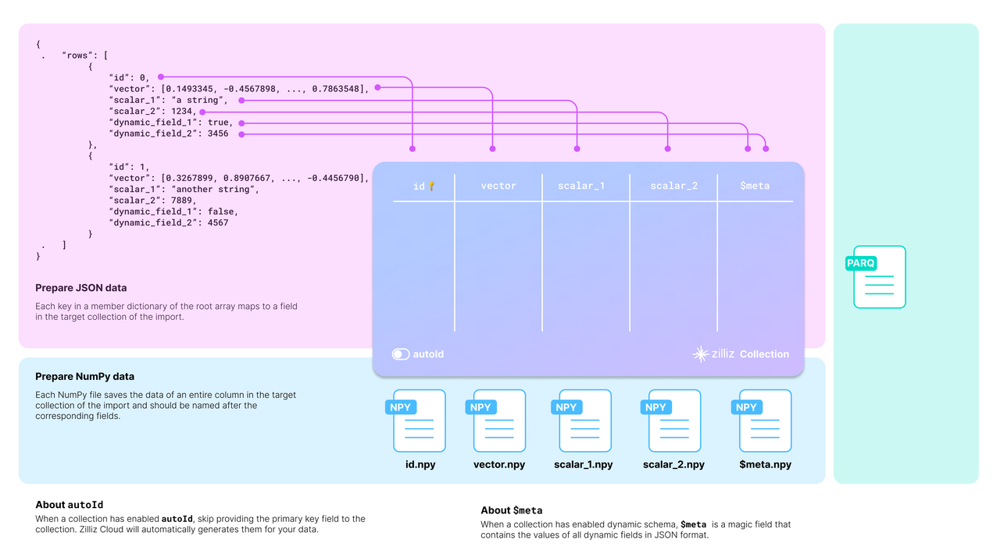

# 准备源数据

在开始批量插入数据到集合之前，您应该考虑的一些事项。

## 开始之前

目标集合需要将源数据映射到其模式。下面的图表展示了可接受的源数据如何映射到目标集合的模式。



您应该仔细检查您的数据，并相应地设计目标集合的模式。

以上图中的 JSON 数据为例，列表中有两个实体，每个实体有六个字段。集合模式有选择地包括了四个字段：**id**、**vector**、**scalar_1** 和 **scalar_2**。

在设计模式时还有两件事情需要考虑：

- **是否启用 AutoID**

    **id** 字段作为集合的主字段。为了使主字段自动递增，您可以在模式中启用 **AutoID**。在这种情况下，您应该在源数据的每行中排除 **id** 字段。

- **是否启用动态字段**

    如果模式启用了动态字段，目标集合还可以存储未包含在预定义模式中的字段。**$meta** 字段是一个保留的 JSON 字段，用于以键值对的形式保存动态字段及其值。在上图中，字段 **dynamic_field_1** 和 **dynamic_field_2** 及其值将以键值对的形式保存在 **$meta** 字段中。

以下代码展示了如何为上图中所示的集合设置模式。

<div class="language-python">

要获取更多信息，请参考[`create_schema()`](https://milvus.io/api-reference/pymilvus/v2.4.x/MilvusClient/Collections/create_schema.md)和[`add_field()`](https://milvus.io/api-reference/pymilvus/v2.4.x/MilvusClient/CollectionSchema/add_field.md)中的 SDK 参考。

</div>

<div class="language-java">

要获取更多信息，请参考 SDK 参考中的[`CollectionSchema`](https://milvus.io/api-reference/java/v2.4.x/v2/CollectionSchema/CollectionSchema.md)。

</div>

<div class="multipleCode">
  <a href="#python">Python </a>
  <a href="#java">Java</a>
</div>

```python
from pymilvus import MilvusClient, DataType

# 您需要根据数据集设计一个集合模式。
schema = MilvusClient.create_schema(
    auto_id=False,
    enable_dynamic_field=True
)

schema.add_field(field_name="id", datatype=DataType.INT64, is_primary=True)
schema.add_field(field_name="vector", datatype=DataType.FLOAT_VECTOR, dim=768)
schema.add_field(field_name="scalar_1", datatype=DataType.VARCHAR, max_length=512)
schema.add_field(field_name="scalar_2", datatype=DataType.INT64)

schema.verify()
```
```java
import io.milvus.grpc.DataType;
import io.milvus.param.collection.CollectionSchemaParam;
import io.milvus.param.collection.FieldType;

// 为目标集合定义模式
FieldType id = FieldType.newBuilder()
        .withName("id")
        .withDataType(DataType.Int64)
        .withPrimaryKey(true)
        .withAutoID(false)
        .build();

FieldType vector = FieldType.newBuilder()
        .withName("vector")
        .withDataType(DataType.FloatVector)
        .withDimension(768)
        .build();

FieldType scalar1 = FieldType.newBuilder()
        .withName("scalar_1")
        .withDataType(DataType.VarChar)
        .withMaxLength(512)
        .build();

FieldType scalar2 = FieldType.newBuilder()
        .withName("scalar_2")
        .withDataType(DataType.Int64)
        .build();

CollectionSchemaParam schema = CollectionSchemaParam.newBuilder()
        .withEnableDynamicField(true)
        .addFieldType(id)
        .addFieldType(vector)
        .addFieldType(scalar1)
        .addFieldType(scalar2)
        .build();
```
## 设置 BulkWriter

**BulkWriter** 是一个工具，旨在将原始数据集转换为适合通过 RESTful Import API 导入的格式。它提供两种类型的写入器：

- **LocalBulkWriter**：读取指定的数据集并将其转换为易于使用的格式。
- **RemoteBulkWriter**：执行与 LocalBulkWriter 相同的任务，但另外将转换后的数据文件传输到指定的远程对象存储桶。

**RemoteBulkWriter** 与 **LocalBulkWriter** 的不同之处在于 **RemoteBulkWriter** 将转换后的数据文件传输到目标对象存储桶。

### 设置 LocalBulkWriter

**LocalBulkWriter** 从源数据集中追加行并将它们提交到指定格式的本地文件中。

<div class="multipleCode">
  <a href="#python">Python </a>
  <a href="#java">Java</a>
</div>

```python
from pymilvus.bulk_writer import LocalBulkWriter, BulkFileType
# 当您使用早于 2.4.2 版本的 pymilvus 时，请使用 `from pymilvus import LocalBulkWriter, BulkFileType`

writer = LocalBulkWriter(
    schema=schema,
    local_path='.',
    segment_size=512 * 1024 * 1024, # 默认值
    file_type=BulkFileType.PARQUET
)
```

```java
import io.milvus.bulkwriter.LocalBulkWriter;
import io.milvus.bulkwriter.LocalBulkWriterParam;
import io.milvus.bulkwriter.common.clientenum.BulkFileType;

LocalBulkWriterParam localBulkWriterParam = LocalBulkWriterParam.newBuilder()
    .withCollectionSchema(schema)
    .withLocalPath(".")
    .withChunkSize(512 * 1024 * 1024)
    .withFileType(BulkFileType.PARQUET)
    .build();

LocalBulkWriter localBulkWriter = new LocalBulkWriter(localBulkWriterParam);
```

<div class="language-python">

创建 **LocalBulkWriter** 时，您应该：

- 在 `schema` 中引用创建的模式。
- 将 `local_path` 设置为输出目录。
- 将 `file_type` 设置为输出文件类型。
- 如果您的数据集包含大量记录，建议通过将 `segment_size` 设置为适当的值来对数据进行分段。

有关参数设置的详细信息，请参阅 SDK 参考中的 [LocalBulkWriter](https://milvus.io/api-reference/pymilvus/v2.4.x/DataImport/LocalBulkWriter/LocalBulkWriter.md)。

</div>

<div class="language-java">

创建 **LocalBulkWriter** 时，您应该：

- 在 `CollectionSchema()` 中引用创建的模式。
- 在 `withLocalPath()` 中设置输出目录。
- 在 `withFileType()` 中设置输出文件类型。
- 如果您的数据集包含大量记录，建议通过将 `withChunkSize()` 设置为适当的值来对数据进行分段。

有关参数设置的详细信息，请参阅 SDK 参考中的 LocalBulkWriter。

</div>

### 设置 RemoteBulkWriter

与将追加数据提交到本地文件不同，**RemoteBulkWriter** 将它们提交到远程存储桶。因此，在创建 **RemoteBulkWriter** 之前，您应该设置一个 **ConnectParam** 对象。

<div class="multipleCode">
  <a href="#python">Python </a>
  <a href="#java">Java</a>
</div>
```python
从 pymilvus.bulk_writer 导入 RemoteBulkWriter
# 当您使用早于 2.4.2 版本的 pymilvus 时，请使用 `from pymilvus import RemoteBulkWriter`

# 第三方常量
ACCESS_KEY="minioadmin"
SECRET_KEY="minioadmin"
BUCKET_NAME="milvus-bucket"

# 连接参数，用于访问远程存储桶
conn = RemoteBulkWriter.S3ConnectParam(
    endpoint="localhost:9000",  # 默认的 MinIO 服务与 Milvus 一起启动
    access_key=ACCESS_KEY,
    secret_key=SECRET_KEY,
    bucket_name=BUCKET_NAME,
    secure=False
)
```
```java
import io.milvus.bulkwriter.common.clientenum.BulkFileType;
import io.milvus.bulkwriter.connect.S3ConnectParam;
import io.milvus.bulkwriter.connect.StorageConnectParam;

String ACCESS_KEY = "minioadmin";
String SECRET_KEY = "minioadmin";
String BUCKET_NAME = "milvus-bucket";

StorageConnectParam storageConnectParam = S3ConnectParam.newBuilder()
    .withEndpoint(MINIO_URI)
    .withAccessKey(ACCESS_KEY)
    .withSecretKey(SECRET_KEY)
    .withBucketName(BUCKET_NAME)
    .build();
```

连接参数准备就绪后，您可以在 **RemoteBulkWriter** 中引用如下：

<div class="multipleCode">
  <a href="#python">Python </a>
  <a href="#java">Java</a>
</div>

```python
from pymilvus.bulk_writer import BulkFileType
# 当您使用早于 2.4.2 版本的 pymilvus 时，请使用 `from pymilvus import BulkFileType`

writer = RemoteBulkWriter(
    schema=schema,
    remote_path="/",
    connect_param=conn,
    file_type=BulkFileType.PARQUET
)
```

```java
import io.milvus.bulkwriter.RemoteBulkWriter;
import io.milvus.bulkwriter.RemoteBulkWriterParam;

RemoteBulkWriterParam remoteBulkWriterParam = RemoteBulkWriterParam.newBuilder()
    .withCollectionSchema(schema)
    .withConnectParam(storageConnectParam)
    .withChunkSize(512 * 1024 * 1024)
    .withRemotePath("/")
    .withFileType(BulkFileType.PARQUET)
    .build();

RemoteBulkWriter remoteBulkWriter = new RemoteBulkWriter(remoteBulkWriterParam);
```

<div class="language-python">

创建 **RemoteBulkWriter** 的参数与 **LocalBulkWriter** 的参数几乎相同，只有 `connect_param` 不同。有关参数设置的详细信息，请参阅 SDK 参考中的 [RemoteBulkWriter](https://milvus.io/api-reference/pymilvus/v2.4.x/DataImport/RemoteBulkWriter/RemoteBulkWriter.md) 和 [ConnectParam](https://milvus.io/api-reference/pymilvus/v2.4.x/DataImport/RemoteBulkWriter/S3ConnectParam.md)。

</div>

<div class="language-java">

创建 **RemoteBulkWriter** 的参数与 **LocalBulkWriter** 的参数几乎相同，只有 `StorageConnectParam` 不同。有关参数设置的详细信息，请参阅 SDK 参考中的 RemoteBulkWriter 和 StorageConnectParam。

</div>

## 开始写入

<div class="language-python">

**BulkWriter** 有两种方法：`append_row()` 从源数据集添加一行，`commit()` 将添加的行提交到本地文件或远程存储桶。

</div>

<div class="language-java">

**BulkWriter** 有两种方法：`appendRow()` 从源数据集添加一行，`commit()` 将添加的行提交到本地文件或远程存储桶。

</div>

为演示目的，以下代码将随机生成的数据追加到数据集中。

<div class="multipleCode">
  <a href="#python">Python </a>
  <a href="#java">Java</a>
</div>
```
```python
import random
import string

def generate_random_str(length=5):
    letters = string.ascii_uppercase
    digits = string.digits
    
    return ''.join(random.choices(letters + digits, k=length))

for i in range(10000):
    writer.append_row({
        "id": i, 
        "vector": [random.uniform(-1, 1) for _ in range(768)],
        "scalar_1": generate_random_str(random.randint(1, 20)),
        "scalar_2": random.randint(0, 100)
    })
    
writer.commit()
```
```java
import com.alibaba.fastjson.JSONObject;

for (int i = 0; i < 10000; i++) {
    JSONObject json = new JSONObject();
    json.put("id", i);
    json.put("vector", get_random_vector(768));
    json.put("scalar_1", get_random_string(20));
    json.put("scalar_2", (long) (Math.random() * 100));

    // localBulkWriter.appendRow(json);
    remoteBulkWriter.appendRow(json);
}

// localBulkWriter.commit(false);
remoteBulkWriter.commit(false);
```

由于定义的模式允许动态字段，您还可以在要插入的数据中包含非模式定义的字段，如下所示。

<div class="multipleCode">
  <a href="#python">Python </a>
  <a href="#java">Java</a>
</div>

```python
import random
import string

def generate_random_string(length=5):
    letters = string.ascii_uppercase
    digits = string.digits
    
    return ''.join(random.choices(letters + digits, k=length))

for i in range(10000):
    writer.append_row({
        "id": i, 
        "vector":[random.uniform(-1, 1) for _ in range(768)],
        "scalar_1": generate_random_string(),
        "scalar_2": random.randint(0, 100),
        "dynamic_field_1": random.choice([True, False]),
        "dynamic_field_2": random.randint(0, 100)
    })
    
writer.commit()
```

```java
for (int i = 0; i < 10000; i++) {
    JSONObject json = new JSONObject();
    json.put("id", i);
    json.put("vector", get_random_vector(768));
    json.put("scalar_1", get_random_string(20));
    json.put("scalar_2", (long) (Math.random() * 100));
    json.put("dynamic_field_1", get_random_boolean());
    json.put("dynamic_field_2", (long) (Math.random() * 100));

    // localBulkWriter.appendRow(json);
    remoteBulkWriter.appendRow(json);
}

// localBulkWriter.commit(false);
remoteBulkWriter.commit(false);
```

## 验证结果

<div class="language-python">

要检查结果，您可以通过打印写入器的 `batch_files` 属性来获取实际输出路径。

</div>

<div class="language-java">

要检查结果，您可以通过打印写入器的 `getBatchFiles()` 方法来获取实际输出路径。

</div>

<div class="multipleCode">
  <a href="#python">Python </a>
  <a href="#java">Java</a>
</div>

```python
print(writer.batch_files)

# [['d4220a9e-45be-4ccb-8cb5-bf09304b9f23/1.parquet'],
#  ['d4220a9e-45be-4ccb-8cb5-bf09304b9f23/2.parquet']]
```

```java
// localBulkWriter.getBatchFiles();
remoteBulkWriter.getBatchFiles();

// 

// Close the BulkWriter
try {
    localBulkWriter.close();
    remoteBulkWriter.close();            
} catch (Exception e) {
    // TODO: handle exception
    e.printStackTrace();
}
```

**BulkWriter** 生成一个 UUID，在提供的输出目录中使用该 UUID 创建一个子文件夹，并将所有生成的文件放在子文件夹中。[点击这里](https://assets.zilliz.com/bulk_writer.zip) 下载准备好的示例数据。

可能的文件夹结构如下：
```
```bash
# JSON
├── 文件夹
│   └── 45ae1139-1d87-4aff-85f5-0039111f9e6b
│       └── 1.json 

# Parquet
├── 文件夹
│   └── 45ae1139-1d87-4aff-85f5-0039111f9e6b
│       └── 1.parquet 
```
