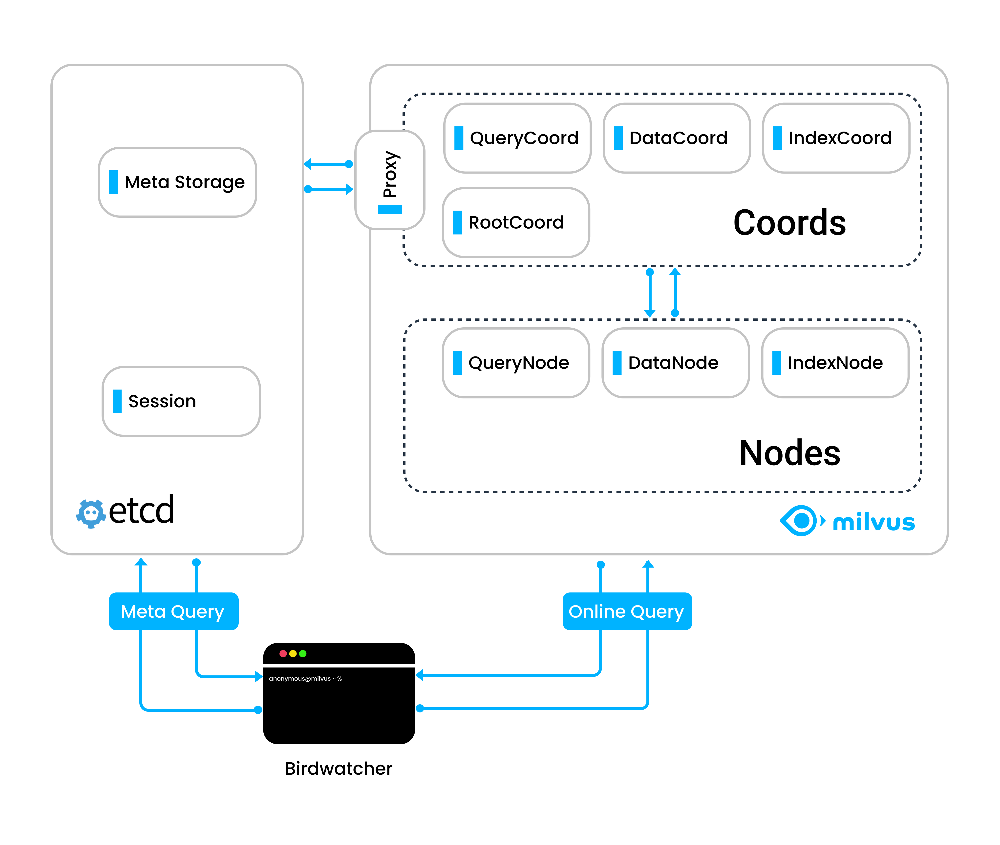

# Birdwatcher

Milvus 是一个无状态向量数据库，将读取和写入分开，并让 etcd 扮演单一状态源的角色。所有协调者在对其进行任何更改之前，都必须从 etcd 查询状态。一旦用户需要检查或清理状态，他们就需要一个工具与 etcd 进行通信。这就是 Birdwatcher 出场的地方。

Birdwatcher 是 Milvus 的调试工具。通过连接到 etcd，您可以实时检查 Milvus 系统的状态或对其进行配置。

## 先决条件

- 您已经安装了 [Go 1.18 或更高版本](https://go.dev/doc/install)。

## 架构

## 最新版本

[Release v1.0.2](https://github.com/milvus-io/birdwatcher/releases/tag/v{{var.birdwatcher_release}})