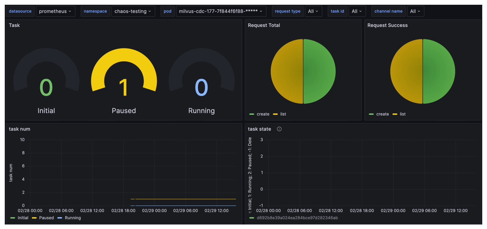

# 监控

Milvus-CDC 通过 Grafana 仪表板提供全面的监控功能，让您可以可视化关键指标，确保 Change Data Capture (CDC) 任务和服务器健康的顺利运行。

### CDC 任务指标

要开始使用，将 [cdc-grafana.json](https://github.com/zilliztech/milvus-cdc/blob/main/server/configs/cdc-grafana.json) 文件导入 Grafana。这将添加一个专门设计用于监控 CDC 任务状态的仪表板。

__CDC Grafana 仪表板概述__:

__关键指标解释__:

- __任务__: 不同状态下的 CDC 任务数量，包括 __Initial__、__Running__ 和 __Paused__。

- __请求总数__: Milvus-CDC 收到的总请求数。

- __请求成功数__: Milvus-CDC 收到的成功请求数。

- __任务数量__: 随时间变化的 __Initial__、__Paused__ 和 __Running__ 状态的任务数量。

- __任务状态__: 单个任务的状态。

- __请求计数__: 成功请求和总请求数量。

- __请求延迟__: 通过 p99、平均值和其他统计数据的请求延迟。

- __复制数据速率__: 读/写操作的复制数据速率。

- __复制时间滞后__: 读/写操作的复制时间滞后。

- __API 执行计数__: 执行不同 Milvus-CDC API 的次数。

- __中心时间戳__: 读/写任务的时间戳。

