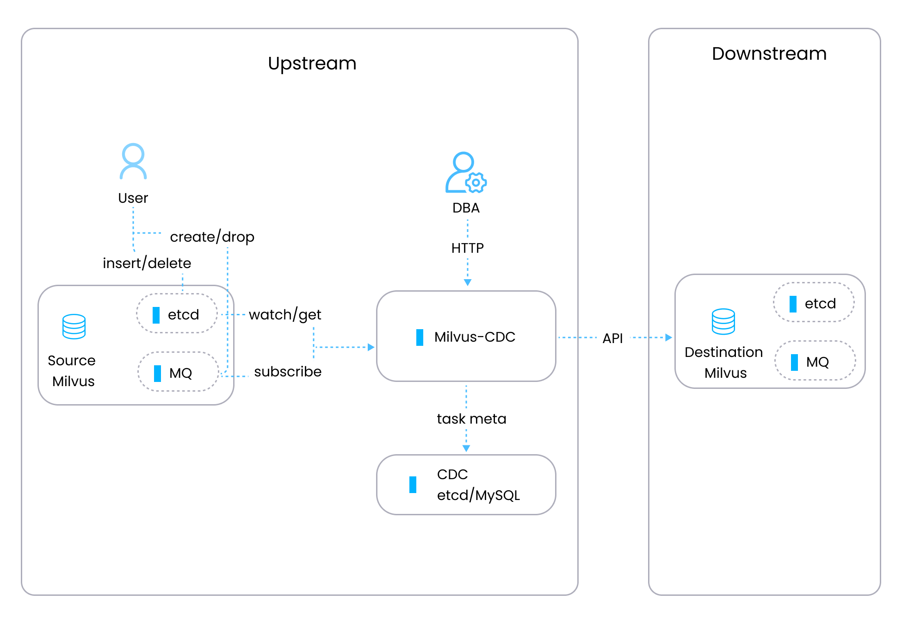

# 概述

Milvus-CDC 是一个用户友好的工具，可以捕获和同步 Milvus 实例中的增量数据。它通过在源实例和目标实例之间无缝传输数据，确保业务数据的可靠性，实现轻松的增量备份和灾难恢复。

## 主要功能

- __顺序数据同步__: 通过在 Milvus 实例之间按顺序同步数据更改，确保数据完整性和一致性。

- __增量数据复制__: 从源 Milvus 复制增量数据，包括插入和删除操作，到目标 Milvus，提供持久存储。

- __CDC 任务管理__: 通过 OpenAPI 请求管理 CDC 任务，包括创建、查询状态和删除 CDC 任务。

此外，我们计划将来扩展我们的功能，以支持与流处理系统的集成。

## 架构

Milvus-CDC 采用两个主要组件构成的架构 - 一个管理任务和元数据的 HTTP 服务器，以及__corelib__，它通过一个从源 Milvus 实例获取数据的读取器和一个将处理后的数据发送到目标 Milvus 实例的写入器来同步任务执行。

在上图中，

- __HTTP 服务器__: 处理用户请求，执行任务，并维护元数据。它作为 Milvus-CDC 系统内任务编排的控制平面。

- __Corelib__: 负责实际任务的同步。它包括一个从源 Milvus 的 etcd 和消息队列（MQ）检索信息的读取器组件，以及一个将 MQ 中的消息转换为 Milvus 系统的 API 参数并将这些请求发送到目标 Milvus 完成同步过程的写入器组件。

## 工作流程

Milvus-CDC 数据处理流程包括以下步骤：

1. __任务创建__: 用户通过 HTTP 请求启动 CDC 任务。

1. __元数据检索__: 系统从源 Milvus 的 etcd 中获取特定于集合的元数据，包括集合的通道和检查点信息。

1. __MQ 连接__: 有了元数据，系统连接到 MQ 开始订阅数据流。

1. __数据处理__: 从 MQ 中读取数据，解析数据，然后使用 Go SDK 传递数据，或者处理以复制在源 Milvus 中执行的操作。

## 限制

- __增量数据同步__: 截至目前，Milvus-CDC 仅设计用于同步增量数据。如果您的业务需要完整数据备份，请[与我们联系](https://milvus.io/community)寻求帮助。
- **同步范围**：目前，Milvus-CDC 可以在集群级别同步数据。我们正在努力在即将发布的版本中添加对集合级别数据同步的支持。

- **支持的 API 请求**：Milvus-CDC 目前支持以下 API 请求。我们计划在未来的版本中扩展对其他请求的支持：

    - 创建/删除集合（Create/Drop Collection）

    - 插入/删除/更新（Insert/Delete/Upsert）

    - 创建/删除分区（Create/Drop Partition）

    - 创建/删除索引（Create/Drop Index）

    - 加载/释放/刷新（Load/Release/Flush）

    - 加载/释放分区（Load/Release Partition）

    - 创建/删除数据库（Create/Drop Database）