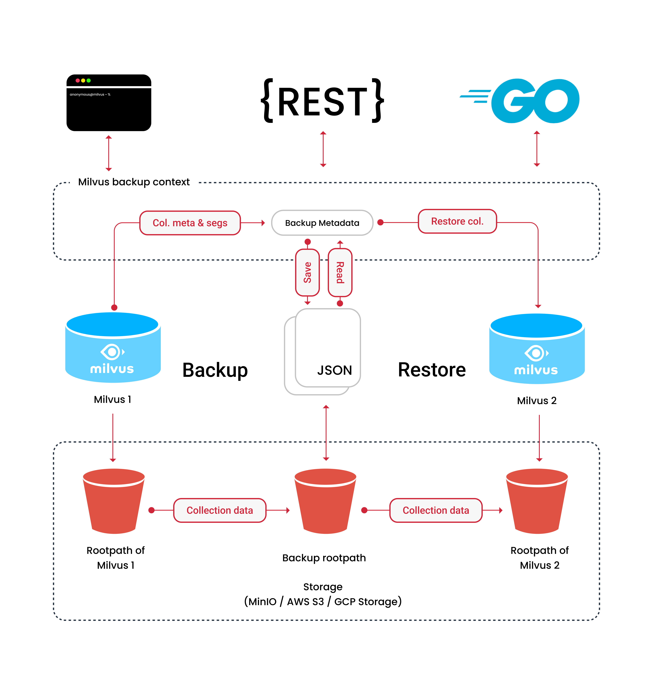

# Milvus备份

Milvus备份是一个工具，允许用户备份和恢复Milvus数据。它提供了CLI和API，以适应不同的应用场景。

## 先决条件

在开始使用Milvus备份之前，请确保：

- 操作系统为CentOS 7.5+或Ubuntu LTS 18.04+，
- Go版本为1.20.2或更高版本。

## 架构

Milvus备份促进了在Milvus实例之间备份和恢复元数据、分段和数据。它提供了CLI、API和基于gRPC的Go模块等北向接口，用于灵活地操作备份和恢复过程。

Milvus备份从源Milvus实例中读取集合元数据和分段，以创建备份。然后，它从源Milvus实例的根路径复制集合数据，并将复制的数据保存到备份根路径中。

要从备份中恢复，Milvus备份在目标Milvus实例中基于备份中的集合元数据和分段信息创建一个新的集合。然后，它将备份数据从备份根路径复制到目标实例的根路径。

## 最新发布

- [v{{var.milvus_backup_release}}](https://github.com/zilliztech/milvus-backup/releases/tag/v{{var.milvus_backup_release}})
